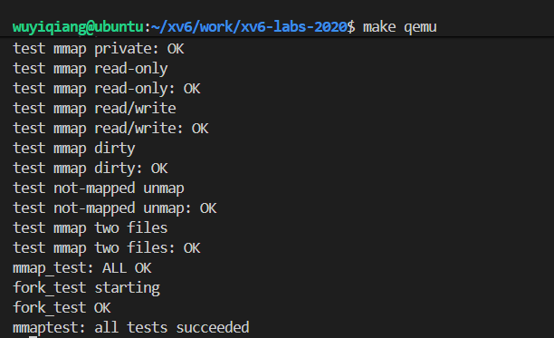
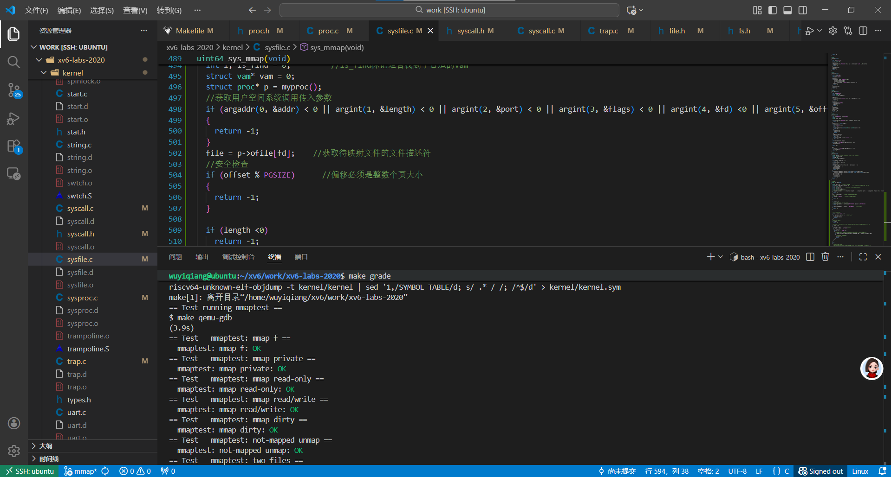

# mmap

## 实验说明

（1）、问题背景：传统的文件读写方式数据需要经历 用户空间 → 内核空间 →磁盘 ；用户空间进入内核需要进行上下文切换，以及对磁盘的读写操作开销都巨大。如果频繁的对文件进行读写，那么这个过程的开销是巨大的。

①、mmap为解决频繁读取文件开销巨大问题：他将需要频繁读写的文件数据块映射到一块特定的**用户空间内存**，映射成功之后接下来对文件的读写操作就转换为对用户空间内存的读写操作，数据只在用户空间中传递，这大大提高了效率。待文件使用完毕之后，通过`munmap`将这一块修改过的内存写回文件。

②、mmap可以实现进程间的通信（IPC）：mmap对于传入MAP_SHARED标志的进程，如果他们映射了一个文件的同一个区域那么对于每一个调用mmap的进程，系统会把这一块文件区域映射到了同一块物理内存，所有进程就共享了这一块物理内存（只是这块物理内存对应不同进程的虚拟地址不同），所有进程对这块内存的读写操作是共享的，进而实现进程间的快速通信。（这一块实验没有要求实现）

③、延迟加载/按需加载（惰性分配）：映射大文件的时候数据不会立马加载而是通过缺页异常，在访问时加载，对资源的消耗更加友好。

（2）、官网说明

mmap 和 munmap 系统调用允许 UNIX 程序对其地址空间进行详细控制。**它们可以用于在进程之间共享内存、将文件映射到进程的地址空间中，以及用于用户级缺页处理机制，**比如在课堂上讨论的垃圾回收算法。
在这个实验中，你将为 xv6 添加 mmap 和 munmap，重点是实现内存映射文件功能。
mmap 可以有很多种使用方式，但这个实验只需要支持与文件内存映射相关的一小部分功能：

```c
void *mmap(void *addr, size_t length, int prot, int flags, int fd, off_t offset);
```

• 你可以假设 addr 总是为 0，表示应由内核决定映射文件的虚拟地址。mmap 返回这个地址，或者在失败时返回 0xffffffffffffffff。

• length 是要映射的字节数，可能不同于文件的长度。

• prot 指示内存应是否可读、可写和/或可执行；你可以假设 prot 是 PROT_READ 或 PROT_WRITE 或两者都有。

• flags 将是 MAP_SHARED（表示对映射内存的修改应写回文件）或 MAP_PRIVATE(不写回)你不需要处理 flags 的其他位。

• fd 是要映射的文件的打开文件描述符。

• 你可以假设 offset 为 0（即映射从文件的起始位置开始）。

如果多个进程映射了同一个 MAP_SHARED 文件，它们不共享物理页面也没有问题。

munmap(addr, length) 应移除该地址范围内的 mmap 映射。如果进程修改了这段内存，并且是以 MAP_SHARED 映射的，那么这些修改应写回文件。一个 munmap 调用可能只覆盖一个 mmap 区域的一部分，但你可以假设它只会取消映射开头、结尾，或整个区域（不会在中间打洞）。

你应实现足够的 mmap 和 munmap 功能以使 mmaptest 测试程序能够工作。mmaptest 没有使用的功能你就不必实现。

- 官网的一些提示

1. 先在 UPROGS 中添加 _mmaptest，并实现 mmap 和 munmap 系统调用，使 user/mmaptest.c 能够编译通过。此时先让 mmap 和 munmap 返回错误。我们已在 kernel/fcntl.h 中定义了 PROT_READ 等常量。运行 mmaptest，它会在第一次调用 mmap 时失败。
2. 像懒分配实验那样，懒惰地填充页表，也就是说，mmap 不应该立即分配物理内存或读取文件内容。相反，应在页错误处理代码（usertrap 或其调用函数）中完成这一步。这样做的原因是为了使大文件的 mmap 操作足够快，且可以支持映射大于物理内存的文件。
3. 跟踪每个进程通过 mmap 映射了什么。定义一个结构体表示虚拟内存区域（VMA，Lecture 15中讲过），记录地址、长度、权限、文件等信息。由于 xv6 内核没有动态内存分配器，可以使用一个固定大小的 VMA 数组，动态分配其中的元素。大小为 16 应该足够。
4. 实现 mmap：在进程地址空间中找到一个未使用的区域用于映射文件，并将一个 VMA 添加到进程的映射区域表中。VMA 中应包含指向映射文件的 struct file 指针；mmap 应增加文件的引用计数（提示：参见 filedup）。此时运行 mmaptest，第一个 mmap 应成功，但第一次访问映射内存会触发缺页错误并导致程序被杀死。
5. 添加代码，在访问 mmap 区域时触发页错误后分配物理页、从文件中读取 4096 字节到该页，并将其映射到用户空间。用 readi 读取文件，它接受偏移参数（但你需要加锁/解锁传给 readi 的 inode）。别忘了为该页设置正确的权限。运行 mmaptest，应该会执行到第一个 munmap。
6. 实现 munmap：查找指定地址范围的 VMA，取消映射指定的页面（提示：使用 uvmunmap）。如果这次 munmap 移除了之前 mmap 的所有页面，应减少相关文件结构的引用计数。如果取消映射的页被修改过，且是以 MAP_SHARED 映射的，应将该页写回文件。可参考 filewrite 的实现。
7. 理想情况下，只有在页面被实际修改后，才写回 MAP_SHARED 页面。RISC-V 页表项中的 D（dirty）位表明该页是否被写过。不过，mmaptest 并不检查未修改页面是否被写回，因此即使不检查 D 位，写回所有页也能通过测试。
8. 修改 exit，让进程退出时像调用了 munmap 一样取消所有映射区域。此时运行 mmaptest，mmap_test 应该能通过，但 fork_test可能仍然失败。
9. 修改 fork，确保子进程拥有和父进程一样的映射区域。不要忘了增加每个 VMA 所指 struct file 的引用计数。在子进程页错误处理器中，为页面分配新的物理页是可以的（不与父进程共享）。共享物理页更酷，但实现更复杂。此时运行 mmaptest，应能通过 mmap_test 和 fork_test。
10. 最后运行 usertests，确保所有功能仍然正常工作。


## 实验思路


### 添加mmap和munmap的系统调用

1、在user/user.h中申明：

```c
void* mmap(void*, int , int , int , int , int );      //lab10
int munmap(void*, int);
```

2、在user/usys.pl中添加入口

```c
entry("mmap");
entry("munmap");
```

3、在kernel/syscall.h中添加系统调用号

```c
#define SYS_mmap   22   //lab10
#define SYS_munmap 23
```

4、修改kernel/syscall.c

```c
extern uint64 sys_mmap(void);   //lab10
extern uint64 sys_munmap(void);

static uint64 (*syscalls[])(void) = {
[SYS_mmap]    sys_mmap,   //lab10
[SYS_munmap]  sys_munmap,
};
```

5、在kernel/sysfile.c里添加系统调用的具体形式

```c
uint64 sys_mmap(void)
{
    return 0;
}
uint64 sys_munmap(void)
{
    return 0;
}
```

6、在makefile里添加

```c
UPROGS=\
    ...
	$U/_zombie\
	$U/_mmaptest\
```

这个时候执行`make qeum`应该是可以通过了

### 实现sys_mmap

1、在keernel/proc.h中定义vam结构体：记录地址、长度、权限、文件等信息。

```c
//lab10 vam内存映射块
struct vam {
  struct file* file;    //需要映射文件的文件描述符
  uint length;          //需要映射的文件大小
  uint64 addr;          //映射到用户空间的虚拟地址addr
  int port;             //标记该被映射内存的读写权限
  uint offset;          //映射从文件的offset位置开始(4096的整数倍)
  int flags;            //标记对内存映射的修改是否需要同步到文件
};
```

2、每个进程都有自己的vam，这里为每个进程分配16个，在keernel/proc.h中添加

```c
#definfe NVAM	16
struct proc {
...
  struct vam vam[NVAM];   //lab10
};
```

3、sys_mmap核心功能实现：

①、我们需要在进程的页表上划分一段合适的虚拟地址空间用于文件的映射

②、寻找空闲的vam，为其分配合适的虚拟地址空间，保证两块vam不重叠

③、我们只需要修改vam不需要为他分配实际的物理内存，等到触发页错误的时候在分配。


①：我们在trapframe之下为其分配16 PGSIZE大小的内存作为文件映射区

在kernel/memlayout.h中定义

```c
#define MMAPBASE (TRAPFRAME - 16 * PGSIZE)      //lab10 mmap映射区的起始地址
```

②、在kernel/sysfile.c中实现sys_mmap

```c
//lab10 
uint64 sys_mmap(void)
{
  uint64 addr = 0;    //用户空间传入地址
  int length, flags, port, offset, fd;      //用于保存用户空间系统调用的传入参数
  struct file* file;
  int i, is_find = 0;         //is_find标记是否找到了合适的vam
  struct vam* vam = 0;
  struct proc* p = myproc();
  //获取用户空间系统调用传入参数
  if (argaddr(0, &addr) < 0 || argint(1, &length) < 0 || argint(2, &port) < 0 || argint(3, &flags) < 0 || argint(4, &fd) <0 || argint(5, &offset) < 0)
  {
    return -1;
  }
  file = p->ofile[fd];    //获取待映射文件的文件描述符
  //安全检查
  if (offset % PGSIZE)      //偏移必须是整数个页大小
  {
    return -1;
  }

  if (length <0)
    return -1;
  //不能将不可写文件映射为MAP_SHARED
  if (file->writable == 0 && (flags & MAP_SHARED) && (port & PROT_WRITE))
    return -1;

  if (file->readable == 0 && (port & PROT_READ))    //必须全部可读
  {
    return -1;
  }
    
  
  //寻找空闲的vam块
  for (i = 0; i < NVAM; i++)
  {
    if (p->vam[i].addr == 0)    //还没被使用过
    {
      vam = &p->vam[i];
      break;
    }
  }
  //没有找到空的vam
  if (!vam)   
    return -1;
  
  //如果addr = 0由内核自动分配内存映射文件，如果addr！=0则用用户指定的addr进行映射
  if (addr != 0)     
  {
    vam->addr = addr;     //用户设置的addr
    if (addr + length < TRAPFRAME)
    {
      is_find = 1;
      for (i = 0; i < NVAM; i++)
      {
        //注意这里不能加等号，因为vam的区间是[addr,addr + length)左闭右开的
        if (addr < p->vam[i].addr + p->vam[i].length && addr + length > p->vam[i].addr)
        {
          //与现存的映射块重叠了
          is_find = 0;
          break;
        }
      }
    }
    
  }
  else
  {
    //内核自己分配内存
    //这里mmap规定offset必须是页大小的整数倍，我们给他映射的虚拟地址也是从页边界开始
    addr = MMAPBASE;
    while (addr + length < TRAPFRAME)
    {
      is_find = 1;
      for (i = 0; i < NVAM; i++)
      {
        //注意这里不能加等号，因为vam的区间是[addr,addr + length)左闭右开的
        if (addr < p->vam[i].addr + p->vam[i].length && addr + length > p->vam[i].addr)
        {
          //与现存的映射块重叠了
          is_find = 0;
          break;
        }
      }

      if (is_find)    //如果当前的addr合适，那么break
      {
        break;
      }
      else{
        addr += PGSIZE;     //保证虚拟地址从页边界开始映射
      }
    }
  }
  
  if (is_find)    //如果找到了合适的映射空间
  {
    vam->addr = addr;
    vam->flags = flags;
    vam->length = length;
    vam->offset = offset;
    vam->port = port;
    vam->file = file;

    filedup(vam->file);   //增加fd的引用计数
    
    return addr;          //返回映射的虚拟地址
  }
  return -1;
}
```

注意：vam的区间是[addr, addr + length)；结束的时候别忘了增加文件描述符的引用次数，避免文件描述符被释放在unmap的时候无法将修改写回文件。


### 实现lazy allocation

①、通过va找到对应的vam，并且为va对应的页分配物理内存pa

②、从vam中找到需要拷贝的文件数据块在文件中的偏移`vam->offset + (va - vam->addr)`

③、调用`readi`将文件数据读取到va映射的物理内存上，注意每次读取都是读取一个页大小的数据

⑤、调用`mapages`将va映射到物理内存pa上去

⑥、PORT标志位并不等同于PTE标志位，使用时需要转换。但实际上，PORT标志位右移一位，就转换成了PTE标志位

注意：对于待映射数据大小不足一页的情况，每次都映射一个页的内容可能会将文件中不需要的部分页映射到内存里，但是这无伤大雅，需要注意的是对于不需要映射的部分，写回文件的时候不能一起写入。

- 在kernel/riscv.h中添加

```c
//lab10 把port转换为pte
#define PORT2PTE(port) (port << 1)
```

- 在kernel/trap.c中实现内存的动态分配

```c
void
usertrap(void)
{
......
    syscall();
  } else if((which_dev = devintr()) != 0){
    // ok
  } 
  else if(r_scause() == 12 || r_scause() == 13 || r_scause() == 15)
  {
    //lab10
    uint64 va = r_stval();      //读取发生页错误的虚拟地址
    uint64 pa = 0;
    struct vam* vam = 0;
    struct inode* ip;
    int flags = 0;     //映射页权限
    int i;

    //找到va对应的vam
    for (i = 0; i < NVAM; i++)
    {
      if (va >= p->vam[i].addr && va < p->vam[i].addr + p->vam[i].length) //注意边界左闭右开
      {
        vam = &p->vam[i];
        break;
      }
    }
    if (!vam)     
    {
      //没找到vam
      printf("err vam\n");
      p->killed = 1;
      goto end;
    }

    //分配物理页
    if ((pa = (uint64)kalloc()) != 0) 
    {
      //虚拟地址有效并且物理内存未耗尽  
      va = PGROUNDDOWN(va);     //页对齐
      memset((void*)pa, 0, PGSIZE);
    }
    else
    {
      p->killed = 1;
      goto end;
    }
    
    //把文件写入vam内存
    ip = vam->file->ip;
    ilock(ip);      //操作inode前需要加锁
    
    //一次最多读取一页文件数据到内存
    //文件和虚拟内存还有物理内存都是页对齐的
    //vam->offset对应vam->addr，va - vam->addr只可能是4096的整数倍
    if (readi(ip, 0, pa, vam->offset + (va - vam->addr), PGSIZE) < 0)
    {
      kfree((char*)pa);
      iunlock(ip);
      p->killed = 1;
      goto end;
    }
    iunlock(ip);

    //物理内存映射到虚拟地址
    flags = (PORT2PTE(vam->port) | PTE_U);    //设置映射页权限
    if (mappages(p->pagetable, va, PGSIZE, pa, flags) != 0)
    {
      kfree((char*)pa);
      p->killed = 1;
      goto end;
    }
    
  } else {
    printf("usertrap(): unexpected scause %p pid=%d\n", r_scause(), p->pid);
    printf("            sepc=%p stval=%p\n", r_sepc(), r_stval());
    p->killed = 1;
  }
end:
  if(p->killed)
    exit(-1);

  // give up the CPU if this is a timer interrupt.
  if(which_dev == 2)
    yield();

  usertrapret();
}
```


### 实现sys_unmap

①、通过传入参数addr和length找到对应的vam

②、遍历vam的每一页，需要先判断是否有映射（可能映射了但是没有分配物理页），对于映射了的page，取消映射，对于没有映射的直接跳过

③、取消映射可能取消的是vam的一部分，且munmap要么包含mmap区域的头部，要么包含尾部，要么解除整个区域，而不会出现在mmap区域内打洞的情况。故不用担心munmap会将一个mmap区域一分为二，从而需要多出一个VMA存储。我们需要根据取消映射的范围修改vam里的addr和length参数；如果将整个vam都取消了，那么要记得释放vam，关闭文件fileclose。

④、注意对于数据不满一整页的情况，不能多写

- 在kernel/vm.c中添加unmap_write()函数：

```c
//lab10 unmap_write
int unmap_write(struct vam* vam, uint64 addr, uint length)
{
  struct proc* p = myproc();
  pte_t* pte;
  uint64 a, write_size;
  //遍历页表addr~addr+length的每一页，如果存在映射那么取消映射写回文件
  for (a = addr; a < addr + length; a += PGSIZE)
  {
    if ((pte = walk(p->pagetable, a, 0)) == 0)
    {
      return -1;
    }
      
    if ((*pte & PTE_V) == 0)
    {
      //没有映射
      continue;
    }
    //取消映射写回文件，注意判断最后不足一页的情况
    if (addr + length - a >= PGSIZE)
    {
      write_size = PGSIZE;
    }
    else {
      write_size = addr + length - a;
    }

    if (vam->file->writable != 0)	//判断文件是否可写，将内存数据全部写回
    {
      if (filewrite(vam->file, a, write_size) < 0)
      {
        printf("err file_write\n");      //测试
        return -1;
      }
    }
    uvmunmap(p->pagetable, a, 1, 1);    //取消映射，并释放内存物理页
  }
  
  return 0;
}
```

同时在kernel/defs.h中申明

```c
int unmap_write(struct vam*, uint64, uint);
```

注意：这里我们先不进行脏页的处理，直接将数据全部写回文件。


- 在kernel/sysfile.c中实现sys_munmap

```c
uint64 sys_munmap(void)
{
  
  uint64 addr;
  int length;
  struct vam* vam = 0;
  struct proc* p;
  int i;
  //获取用户层系统调用传入参数
  if (argaddr(0, &addr) < 0 || argint(1, &length) < 0)
  {
    return -1;
  }
  if (addr % PGSIZE)    //addr需要是页对齐的
    return -1;
  p = myproc();

  //寻找addr对应的vam，注意区间左闭右开
  for (i = 0; i < NVAM; i++)
  {
    if (addr >= p->vam[i].addr && addr < p->vam[i].addr + p->vam[i].length)
    {
      vam = &p->vam[i];
      break;
    }
  }
  if (!vam)     //没有找到出错
    return -1;
  if (length == 0)
    return 0;
  
  if (unmap_write(vam, addr, length) < 0)     //取消[addr, addr + length)的映射，并写回文件
    return -1;
  
  //根据取消映射区的情况来修改vam
  if (addr == vam->addr && length == vam->length)
  {
    //vam 被全部unmap
    fileclose(vam->file);
    memset(vam, 0, sizeof(struct vam));
  }
  else if (addr == vam->addr)
  {
    //只取消了头部
    vam->addr += length;
    vam->length -= length;
  }
  else if (addr + length == vam->addr + vam->length)
  {
    //取消了尾部
    vam->length -= length;
  }
  else {
    //出错
    return -1;
  }
  
  return 0;
}
```

### 完善fork和exit

（1）、完善fork

在fork的时候子进程需要拷贝将父进程的vam拷贝过来，无需拷贝页表vam部分的映射，子进程通过页错误可自己映射。记得增加文件描述符的引用计数。

- 修改kernel/proc.c中的fork函数

```c
int
fork(void)
{
......
  // Copy user memory from parent to child.
  if(uvmcopy(p->pagetable, np->pagetable, p->sz) < 0){
    freeproc(np);
    release(&np->lock);
    return -1;
  }
    
  //lab10 拷贝父进程的vam
  //只需要拷贝vam，不需要拷贝页表这部分的映射，等到时候发生页错误自己映射
  for (int i = 0; i < NVAM; i++)
  {
    if (p->vam[i].addr)
    {
      np->vam[i] = p->vam[i];
      filedup(p->vam[i].file);		
    }
  }
    
  np->sz = p->sz;
  np->parent = p;
  return pid;
}

```

（2）、完善exit

进程退出的时候如果没有进行munmap，那么exit需要释放进程的vam资源

- 修改kernel/proc.c中的exit

```c
void
exit(int status)
{
......
  //lab10 解除当前进程所有映射
  for (int i = 0; i < NVAM; i++)
  {
    if (p->vam[i].addr != 0)
    {
      unmap_write(&p->vam[i], p->vam[i].addr, p->vam[i].length);    //取消映射
      fileclose(p->vam[i].file);    //释放文件描述符
      memset(&p->vam[i], 0, sizeof(struct vam));
    }
  }
......
}
```

现在可以进行阶段性测试：mmaptest没有进行脏页的测试，所以现在测试也能成功



### 完善脏页处理

由于写操作是用户程序干的事情，内核难以知道程序在何处执行了写指令。那么如何知道用户修改了哪些页呢？

通过页错误来实现，我们只需要禁用掉页的写权限，这样在发生页错误的时候读取scause寄存器，如果是因为写入造成的那么就可以判断这个页是脏页。

对于发生页错误的三种情景：1、无执行权限（r_scause=12），2、无读权限（r_scause=13），3、无写权限（r_scause=15）。

我们可以分3类情况讨论：

①、由于读和执行操作触发页错误，原因是页未映射：无论该页是否可写我们都将页的写权限给禁用掉。（sacuse=12|13）

②、由写操作发生页错误，原因是页未映射：将该页直接标记为脏页即可。

③、由于写操作发生页错误，原因是虽然页已经映射但是没有写权限：第三种情况是由于第一种情况导致的，（说明说该页权限应该是可读且可写或可执行）我们需要恢复他的写权限，并且将其标记为脏。

注意：第二种情况和第三种情况可以通过PTE_V标志位来区分。


- 脏页设置的部分用到了walk函数（其是vm.c的内部函数），故同样集成在vm.c中，向外提供dirty_write函数作为接口

  在kernel/vm.c中添加函数来判断②和③两种情况

```c
//lab 10 脏页
int dirty_write(int port, uint64 va)
{
  struct proc* p = myproc();
  pte_t* pte;
  if ((pte = walk(p->pagetable, va, 0)) == 0)
  {
    return -1;
  }

  //第二种情况
  if ((*pte & PTE_V) == 0 && (port & PROT_WRITE) != 0)     //写指令触发页错误，原因是由于未映射
  {
    return 2;
  }

  //第三种情况 写指令触发页错误，原因是权限不足
  if (port & PROT_WRITE)
  {
    *pte |= (PTE_D | PTE_W);    //给写权限，标记脏页
    return 3;
  }
  return -1;
}
```

注意：由于第三种情况页已经映射了，所以我们只需要修改pte就可以，而pte涉及walk所以我们直接在dirty_write（vm.c）中完成第三种情况的处理。


- 修改kernel/trap.c中的usertrap

```c
void
usertrap(void)
{
  ......
  } else if((which_dev = devintr()) != 0){
    // ok
  } 
  else if(r_scause() == 12 || r_scause() == 13 || r_scause() == 15)
  {
    //lab10
    uint64 va = r_stval();      //读取发生页错误的虚拟地址
    uint64 pa = 0;
    struct vam* vam = 0;
    struct inode* ip;
    int flags = 0;     //映射页权限
    int i, ret = 0;

    //找到va对应的vam
    for (i = 0; i < NVAM; i++)
    {
      if (va >= p->vam[i].addr && va < p->vam[i].addr + p->vam[i].length) //注意边界左闭右开
      {
        vam = &p->vam[i];
        break;
      }
    }
    if (!vam)     
    {
      //没找到vam
      printf("err vam\n");
      p->killed = 1;
      goto end;
    }

    //============处理脏页=========================
    if (r_scause() == 12 || r_scause() == 13)   //如果是读取和执行指令触发的页错误，原因是页未映射
    {
      ret = 1;          //对应第一种情况
    }
    else
    {
      ret = dirty_write(vam->port, va);
      if (ret == 2)
      {
        flags |= PTE_D;
      }
      else if (ret == 3)
      {
        //第三种情况是已经映射了，只需要给写权限并且标记为脏页就行，在dirty_write中处理不需要分配物理页
        goto end;
      }
    }
    //==============================================

    //分配物理页
    if ((pa = (uint64)kalloc()) != 0) 
    {
      //虚拟地址有效并且物理内存未耗尽  
      va = PGROUNDDOWN(va);     //页对齐
      memset((void*)pa, 0, PGSIZE);
    }
    else
    {
      p->killed = 1;
      goto end;
    }
    
    //把文件写入vam内存
    ip = vam->file->ip;
    ilock(ip);      //操作inode前需要加锁
    
    //一次最多读取一页文件数据到内存
    //文件和虚拟内存还有物理内存都是页对齐的
    //vam->offset对应vam->addr，va - vam->addr只可能是4096的整数倍
    if (readi(ip, 0, pa, vam->offset + (va - vam->addr), PGSIZE) < 0)
    {
      kfree((char*)pa);
      iunlock(ip);
      p->killed = 1;
      goto end;
    }
    iunlock(ip);

    //物理内存映射到虚拟地址
    flags = (PORT2PTE(vam->port) | PTE_U);    //设置映射页权限
     //处理脏页
    if (ret == 1)   //对应第一种情况，需要取消写标志位
    {
      flags &= (~PTE_W);
    }

    if (mappages(p->pagetable, va, PGSIZE, pa, flags) != 0)
    {
      kfree((char*)pa);
      p->killed = 1;
      goto end;
    }
    
  } else {
    printf("usertrap(): unexpected scause %p pid=%d\n", r_scause(), p->pid);
    printf("            sepc=%p stval=%p\n", r_sepc(), r_stval());
    p->killed = 1;
  }
end:
  if(p->killed)
    exit(-1);

  // give up the CPU if this is a timer interrupt.
  if(which_dev == 2)
    yield();

  usertrapret();
}

```

- 同时需要修改vm.c中的 unmap_write函数：只有MAP_SHARED以及是脏页的情况才需要写回文件

```c
int unmap_write(struct vam* vam, uint64 addr, uint length)
{
  struct proc* p = myproc();
  pte_t* pte;
  uint64 a, write_size;
  //遍历页表addr~addr+length的每一页，如果存在映射那么取消映射写回文件
  for (a = addr; a < addr + length; a += PGSIZE)
  {
    if ((pte = walk(p->pagetable, a, 0)) == 0)
    {
      return -1;
    }
      
    if ((*pte & PTE_V) == 0)
    {
      //没有映射
      continue;
    }
    //取消映射写回文件，注意判断最后不足一页的情况
    if (addr + length - a >= PGSIZE)
    {
      write_size = PGSIZE;
    }
    else {
      write_size = addr + length - a;
    }

    if ((vam->flags & MAP_SHARED) && (*pte & PTE_D))    //如果vam被标记位MAP_SHARED，并且是脏页需要写回文件
    {
      if (filewrite(vam->file, a, write_size) < 0)
      {
        printf("err file_write\n");      //测试
        return -1;
      }
    }
    uvmunmap(p->pagetable, a, 1, 1);    //取消映射，并释放内存物理页
  }
  
  return 0;
}
```

## 提交测试


