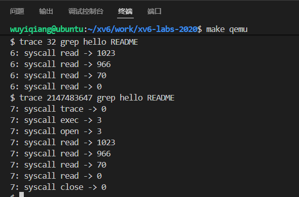
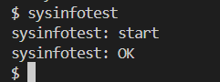
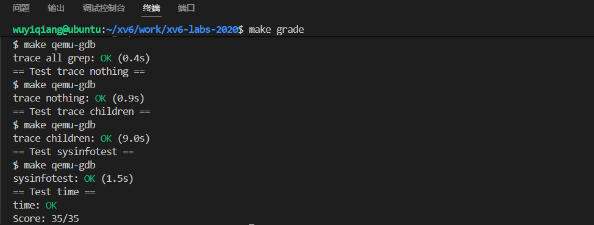

# lab2 syscall

## trace

### 实验要求

- 这个任务要求你添加一个tracing 系统调用，来帮你在后续lab中进行debug。
- 它接收一个int 类型的参数 mask，每一位都代表一个系统调用， 1 代表追踪，0则反之。

- 在系统调用返回值的时候你应该打印一行，包含如下信息：**pid 系统调用名 系统调用返回值**

- trace 系统调用可以跟踪调用它的进程以及它后续fork的子进程。


### 实验思路

（1）、根据提示在makefile中添加`$U/_trace\`使得makefile可以编译测试文件user/trace,c

```c
UPROGS=\
....
	$U/_zombie\
	$U/_trace\		

```

这个时候由于还未添加系统调用，编译（make qemu）无法通过。


（2）、注册一个新的系统调用

①、在user/user.h中声明一个用户层封装的系统调用（用户层调用分装的系统调用来调动内核中真正的系统调用）

```c
int trace(int);         //lab2 新增系统调用trace
```

②、在user/usys.pl这个脚本文件中添加系统调用汇编入口

```c
.....
entry("uptime");
entry("trace");		
```

注意用户态分装的系统调用并没有具体的函数实现，他是通过一个脚本文件usys.pl为系统调用trace生成一个汇编存根，执行封装的系统调用实际上是执行这一段汇编代码，代码具体如下：

usys.S：

```assembly
.global trace
trace:
 li a7, SYS_trace
 ecall
 ret
```

这一段汇编代码就算用户层分装的系统调用的具体实现，主要做的是将系统调用号SYS_trace存入a7寄存器。通过risk-v的ecall指令陷入内核。

③、在kernel/syscall.h中添加系统调用号

```c
...
#define SYS_close  21
#define SYS_trace  22       //lab2 新加系统调用号
```

④、在kernel/sysproc.c中添加系统调用的内核具体实现函数sys_trace

```c
//lab2 trace 系统调用的具体实现
uint64 sys_trace(void)
{
  return 0;
}
```

⑤、在kernel/syscall.c中声明跨文件函数，并在函数指针数组中添加如下;

```c
extern uint64 sys_trace(void);    //lab2

static uint64 (*syscalls[])(void) = {
[SYS_fork]    sys_fork,
......
[SYS_trace]   sys_trace,    //lab2
};

```

注意：`static uint64 (*syscalls[])(void)`表示一个函数指针数组：syscalls[]：表示syscalls是一个数组，*syscalls[]：表示这个数组里面存放的是指针，uint64 (*syscalls[])(void)：表示指针指向一个没有参数且返回值为uint64类型的函数。


（3）、在kernel/proc.h中为进程添加mask标志

```c
struct proc {
  char mask[23];   //lab2 trace追踪掩码
......
}
```

由于我们是根据用户传入参数int mask掩码按位来决定当前进程需要追踪哪个系统调用，如mask=32，那么对应的二进制是100000，也就是要追踪第五个系统调用read。

我们这里设置的mask数组中每一个槽都代表一个系统调用0位无效，一共22个


（4）、完善sys_trace

这里主要做的就是解析用户空间的传入参数mask，再将进程结构体中需要追踪的系统调用数组槽位置1。

```c
//lab2 trace 系统调用的具体实现
uint64 sys_trace(void)
{
  struct proc* p = myproc();
  int mask;
  if (argint(0, &mask) < 0)     //获取用户空间的传入参数
    return -1;
  for (int i = 0; i < 23; i++)    //获取每一个标志位
  {
    if ((mask >> i) & 0x01)
    {
      p->mask[i] = '1';
    } else {
      p->mask[i] = '0';
    }
  }
  return 0;
}
```

（5）、修改kernel/syscall.c中的syscall函数：

```c
void
syscall(void)
{
  int num;
  struct proc *p = myproc();

  num = p->trapframe->a7;
  if(num > 0 && num < NELEM(syscalls) && syscalls[num]) {
    p->trapframe->a0 = syscalls[num]();     
    //系统调用执行结束
    //lab2 通过掩码判断系统调用是否需要被追踪
    if (strlen(p->mask) > 0 && p->mask[num] == '1')    
    {
      //需要被追踪，打印，进程号 + 系统调用名 + 该次系统调用的返回值
      printf("%d: syscall %s -> %d\n", p->pid, syscall_name[num],p->trapframe->a0);
    }
  } else {
    printf("%d %s: unknown sys call %d\n",
            p->pid, p->name, num);
    p->trapframe->a0 = -1;
  }
}
```

注意：系统调用的返回值被存放再a0寄存器，到时候会返回给用户空间。

（6）、在kernel/proc.c中修改fork函数：

```c
int
fork(void)
{
.....
  np->sz = p->sz;

  np->parent = p;
  strncpy(np->mask, p->mask, sizeof(p->mask));      //lab2 将父进程的mask拷贝到子进程
....
}
```

### 结果测试




## sysinfo

### 实验要求

在该作业中，你需要添加一个 sysinfo 系统调用，用于收集系统运行时信息。这个系统调用接收一个参数：一个 struct sysinfo 的指针。内核填充该结构体的字段：

- freemem：设置为空闲内存的字节数
- nproc：设置为状态不是 UNUSED 的进程
- 提供的 sysinfotest 程序用来测试，如果你通过了，那么会打印：“sysinfotest: OK”.

### 实验思路

查看sysinfo结构体我们会发现它需要的是系统空闲内存数和当前系统运行的进程数量，所以我们需要先获取系统空闲的内存数和系统正在运行的进程数量

（1）、在kernel/proc.c中添加：get_proc_num，用于获取当前活跃的进程数

```c
//lab2 sysinfo 获取当前系统的proc数量
uint64 get_proc_num(void)
{
  uint64 cnt = 0;
  struct proc* p = myproc();
  for (p = proc; p < &proc[NPROC]; p++)   //遍历所有进程获取当前正在运行的进程数量
  {
    acquire(&p->lock);
    if (p->state != UNUSED) 
    {
      cnt++;
    }
    release(&p->lock);
  }
  return cnt;
}
```

（2）、在kernel/kalloc.c中添加

```c
//lab2 sysinfo 获取剩余内存大小
uint64 get_free_memory(void)
{
  uint64 cnt = 0;
  struct run* r = kmem.freelist;    //获取空闲页链表头结点
  acquire(&kmem.lock);
  while (r != 0)
  {
    cnt++;
    r = r->next;
  }
  release(&kmem.lock);
  return cnt * PGSIZE;
}
```

注意：xv6是通过一张页链表来维护内存的，我们只需要遍历页链表就知道剩余多少空闲内存空间了。

（3）、在kernel/defs.h中声明：

```c
uint64          get_proc_num(void);        //lab2
uint64          get_free_memory(void);        //lab2
```

（4）、注册一个新的系统调用

在user.h中添加：

```c
struct sysinfo;     //lab2
int sysinfo(struct sysinfo*);   //lab2 sysinfo
```

其他流程一样不在赘述...

（5）、在kernel/sysproc.c中实现内核的系统调用

```c
//lab2 sysinfo
uint64 sys_sysinfo(void)
{
  struct proc* p = myproc();
  struct sysinfo info;
  uint64 user_addr;
  if (argaddr(0,&user_addr) < 0)    //获取用户空间info的地址
    return -1;
  info.freemem = get_free_memory();
  info.nproc = get_proc_num();
  if (copyout(p->pagetable, user_addr, (char*)&info, sizeof(info)) < 0)  //user_addr用p->trapframe->a0也可以
  {
    return -1;
  } else {
    return 0;
  }
}
```

注意：这里由于内核空间和用户空间用的是不同的页表，想要把内核空间的数据拷贝到用户空间去需要用特定的函数copyout


### 结果测试



## 提交评分

