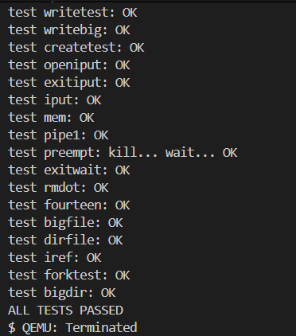
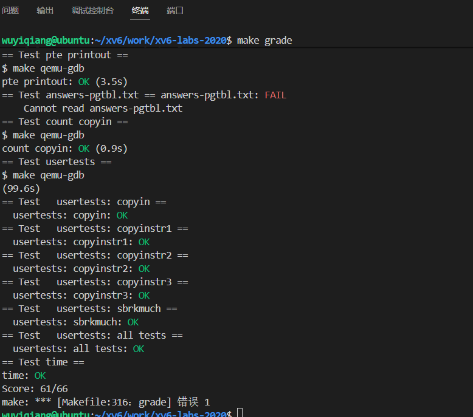

# lab3 page table

## Print a page table

- 实验要求：在第一个进程创建时打印一下进程的页表信息

实验代码：

在vm.c中添加：

```c
void _vmprint(pagetable_t pagetable, int level)
{
    //传入页表首地址，用level判断是几级页表
  for (int i = 0; i < 512; i++)	//遍历页表里的每一个pte
  {
    pte_t pte = pagetable[i];   
    if (pte & PTE_V)  //判断pte是否有效
    {
      switch (level)
      {
        case 1:
          printf("..");
          break;
        case 2:
          printf(".. ..");
          break;
        case 3:
          printf(".. .. ..");
          break;
      }
      uint64 child = PTE2PA(pte);    //得到下一级页表的首地址
      printf("%d: pte %p pa %p\n", i, pte, child);

      if ((pte & (PTE_W | PTE_X | PTE_R)) == 0)
      {
        //如果判断不是最后一级页表的pte
        //递归
        _vmprint((pagetable_t)child, level + 1);
      }
    }
  }
}
void vmprint(pagetable_t pagetable)
{
  printf("page table %p\n", pagetable);
  _vmprint(pagetable, 1);
}
```

在defs.h中声明

```c
void            vmprint(pagetable_t);
void            proc_kvmmap(pagetable_t, uint64, uint64, uint64, int);
```

由于实验要求在第一个进程创建时打印，进程在kernel/exec中创建，我们在其return前打印就行。

```c
.....
// Commit to the user image.
  oldpagetable = p->pagetable;
  p->pagetable = pagetable;
  p->sz = sz;
  p->trapframe->epc = elf.entry;  // initial program counter = main
  p->trapframe->sp = sp; // initial stack pointer
  proc_freepagetable(oldpagetable, oldsz);

  //打印页表信息
  if (p->pid == 1)
  {
    vmprint(p->pagetable);
  }
  return argc; // this ends up in a0, the first argument to main(argc, argv)
......
```

## A kernel page table per process

- 实验要求：xv6在启动的时候为内核创建了一张内核页表，并且在内核页表里为每个进程分配了内核栈，以及为系统启动做了一些必要的映射。所有进程共用一张内核页表。现在实验要求，在创建进程的时候创建一张属于进程自己的内核页表，每个进程都有一张，并且在进程运行的时候使用自己的内核页表。

- 实验思路：

  ①、要想为进程分配一张自己的内核页表那就必须在进程的pcb中添加一个内核页表属性：`pagetable_t kernelpt`

  ②、参考内核页表的初始化函数kvminit函数，在vm.c里创建一个进程页表初始化函数`void proc_kvminit()`，这里面不进行内核栈的映射，只进行一些设备文件的映射等等

  ③、参考procinit()函数发现内核栈由它创建，参考其代码在allocproc()中为每一个进程的内核页表映射一个自己的内核栈。这个时候进程的内核页表就创建好了。

  ④、参考进程调度函数scheduler()，在进程调度前我们需要写一个`proc_inithart(p->kernelpt)`把进程的内核页表写入satp中并且刷新TLB，在进程调度结束后调用`kvminithart()`刷新回内核页表。

  ⑤、在进程结束后要释放内核栈，并且删除进程的内核页表。这一步在freeproc()中完成

- 实验代码：

  (一)、修改proc.h中的proc结构体，添加

  ```c
  pagetable_t kernelpt;       //进程的内核页表
  ```

  (二)、在vm.c中创建proc_kvminit()

  ```c
  //kvmmap()函数原来使用的是内核页表，这里要添加参数让它使用用户页表
  void proc_kvmmap(pagetable_t kernelpt, uint64 va, uint64 pa, uint64 sz, int perm)
  {
    if(mappages(kernelpt, va, sz, pa, perm) != 0)
      panic("proc_kvmmap");
  }
  
  pagetable_t proc_kvminit()
  {
    pagetable_t kernelpt = (pagetable_t) kalloc();
    memset(kernelpt, 0, PGSIZE);
  
    // uart registers
    proc_kvmmap(kernelpt, UART0, UART0, PGSIZE, PTE_R | PTE_W);
  
    // virtio mmio disk interface
    proc_kvmmap(kernelpt, VIRTIO0, VIRTIO0, PGSIZE, PTE_R | PTE_W);
  
    // CLINT
    //kvmmap(CLINT, CLINT, 0x10000, PTE_R | PTE_W);
  
    // PLIC
    proc_kvmmap(kernelpt, PLIC, PLIC, 0x400000, PTE_R | PTE_W);
  
    // 内核起始地址直接映射，大小为内核的代码段
    proc_kvmmap(kernelpt, KERNBASE, KERNBASE, (uint64)etext-KERNBASE, PTE_R | PTE_X);
  
    // map kernel data and the physical RAM we'll make use of.（freememory+kerneldata段）
    proc_kvmmap(kernelpt, (uint64)etext, (uint64)etext, PHYSTOP-(uint64)etext, PTE_R | PTE_W);
  
    //用于映跳板页（用于内核和用户间切换）的地址，这个是非直接映射
    proc_kvmmap(kernelpt, TRAMPOLINE, (uint64)trampoline, PGSIZE, PTE_R | PTE_X);
    return kernelpt;
  }
  ```

  (三)、在proc.c里修改allocproc()函数

  先参考procinit（）,这里需要把p->kstack = va;注释掉，不然进程的内核栈会识别到内核页表里去

  ```c
  void
  procinit(void)
  {
    struct proc *p;
    
    initlock(&pid_lock, "nextpid");
    for(p = proc; p < &proc[NPROC]; p++) {
        initlock(&p->lock, "proc");
  
        // Allocate a page for the process's kernel stack.
        // Map it high in memory, followed by an invalid
        // guard page.
        char *pa = kalloc();
        if(pa == 0)
          panic("kalloc");
        uint64 va = KSTACK((int) (p - proc));
        kvmmap(va, (uint64)pa, PGSIZE, PTE_R | PTE_W);
        //p->kstack = va;
    }
    kvminithart();
  }
  ```

  修改allocproc(),添加如下：

  ```c
  ... 
  // An empty user page table.
    p->pagetable = proc_pagetable(p);
    if(p->pagetable == 0){
      freeproc(p);
      release(&p->lock);
      return 0;
    }
    //创建一张进程的内核页表
    p->kernelpt = proc_kvminit();
    if(p->kernelpt== 0){
      freeproc(p);
      release(&p->lock);
      return 0;
    }
    //为进程创建内核栈
    char *pa = kalloc();		
    if(pa == 0)			//物理内存耗尽		
      panic("kalloc");
    uint64 va = KSTACK(0);  //每一个进程自己的内核页表只有一个内核栈
    proc_kvmmap(p->kernelpt, va, (uint64)pa, PGSIZE, PTE_R | PTE_W);	//这里可以看出有4KB的虚拟地址是保护页
    p->kstack = va;		//将进程的内核栈地址写入pcb进程控制块中
    
    // Set up new context to start executing at forkret,
    // which returns to user space.
    memset(&p->context, 0, sizeof(p->context));
    p->context.ra = (uint64)forkret;
    p->context.sp = p->kstack + PGSIZE;
  
    return p;
  ```

  (四)、在schedule中进程调度前将进程的内核页表写入satp，刷新TLB,调度结束后切回内核页表

  ```c
  if(p->state == RUNNABLE) {
          // Switch to chosen process.  It is the process's job
          // to release its lock and then reacquire it
          // before jumping back to us.
  
          proc_inithart(p->kernelpt);   //进程运行时使用进程自己的内核页表
         
          p->state = RUNNING;
          c->proc = p;
           // 上下文切换：从调度器切换到进程
          swtch(&c->context, &p->context);  
        	//进程调度结束
          // Process is done running for now.
          // It should have changed its p->state before coming back.
          //进程结束后，把内核的页表刷新回TLB
          kvminithart();
  
          c->proc = 0;
          found = 1;
        }
  ```

  

  (五)、在proc.c里修改freeproc函数

  ```c
  ...
  if(p->pagetable)
      proc_freepagetable(p->pagetable, p->sz);
    //释放内核栈
    if (p->kstack)
      uvmunmap(p->kernelpt, p->kstack, 1, 1);	//这个函数是用来释放第三级页表的pte对应的物理内存的，不会删除页表本身
    p->kstack = 0;
    //删除页表
    if(p->kernelpt)
      proc_free_kernelpt(p->kernelpt);
    p->kernelpt = 0;
    
    p->pagetable = 0;
    p->sz = 0;
  ...
  ```

  参考free_walk，在vm.c中添加`proc_free_kernelpt()`来删除页表

```c
void proc_free_kernelpt(pagetable_t kernelpt)
{
  for (int i = 0; i < 512; i++)
  {
    pte_t pte = kernelpt[i];
    if (pte & PTE_V)
    {
      kernelpt[i] = 0;    //保证被释放的页里面全是填充0
      if ((pte & (PTE_R | PTE_X | PTE_W)) == 0)
      {
        //不是第三级页表
        uint64 child = PTE2PA(pte);
        proc_free_kernelpt((pagetable_t)child);
      }
    }
  }
  kfree((void*)kernelpt);   //释放当前页表
}
```

注意：在vm.c里面添加的所有函数都要申明在defs.h中

(六)、修改kvmpa函数,记得函数声明也要修改。

```c
uint64
kvmpa(pagetable_t kernel_pt, uint64 va)
{
  uint64 off = va % PGSIZE;
  pte_t *pte;
  uint64 pa;
  
  pte = walk(kernel_pt, va, 0);
  if(pte == 0)
    panic("kvmpa");
  if((*pte & PTE_V) == 0)
    panic("kvmpa");
  pa = PTE2PA(*pte);
  return pa+off;
}
```

virtio_disk_rw中调用了kvmpa,也要修改。这一部分应该跟磁盘有关，后续会学吧。

```c
void
virtio_disk_rw(struct buf *b, int write)
{	
	//...
	disk.desc[idx[0]].addr = (uint64) kvmpa(myproc()->kernelpagetable, (uint64) &buf0);
	//...
}
```

（七）、测试：

运行make qemu，执行usertests




## Simplify copyin/copyinstr

- 首先了解这个实验是要干什么：

  ​	对于xv6，它在内核里为自己维护了一个内核页表，这个内核页表存放在内核空间，所有进程在进行系统调用的时候mmu会使用这个页表，**这个页表只有内核空间虚拟地址的映射**，属于所有进程共享的。对于每个进程而言，他们各自维护着一个自己的页表，当系统运行在用户空间时mmu会使用这张页表，**这张页表里只有用户空间的虚拟地址的映射**。内核空间映射的是内核页表的高地址部分，用户空间映射的是用户页表的低地址部分，所以我们在内核空间的时候想要读取用户空间的数据，如果我们直接读取页表的低地址部分，系统会显示页表未映射，因为我们使用的是内核页表，这张页表的低地址部分压根没有映射过，所以copyin的操作是在内核空间通过walk函数来把用户空间的虚拟地址翻译成物理地址，再把物理地址上的数据拷贝到内核空间，及其麻烦！！！

  ​	先了解正常情况下：进程在被调度之前系统把内核页表写到了satp里面，在进程被调度的时候，scheduler（）里的switch函数会执行sret指令将satp切换到进程的用户页表，这个时候mmu使用的是进程的用户页表，在进程进行系统调用的时候陷入trap会把内核页表加载到satp中，这个时候mmu使用的是内核页表。

  ​	那么这个实验要干什么呢？上一个实验为进程创建了一个自己的内核页表，并且对内核空间的虚拟地址进行映射，那么现在要干的是把进程的用户页表也拷贝到进程的内核页表上去。使得一张页表里同时有内核空间的映射和用户空间的映射。shceduler（）进程调度之前把进程专属的内核页表写入satp（这个时候进程自己的内核页表就相当于之前的所有进程共享的内核页表）。好，那么进程开始运行，进行系统调用的时候，mmu使用的是进程的内核页表，这张页表相比于全部进程共享的内核页表优势是这张页表有用户空间虚拟地址的映射。这个时候copyin函数想要从用户空间将数据拷贝到内核空间可以直接用虚拟地址（因为mmu可以通过这张页表解析出用户空间虚拟地址对应的物理内存），而不用再调用walk函数解析虚拟地址了。此外这张页表会被放在TLB（高速缓存中）使得效率显著提高。

- 实验思路：

  ①、按照要求修改copyin和copystr

  ②、参考fork()里面的uvmcopy(),编写一个函数`int u2kvmcopy(pagetable_t userpt, pagetable_t kernelpt, uint64 start, uint64 sz)`用于将进程的用户页表拷贝到进程的内核页表里去。

  ③、涉及到进程的有三个地方：`exec()`，`fork()`，`userinit()`，需要在三个函数里面调用u2vmcopy。

  ④、sbrk()是用来扩展进程用户空间的大小的，扩展用户空间的同时，修改了进程的用户页表，所以进程的内核页表也要跟着修改，但是由于内核页表里面有内核空间的映射，根据提示用户空间有可能会覆盖到PLIC,所有这个地方要做一个判断。

  ...其实还有很多微操。

- 实验代码：

(一)、按照要求将copyin，copystr该成copyin_new,copyinstr_new

```c
int copyin(pagetable_t pagetable, char *dst, uint64 srcva, uint64 len)
{
  return copyin_new(pagetable, dst, srcva, len);
}
int copyinstr(pagetable_t pagetable, char *dst, uint64 srcva, uint64 max)
{
 return copyinstr_new(pagetable, dst, srcva, max);
}
```

这里的copyin_nwe直接将用户虚拟地址上的数据拷贝到内核虚拟地址上。需要在defs.h中声明这两个函数

(二)、参考fork()里面的uvmcopy(),编写一个函数`int u2kvmcopy(pagetable_t userpt, pagetable_t kernelpt, uint64 start, uint64 sz)`用于将进程的用户页表拷贝到进程的内核页表里去。

```c
//将用户页表拷贝到内核页表,start是起始位置，sz是大小
int u2kvmcopy(pagetable_t userpt, pagetable_t kernelpt, uint64 start, uint64 sz)
{
  pte_t *pte;
  uint64 pa, i;
  uint flags;
  uint64 start_page = PGROUNDUP(start);   //start是userpt里的虚拟地址，从整数页开始映射
  for(i = start_page; i < start + sz; i += PGSIZE){
    if((pte = walk(userpt, i, 0)) == 0)
      panic("uvmcopy: pte should exist");
    if((*pte & PTE_V) == 0)
      panic("uvmcopy: page not present");
    pa = PTE2PA(*pte);
    flags = PTE_FLAGS(*pte) & (~PTE_U);   //清除用户标志位否则内核无法访问
    //在进程自己的内核页表里添加对这一块物理内存的映射，不同的虚拟地址可以映射同一个物理地址
    if(mappages(kernelpt, i, PGSIZE, pa, flags) != 0){
      goto err;
    }
  }
  return 0;

 err:
  uvmunmap(kernelpt, start_page, (i - start_page) / PGSIZE, 0);
  //第四个参数写0，由于没有添加新的物理内存所以不用释放，释放了反而会导致进程的用户页表访问不到这块物理内存
  return -1;
}
```

(三)、修改fork，exec，userinit

fork:

```c
int
fork(void)
{
  int i, pid;
  struct proc *np;
  struct proc *p = myproc();

  // Allocate process.
  if((np = allocproc()) == 0){
    return -1;
  }

  // Copy user memory from parent to child.
  if(uvmcopy(p->pagetable, np->pagetable, p->sz) < 0){
    freeproc(np);
    release(&np->lock);
    return -1;
  }
  np->sz = p->sz;
  //将子进程里面用户页表拷贝到内核页表里去
  if(u2kvmcopy(np->pagetable, np->kernelpt, 0, np->sz) < 0){
    freeproc(np);
    release(&np->lock);
    return -1;
  }

  np->parent = p;

  // copy saved user registers.
  *(np->trapframe) = *(p->trapframe);

  // Cause fork to return 0 in the child.
  np->trapframe->a0 = 0;

  // increment reference counts on open file descriptors.
  for(i = 0; i < NOFILE; i++)
    if(p->ofile[i])
      np->ofile[i] = filedup(p->ofile[i]);
  np->cwd = idup(p->cwd);

  safestrcpy(np->name, p->name, sizeof(p->name));

  pid = np->pid;

  np->state = RUNNABLE;

  release(&np->lock);

  return pid;
}
```

exec：

```c
int exec(char *path, char **argv)
{
	...
  // Commit to the user image.
  oldpagetable = p->pagetable;
  p->pagetable = pagetable;
  p->sz = sz;
  p->trapframe->epc = elf.entry;  // initial program counter = main
  p->trapframe->sp = sp; // initial stack pointer
  proc_freepagetable(oldpagetable, oldsz);
  //exec把原来的进程替换为新的进程，会为新进程创建一张用户页表，所以要先解除原进程内核页表的映射
  //将用户页表的新映射拷贝到内核页表上去
  uvmunmap(p->kernelpt, 0, PGROUNDUP(oldsz)/PGSIZE, 0);
  if (u2kvmcopy(p->pagetable, p->kernelpt, 0, p->sz) < 0)
  {
    goto bad;
  }
  
  //打印页表信息
  if (p->pid == 1)
  {
    vmprint(p->pagetable);
  }
  return argc; // this ends up in a0, the first argument to main(argc, argv)

 bad:
  if(pagetable)
    proc_freepagetable(pagetable, sz);
  if(ip){
    iunlockput(ip);
    end_op();
  }
  return -1;
}
```

userinit：

```c
void userinit(void)
{
  struct proc *p;

  p = allocproc();
  initproc = p;
  
  // allocate one user page and copy init's instructions
  // and data into it.
  uvminit(p->pagetable, initcode, sizeof(initcode));
  p->sz = PGSIZE;
  //将页表拷贝一份到内核页表里去
  u2kvmcopy(p->pagetable, p->kernelpt, 0, p->sz);

  // prepare for the very first "return" from kernel to user.
  p->trapframe->epc = 0;      // user program counter
  p->trapframe->sp = PGSIZE;  // user stack pointer

  safestrcpy(p->name, "initcode", sizeof(p->name));
  p->cwd = namei("/");

  p->state = RUNNABLE;

  release(&p->lock);
}
```

(四)、xv6使用系统调用sbrk()来进行对进程用户空间的扩展，添加了进程内核页表，在扩展的时候也要同步修改内核页表

进程空间收缩时，需要将进程的内核页表收缩，可以参考uvmdealloc，但是要注意不要释放物理内存，否则会造成内存重复释放（因为在收缩用户页表的时候已经释放过了，这里只需要删除页就行）

```c
uint64 kvmdealloc(pagetable_t kernelpt, uint64 oldsz, uint64 newsz)
{
  if(newsz >= oldsz)
    return oldsz;

  if(PGROUNDUP(newsz) < PGROUNDUP(oldsz)){
    int npages = (PGROUNDUP(oldsz) - PGROUNDUP(newsz)) / PGSIZE;
    uvmunmap(kernelpt, PGROUNDUP(newsz), npages, 0);  //这里只是把页表删除不能释放物理页了。
  }

  return newsz;
}
```

修改growproc函数：

```c
int growproc(int n)
{
  uint sz;
  struct proc *p = myproc();

  sz = p->sz;
  if(n > 0){
    //判断用户空间虚拟地址不能超过PLIC
    if (sz + n > PLIC)
      return -1;
    
    if((sz = uvmalloc(p->pagetable, sz, sz + n)) == 0) {
      return -1;
    }
    //进程内核页表也要扩展,从原页表的边界开始
    if (u2kvmcopy(p->pagetable, p->kernelpt, p->sz, n) < 0)
    {
      return -1;
    }
  } else if(n < 0){
    uvmdealloc(p->pagetable, sz, sz + n);
    sz = kvmdealloc(p->kernelpt, sz, sz + n);   //上面一个函数释放过物理内存，这里不能再释放了，就简单对kernelpt做一下页删除
  }
  p->sz = sz;
  return 0;
}
```

## 测试

