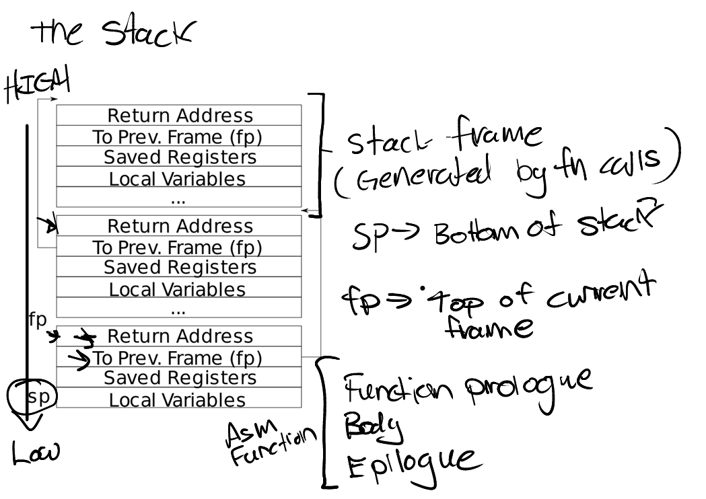
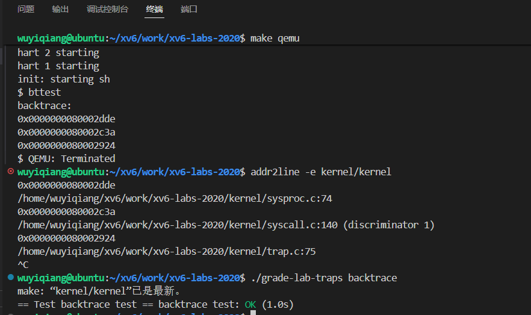
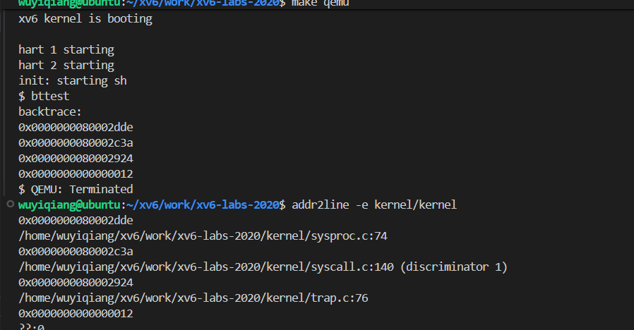
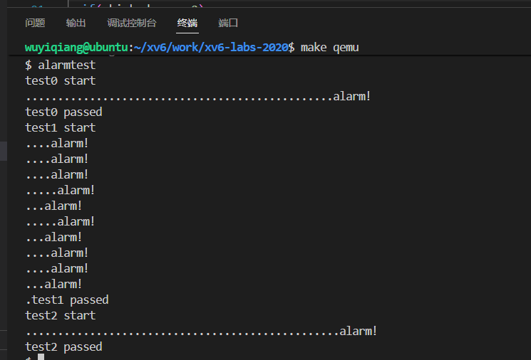
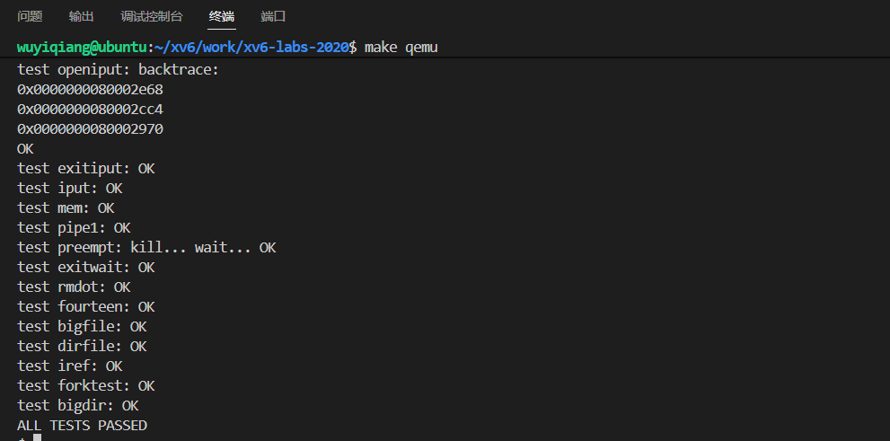
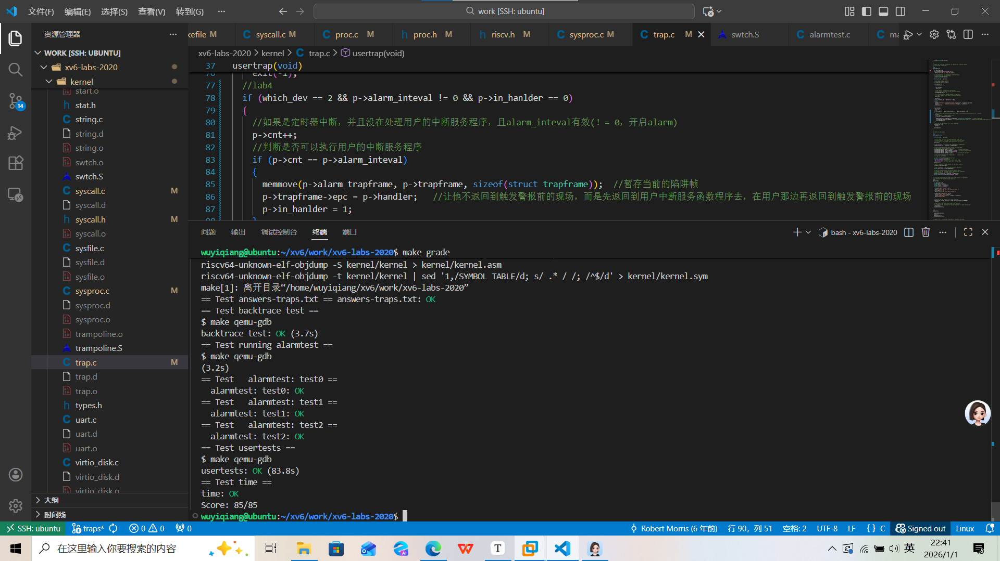

# lab4 trap

## RISC-V assembly

call.asm分析：

1、auipc指令：计算一个32位的地址

​	auipc rd, imm20 	rd = PC + (imm20 << 12)一个20位的立即数被左移12位（x2096）+pc然后赋值给rd寄存器

2、jalr 命令：

​	jalr	1510(ra)

做两件事：跳转到ra + 1510 = 0x30 + 0x5E6 = 0x616去执行函数；将下一条指令的地址（0x34）保存到ra寄存器，在函数结束后会有一个ret指令让他返回到ra

```c
0000000000000000 <g>:
#include "kernel/param.h"
#include "kernel/types.h"
#include "kernel/stat.h"
#include "user/user.h"

int g(int x) {
   0:	1141                	addi	sp,sp,-16	//为函数g()分配16字节的栈帧
   2:	e422                	sd	s0, 8(sp)	//将上一个函数的帧寄存器写入当前栈帧，栈顶偏移8字节位置
   4:	0800                	addi	s0,sp,16	//设置新的帧指针 s0，指向当前栈帧的底部s0 = sp + 16
  return x+3;
}								//准备返回
   6:	250d                	addiw	a0,a0,3		//a0 = a0 + 3
   8:	6422                	ld	s0,8(sp)		//将上一个函数的帧指针写回s0
   a:	0141                	addi	sp,sp,16	//释放栈空间
   c:	8082                	ret					//返回

000000000000000e <f>:

int f(int x) {
   e:	1141                	addi	sp,sp,-16	//开辟16字节的栈空间
  10:	e422                	sd	s0,8(sp)		
  12:	0800                	addi	s0,sp,16
  return g(x);
}
  14:	250d                	addiw	a0,a0,3	//函数内联，这里调用g()本来应该为g函数开辟一个栈帧，但是由										//于g函数太过简单，这里编译器直接解析出来了直接指向g函数的语句
  16:	6422                	ld	s0,8(sp)	//将上一个函数的帧指针写回s0
  18:	0141                	addi	sp,sp,16	////释放栈空间
  1a:	8082                	ret

000000000000001c <main>:

void main(void) {
  1c:	1141                	addi	sp,sp,-16	//为main函数开辟16字节的栈空间
  1e:	e406                	sd	ra,8(sp)		//将函数的返回地址ra写到栈上
  20:	e022                	sd	s0,0(sp)		//将上一个帧指针保存到栈上
  22:	0800                	addi	s0,sp,16	//设置新的帧指针指向栈底（高地址）
  printf("%d %d\n", f(8)+1, 13);
  24:	4635                	li	a2,13
  26:	45b1                	li	a1,12		//函数内联编译器计算出 f(8)+1 = 8+3+1 = 12，直接将 12 												//加载到 a1。
  28:	00000517          	auipc	a0,0x0	//a0 = 0x28 + (0x0 << 12) = 0x0
  2c:	7a850513          	addi	a0,a0,1960 	//a0 = a0 + 1960(0x7A9) = 0x7D0
      										//最终, a0 寄存器中存放的就是字符串 "%d %d\n" 的绝对地址。
  30:	00000097          	auipc	ra,0x0	//ra = 0x30 + (0x00 << 12) = 0x30
  34:	5e6080e7          	jalr	1510(ra) #0x616
      //做两件事：第一，将下一条指令的地址保存到ra寄存器，用于printf返回
      //第二，跳转到ra + 1510 = 0x30 + 0x5E6 = 0x616去执行printf；在printf结束后会有一个ret指令让他返回到ra
  exit(0);
  38:	4501                	li	a0,0
  3a:	00000097          	auipc	ra,0x0	//ra = 0x3a
  3e:	274080e7          	jalr	628(ra) // 2ae <exit>
      									//ra = 0x42;0x3a + 628 = 0x2AE     									
```

（1）、Which registers contain arguments to functions? For example, which register holds 13 in main's call to `printf`?

answer：a0 ~ a7寄存器保存函数的参数；main中的printf中的第三个参数13保存在a2寄存器

（2）、在 main 函数的汇编代码中，对函数 f 的调用在哪里？对 g 的调用又在哪里？（提示：编译器可能会内联函数。）

answer：函数内联，由于函数f和g过于简单，编译器自动优化，将被调函数代码直接插入到调用者函数中，并没有执行函数调用

（3）、函数 printf 位于哪个地址？

answer：0x616

（4）、在 main 函数中执行 jalr 到 printf 之后，寄存器 ra 中的值是什么？

answer：是下一条指令的地址0x38

（5）、在接下来的代码中，接下来会打印什么？（注：答案不是具体的值。）为什么会发生这种情况？`'y='`

```
printf("x=%d y=%d", 3);
```

由于第二个参数没有写入，printf默认从a2寄存器里面取值；printf的参数是从a1，a2，a3...里面取出的。a0存放的是字符串"x=%d y=%d"的地址


## Backtrace

### 实验准备

（1）、什么是栈帧，什么是帧指针、什么是ra？



- 栈帧：xv6中内核栈的大小为一页（4096字节），栈是自上而下生长的，函数每次调用一个新的函数都会在栈中开辟一个新的栈帧，新的栈帧会跟在旧栈帧后面（低地址）。
- 帧指针：函数会将自己的帧指针存放在s0寄存器，这个帧指针是用来索引栈帧的（帧指针通常指向栈帧底（高地址）），函数通过帧指针+偏移来索引栈帧上的数据；被调函数会把调用函数的帧指针暂时保存到自己的栈帧中。保存的位置是帧指针-16（栈底向低地址偏移16）。
- ra寄存器：函数会将自己的下一条指令的地址存放到ra里面作为被调函数的返回地址；被调函数会将其返回地址暂时存放到自己的栈帧中（位置是帧指针-8），然后同时把自己的地址存放到ra（因为可能需要调用其他函数），当被调函数执行完之后会从栈帧中恢复返回地址，ret指令查询ra寄存器返回调用函数。

（2）、宏函数 PGROUNDUP()和 PGROUNDDOWN()

-  PGROUNDUP(fp)：查询虚拟地址所在页的下一页首地址，比如PGROUNDUP(1) = 4096
-  PGROUNDDOWN(fp)：查询虚拟地址所在页的首地址

### 实验要求及思路

（1）、实验要求：编写一个回溯函数，打印出调用该回溯函数的函数的返回地址，从而可以了解函数的调用关系。

（2）、实验思路：

1、在函数backtrace里面调用r_fp()来获取回溯函数的帧指针，再通过帧指针来索引当前函数的返回地址（sp-8）和旧的帧指针（sp-16），然后利用旧的帧指针得到上一个函数的返回地址......就这样一直回溯。

2、那么怎么结束回溯呢。可以先取得backtrace函数的帧指针所在页的页首和页尾，然后判断旧的帧指针是否在这个页的范围内，是的话就会一直打印函数返回地址。

（3）、实验代码

- 在kernel/defs.h中声明

```c
// printf.c
void            printf(char*, ...);
void            panic(char*) __attribute__((noreturn));
void            printfinit(void);
void            backtrace(void);	//回溯
```

- 在kernel/riscv.h中添加函数

```c
//GCC编译器将当前正在执行的函数的帧指针保存在s0寄存器
//将s0寄存器的值移到当前函数变量x中
static inline uint64
r_fp()
{
  uint64 x;
  asm volatile("mv %0, s0" : "=r" (x) );
  return x;
}
```

- 在printf.c中添加回溯函数

```c
//回溯函数
void backtrace(void)
{
  printf("backtrace:\n");
  uint64 fp = r_fp();     //得到backtrace的帧指针
  uint64 up = PGROUNDUP(fp);  
  uint64 down = PGROUNDDOWN(fp);   
  while (fp < up && fp > down)  //如果超出了内核栈不在回溯，这里不加<=是因为usertrap()的帧指针指向up位置     
  {
    uint64 ret_addr = *(uint64*)(fp - 8);   //得到函数的返回地址
    printf("%p\n", ret_addr);
    fp = *(uint64*)(fp - 16);       //得到旧的帧指针
  }
}
```

- 在kernel/sysproc.c中的sys_sleep函数中调用

```c
uint64
sys_sleep(void)
{
  int n;
  uint ticks0;

  if(argint(0, &n) < 0)
    return -1;
  acquire(&tickslock);
  ticks0 = ticks;
  while(ticks - ticks0 < n){
    if(myproc()->killed){
      release(&tickslock);
      return -1;
    }
    sleep(&ticks, &tickslock);
  }
  release(&tickslock);
  backtrace();    //调用回溯
  return 0;
}
```

### 结果测试

```c
make qeum
bttest

./grade-lab-traps backtrace
```



- 从结果可以看出这个回溯打印的是backtrace，sys_sleep，syscall这三个函数的返回地址，并没有打印usertrap的返回地址，说明usertrap这个函数的帧指针不符合这个循环条件，那么他的帧指针是什么呢？

​	由trap机制可以看出来uservec这段汇编会将sp指向内核栈的栈底，也即是内核栈的最高地址，然后跳转到usertrap()而usertrap()的函数序言就是创建栈帧将函数的帧指针sp保存到s0（此时sp指向栈底），所以说明usertrap的帧指针是`PGROUNDUP(fp)`,而在我的代码里没有对这个地址解析判断所以导致usertrap的帧指针被判定为无效。

- 那么usertrap的返回地址和它栈帧上保存的旧的帧指针是什么？

​	通过把页边界加入循环判断可以发现它打印出了4条函数返回地址，最后一条是usertrap()的返回地址，由于他的调用函数是汇编uservec所以没有解析出来！




## alarm

### 实验思路及要求

- 实验要求：编写一个alarm来记录当前进程接收到的定时器中断次数，设置一个报警阈值，当中断次数达到阈值的时候执行用户程序进行报警。
- 实验思路：

（1）、由于每次触发定时器中断cpu都会切换去执行其他进程，所以我们要在进程结果体里面创建一个属性参数来记录当前进程触发定时器中断的次数，以及中断报警阈值和用户中断服务函数地址。

（2）、根据提示需要创建一个系统调用来开启alarm，故创建函数`int sigalarm(int, void(*handler)());`第一个参数用来记录中断报警阈值，第二个参数是用户中断服务函数地址。主要是实现在内核空间将这两个用户空间的参数写入进程结构体指针中。

（3）、每次触发定时器中断都会执行usertrap，故可以在usertrap里面记录中断次数，待达到阈值的时候跳转去执行用户中断服务函数。

（4）、怎么跳转去执行用户中断服务函数呢，分析trap流程知道userret会读去当前进程陷阱帧里面的epc然后sret到相应的地址去执行，所以我们要将进程陷阱帧里的epc修改为用户中断服务函数的地址，让触发警报时trap执行完之后去执行用户中断服务函数。这里需要再创建一个陷阱帧来暂存原来的epc。

（5）、执行完用户中断服务程序之后怎么返回到触发警报之前的现场呢？观察用户中断服务程序，再最后一行调用了sigreturn这个系统调用，系统调用会再次进入trap，我们只需要让这一次trap返回到触发警报之前的现场就行，所以sigreturn执行的应该是恢复现场的功能。

### 实验代码

1、在user/user.h中申明

```c
int sigalarm(int, void(*handler)());    //lab4
int sigreturn(void);     //lab4
```

2、更新user/usys.pl添加两个函数入口

```c
entry("sigalarm");
entry("sigreturn");
```

3、在kernel/syscall.h添加系统调用编号

```c
#define SYS_sigalarm  22
#define SYS_sigreturn 23
```

4、在 kernel/syscall.c 中添加声明和定义

```c
extern uint64 sys_sigalarm(void);   //lab4
extern uint64 sys_sigreturn(void);  //lab4
...
[SYS_sigalarm]  sys_sigalarm, //lab4
[SYS_sigreturn] sys_sigreturn,  //lab4
```

5、在kernel/proc.h的struct proc添加如下

```c
struct proc {
  struct spinlock lock;

  // p->lock must be held when using these:
  enum procstate state;        // Process state
  struct proc *parent;         // Parent process
  void *chan;                  // If non-zero, sleeping on chan
  int killed;                  // If non-zero, have been killed
  int xstate;                  // Exit status to be returned to parent's wait
  int pid;                     // Process ID

  // these are private to the process, so p->lock need not be held.
  uint64 kstack;               // Virtual address of kernel stack
  uint64 sz;                   // Size of process memory (bytes)
  pagetable_t pagetable;       // User page table
  struct trapframe *trapframe; // data page for trampoline.S
  struct trapframe *alarm_trapframe;   //<用于保存之前的陷阱帧>
  struct context context;      // swtch() here to run process
  struct file *ofile[NOFILE];  // Open files
  struct inode *cwd;           // Current directory
  char name[16];               // Process name (debugging)

  uint64 handler;              //<用户中断服务函数虚拟地址>
  int cnt;                     //<时间滴答>
  int alarm_inteval;           //<报警阈值：触发定时器中断时间间隔>
  int in_hanlder;              //<标志位，标志是否处于中断函数中,避免重复出发>
};

```

6、 在kernel/proc.c的allocproc()，freeproc()

```c
static struct proc*
allocproc(void)
{
  struct proc *p;

  for(p = proc; p < &proc[NPROC]; p++) {
    acquire(&p->lock);
    if(p->state == UNUSED) {
      goto found;
    } else {
      release(&p->lock);
    }
  }
  return 0;

found:
  p->pid = allocpid();

  //lab4 初始化alarm参数
  if((p->alarm_trapframe = (struct trapframe *)kalloc()) == 0){
    release(&p->lock);
    return 0;
  }
  p->alarm_inteval = 0;
  p->cnt = 0;
  p->handler = 0;
  p->in_hanlder = 0;  //不在执行中断

  // Allocate a trapframe page.
  if((p->trapframe = (struct trapframe *)kalloc()) == 0){
    release(&p->lock);
    return 0;
  }

  // An empty user page table.
  p->pagetable = proc_pagetable(p);
  if(p->pagetable == 0){
    freeproc(p);
    release(&p->lock);
    return 0;
  }

```

```c
static void
freeproc(struct proc *p)
{
  if(p->trapframe)
    kfree((void*)p->trapframe);
  p->trapframe = 0;
  if(p->pagetable)
    proc_freepagetable(p->pagetable, p->sz);
  p->pagetable = 0;
  p->sz = 0;
  p->pid = 0;
  p->parent = 0;
  p->name[0] = 0;
  p->chan = 0;
  p->killed = 0;
  p->xstate = 0;
  p->state = UNUSED;

  //lab4
  if(p->alarm_trapframe)          
    kfree((void*)p->alarm_trapframe);
  p->cnt = 0;
  p->in_hanlder = 0;
  p->alarm_inteval = 0;
  p->handler = 0;
  p->alarm_trapframe = 0;
}
```

7、在kernel/sysproc.添加系统调用具体实现sys_sigalarm

```c
//lab4
uint64 sys_sigalarm(void)
{
  if (argint(0, &myproc()->alarm_inteval) < 0)   //传入的第一个参数是触发定时器中断的时间间隔
    return -1;
  if (argaddr(1, &myproc()->handler) < 0)    
    return -1;
  return 0;
}


```

8、修改kernel/trap.c

```c
void
usertrap(void)
{
......
  if(p->killed)
    exit(-1);
  //lab4
  if (which_dev == 2 && p->alarm_inteval != 0 && p->in_hanlder == 0)
  {
    //如果是定时器中断，并且没在处理用户的中断服务程序，且alarm_inteval有效(！= 0，开启alarm)
    p->cnt++;
    //判断是否可以执行用户的中断服务程序
    if (p->cnt == p->alarm_inteval)
    {
      memmove(p->alarm_trapframe, p->trapframe, sizeof(struct trapframe));  //暂存当前的陷阱帧
      p->trapframe->epc = p->handler;   //让他不返回到触发警报前的上下文，而是先返回到用户中断服务函数程序去，在用户那边再返回到触发警报前的现场
      p->in_hanlder = 1; 
    }
  }
  // give up the CPU if this is a timer interrupt.
  if(which_dev == 2)
    yield();

  usertrapret();
}
```

9、在kernel/sysproc.添加系统调用具体实现sys_sigreturn

```c
uint64 sys_sigreturn(void)
{
  //用户中断服务程序在结束的时候会调用sigreturn系统调用，这个时候ecall会把sigreturn的现场写道sepc
  //进入trap之后，usertrap会把sepc+4写入陷阱帧用于userret的sret返回
  //而我们需要返回到触发警报之前的现场，所以我们需要修改陷阱帧的sepc,alarm_trapframe存储的就是触发警报之前的现场
  
  struct proc *p = myproc();
  memmove(p->trapframe, p->alarm_trapframe, sizeof(struct trapframe));
  p->cnt = 0;
  p->in_hanlder = 0;
  return 0;
}
```

### 测试

```c
make qeum
alarmtest
usertests
```





### 提交评分



