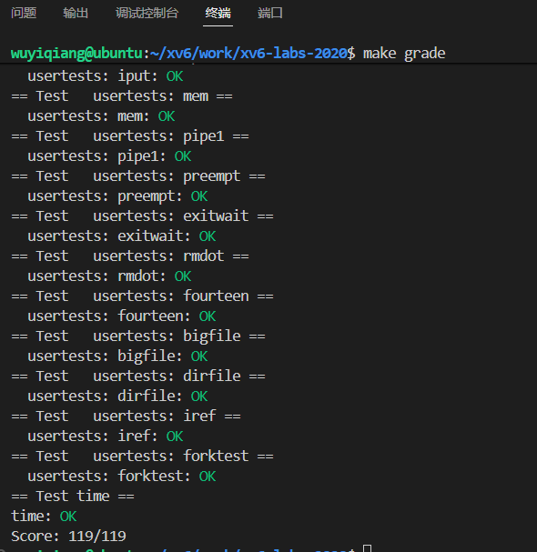

# lazy allocation

## Eliminate allocation from sbrk()

- 实验思路：sbrk()这个系统调用为进程扩展空间，原sbrk()在扩展虚拟空间的同时也会同时分配物理内存，现在要实现惰性分配则只需要为进程分配虚拟地址就行，也就是修改p->sz参数，将原有分配物理内存的growproc(n)注释，等到tarp时再为其分配物理空间。

- 实验代码

修改kernel/sysproc.c

```c
uint64
sys_sbrk(void)
{
  int addr;
  int n;

  if(argint(0, &n) < 0)
    return -1;
  addr = myproc()->sz;
  myproc()->sz += n;
  //if(growproc(n) < 0)
  //  return -1;
  return addr;
}
```


## Lazy allocation

### 实验要求

- 需要在usertrap中处理页错误，未还未映射的页分配物理内存

### 实验思路

（1）、根据提示在usertrap中判断scause寄存器的值是否为13或15，如果是则作出相应处理

（2）、参考uvmalloc程序为其分配新的物理页。读取stval寄存器（存放未映射的虚拟地址），将其映射到物理地址上。

注意：在usertrap中如果是系统调用的话他会有sepc+4，trap返回的时候会执行下一条指令；而这里是由于指令出错进的tarp所以tarp返回要再执行一下出错指令，故不能+4。

(3)、修改uvmunmap。进程结束的时候会调用freeproc，而freeproc会调用这个函数来释放物理页；查看uvmunmap

```c
if((pte = walk(pagetable, a, 0)) == 0)
	panic("uvmunmap: walk");
if((*pte & PTE_V) == 0)
	panic("uvmunmap: not mapped");
```

walk最后一个参数为0表示如果虚拟地址对应的页表不存在则不创建直接返回0

①、PTE==0：这个说明压根没有L0页表，其原因是L1的pte无效或者L1不存在，L2是根页表只有一张一定会存在

②、(*pte & PTE_V) == 0：说明页表存在就是PTE无效他没有映射到物理内存上。

这里由于我们在sbrk（）分配了虚拟地址但是没有进行映射，所以在进程结束的时候释放内存的时候会导致panic，所以在uvmumap中我们应对没有映射的虚拟地址应该跳过不处理。

### 实验代码

（1）、修改kernel/trap.c中usertrap

```c
void
usertrap(void)
{
  ......
  } else if((which_dev = devintr()) != 0){
    // ok
  } else if (r_scause() == 13 || r_scause() == 15)
  {
    //lab5,页错误
    uint64 va = r_stval();   //读取未映射的虚拟地址
    uint64 pa = 0;
    if ((pa = (uint64)kalloc()) != 0) //每次分配一页物理内存
    {
      //虚拟地址有效并且物理内存未耗尽
      va = PGROUNDDOWN(va);   //页对齐;虽然下面mappages函数也对va进行了页对其，但是这里还是需要对齐，否则会									//panic
      memset((void*)pa, 0, PGSIZE);
    }
    else{
      p->killed = 1;
    }
    
    if (!p->killed && mappages(p->pagetable, va, PGSIZE, pa,  PTE_U | PTE_R | PTE_W) != 0)
    {
      kfree((void*)pa);
      p->killed = 1;
    }
    //sepc未加4，结束后返回原指令地点继续执行!!!
  }
  else
  {
    printf("usertrap(): unexpected scause %p pid=%d\n", r_scause(), p->pid);
    printf("            sepc=%p stval=%p\n", r_sepc(), r_stval());
    p->killed = 1;
  }

  if(p->killed)
    exit(-1);

  // give up the CPU if this is a timer interrupt.
  if(which_dev == 2)
    yield();

  usertrapret();
}

```

（二）、修改uvmunmap

```c
void
uvmunmap(pagetable_t pagetable, uint64 va, uint64 npages, int do_free)
{
  uint64 a;
  pte_t *pte;

  if((va % PGSIZE) != 0)
    panic("uvmunmap: not aligned");

  for(a = va; a < va + npages*PGSIZE; a += PGSIZE){
      //lab5
    if((pte = walk(pagetable, a, 0)) == 0)
      //panic("uvmunmap: walk");
      continue;
    if((*pte & PTE_V) == 0)
      //panic("uvmunmap: not mapped");
      continue;
    if(PTE_FLAGS(*pte) == PTE_V)
      panic("uvmunmap: not a leaf");
    if(do_free){
      uint64 pa = PTE2PA(*pte);
      kfree((void*)pa);
    }
    *pte = 0;
  }
}
```

## Lazytests and Usertests

### 实验要求

修复惰性分配中的一些bug，比如va超出了堆区的内存；或者物理内存耗尽的时候没有panic。

### 实验思路

（1）、根据提示一个是添加对sbrk中传入负参数问题的考虑，如果n<0说明要缩小进程空间，这个时候要释放堆区内存。使用uvmdealloc实现。

（2）、处理虚拟地址越界问题：查看用户页表发现堆区夹在栈和陷阱帧之间，所以在usertrap中要对虚拟地址进行一个判断

（3）、处理物理内存不足问题kalloc()==0

（4）、处理fork()调用uvmcopy时会有跟uvmunmap一样的问题，同样是需要我们对没映射的地址跳过不处理

（5）、根据提示系统调用read和write读写用户空间未映射的虚拟地址时会出错。查看read和write系统调用发现他会调用copyin和copyout而这两个函数里面又调用了walkaddr；walkaddr正好有对无效的虚拟地址进行判断，我们只需要改进它如果地址无效那么就对他进行映射。


### 实验代码

（1）、修改kernel/sysproc.c中sbrk（）

```c
uint64
sys_sbrk(void)
{
  int addr;
  int n;

  if(argint(0, &n) < 0)
    return -1;
  addr = myproc()->sz;
  if (n < 0)
  {
    //如果n<0说明要缩小进程的sz，这个时候要释放物理页
    uvmdealloc(myproc()->pagetable, myproc()->sz, myproc()->sz + n);
    myproc()->sz += n;
  }
  else
  {
    //如果n>0,我们先扩展进程的sz再通过页错误来分配物理内存和映射
    myproc()->sz += n;
  }
  
  //if(growproc(n) < 0)
  //  return -1;
  return addr;
}
```

(2)、修改kernel/trap.c中usertrap

```c
void
usertrap(void)
{
......
  } else if((which_dev = devintr()) != 0){
    // ok
  } else if (r_scause() == 13 || r_scause() == 15)
  {
    //lab5,页错误
    uint64 va = r_stval();   //读取未映射的虚拟地址
    uint64 pa = 0;
    //查看进程页表得知va的有效范围在(p->trapframe->sp < va < p->sz)
    if (va >= p->sz || va < p->trapframe->sp)
    {
      p->killed = 1;
    }
    if (!p->killed && (pa = (uint64)kalloc()) != 0) //每次分配一页物理内存
    {
      //虚拟地址有效并且物理内存未耗尽
      va = PGROUNDDOWN(va);   //页对齐
      memset((void*)pa, 0, PGSIZE);
    }
    else{
      p->killed = 1;
    }
    
    if (!p->killed && mappages(p->pagetable, va, PGSIZE, pa,  PTE_U | PTE_R | PTE_W) != 0)
    {
      kfree((void*)pa);
      p->killed = 1;
    }
    //sepc未加4，结束后返回原指令地点继续执行!!!
  }
  else
  {
    printf("usertrap(): unexpected scause %p pid=%d\n", r_scause(), p->pid);
    printf("            sepc=%p stval=%p\n", r_sepc(), r_stval());
    p->killed = 1;
  }

  if(p->killed)
    exit(-1);

  // give up the CPU if this is a timer interrupt.
  if(which_dev == 2)
    yield();

  usertrapret();
}
```

（3）、修改kernel\vm.c中uvmcopy()函数

```c
int uvmcopy(pagetable_t old, pagetable_t new, uint64 sz)
{
  pte_t *pte;
  uint64 pa, i;
  uint flags;
  char *mem;

  for(i = 0; i < sz; i += PGSIZE){
    if((pte = walk(old, i, 0)) == 0)
      //panic("uvmcopy: pte should exist");
      continue;
    if((*pte & PTE_V) == 0)
      //panic("uvmcopy: page not present");
      continue;
      
    pa = PTE2PA(*pte);
    flags = PTE_FLAGS(*pte);
    if((mem = kalloc()) == 0)
      goto err;
    memmove(mem, (char*)pa, PGSIZE);
    if(mappages(new, i, PGSIZE, (uint64)mem, flags) != 0){
      kfree(mem);
      goto err;
    }
  }
  return 0;

```

（4）、修改kernel\vm.c中walkaddr()函数

```c
#include "spinlock.h"
#include "proc.h"
```

```c
uint64
walkaddr(pagetable_t pagetable, uint64 va)
{
  pte_t *pte;
  uint64 pa;

  if(va >= MAXVA)
    return 0;

  pte = walk(pagetable, va, 0);
  /*if(pte == 0)    //说明L0级页表不存在，也就是L1级页表pte无效或者L1级页表不存在
    return 0;
  if((*pte & PTE_V) == 0) //说明L0级页表存在但是没有映射
    return 0;
  */
  if (pte == 0 || (*pte & PTE_V) == 0)
  {
    struct proc *p = myproc();
    if (va >= p->sz || va < p->trapframe->sp)
    {
      return 0;
    }
    if ((pa = (uint64)kalloc()) != 0) //每次分配一页物理内存
    {
      //虚拟地址有效并且物理内存未耗尽
      va = PGROUNDDOWN(va);   //页对齐
      memset((void*)pa, 0, PGSIZE);
    }
    else
    {
      return 0;
    }
    if (mappages(p->pagetable, va, PGSIZE, pa,  PTE_U | PTE_R | PTE_W) != 0)
    {	//mappages里面的walk对于没有创建页表的pte会创建页表，然后mappages对齐进行映射
      kfree((void*)pa);
      return 0;
    }
  }
  if((*pte & PTE_U) == 0)
    return 0;
  pa = PTE2PA(*pte);
  return pa;
}

```

## 提交测试

```c
makegrade
```



