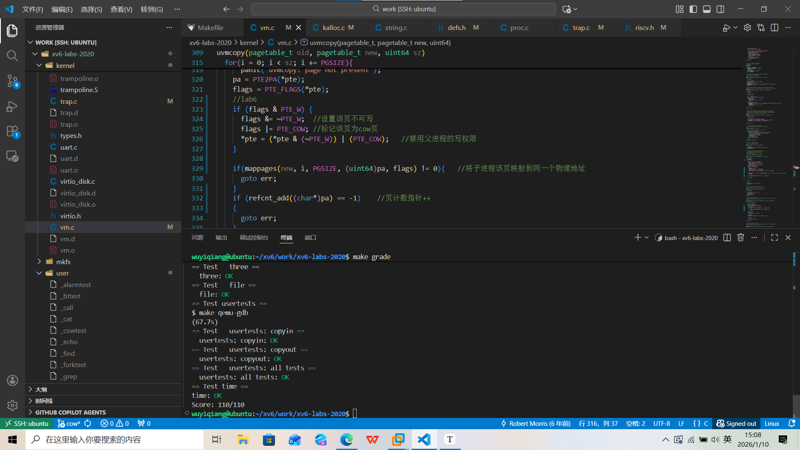

# 1、lab6 copy on write

## 实验要求

实现fork的写时复制，子进程不复制父进程的内存而是将内存映射到父进程的物理页，并将该物理页设置二者都不可写入，若有进程写入该页，则复制该页并赋予进程写权限。

## 实验思路

（1）、对于一个进程，如果它不调用fork创建子进程那么不对其物理页进行操作。

（2）、对于执行fork的进程，在执行fork的时候我们不为子进程分配新的物理页，而是将其虚拟地址映射到与父进程相同的物理页上。并取消父子进程对该页的写权限。只保留二者对该页的读取权限。若有进程想对该页进行写操作，那么该进程触发trap，在trap里面为该进程开辟一个新的物理页，并将原物理页的内存复制过来，并让进程对该页做虚拟映射，赋予该页写权限。

- 之所以要禁用父子进程的写权限是因为如果不禁用父进程的写权限，那如果父进程执行写操作而子进程只执行读操作，子进程因为只读不会开辟新的物理页，所以它会读取到父进程写入的东西导致出错。

注意：第二部操作只是一个思路框架会引发一系列细节的问题需要处理

1、我们是通过页错误陷入trap来实现cow，那么某页发生页错误可能不是因为fork的时候你禁用该页的写权限导致的，可能是其他原因导致的；所以我们要对因fork被取消写权限的那一些页做一个标记，才能在trap的时候对这些fork页单独处理。

- 具体方法是增加一个pte标志位PTE_COW，在fork的时候为这些页打上标签。

2、对于如果父子进程只读不写的情况，系统不会出现页错误也就是两个进程会共享一个物理页，但是如果父进程的生命周期比子进程的生命周期长，子进程结束会释放物理页（kfree），这个时候父进程读取物理页会出错因为被子进程释放掉了。

- 解决方法就是在kalloc分配每个物理页的时候为每个物理页打上一个计数指针标签用于说明这个物理页被几个进程共享，初始值为1，在fork的时候我们需要将对应的物理页的计数指针加1，表示这个物理页被两个进程共享，同时也要处理kfree，对于计数指针为1的页才进行删除操作，对于指针>=2的页执行kfree只是将其的计数指针减一。

3、由于我们之前禁用了父子进程的写权限，这会导致我们在trap里面需要应对两种情况

①、第一种是父子进程目前还在共享一个物理页，该物理页的计数指针=2，例如由于子进程写入操作触发trap，这个时候trap的处理逻辑是实现写时复制COW。**为子进程开辟一个新页，然后进行映射并且给子进程这个新页的写权限，并且将原来的物理页的计数指针减一，取消新页PTE_COW标志，那么在子进程下一次写的时候就不会触发trap。**但是注意由于我们刚刚开始的时候禁用了父子进程的写权限，这个时候trap只是给了子进程写权限还没有给父进程写权限，父进程写入的时候依旧会发生页错误，触发trap，但是这个时候我们trap里面的处理逻辑就不是要实现cow了而是对父进程的错误页给予写权限。也就是②所对应的情况。

②、某些发生页错误的页只是因为缺失写权限，我们只需要给该页写权限就行了，不需要做cow的操作。

- 如何区分发生的是①还是②呢？

就是用刚刚提到的计数指针，对于fork过的物理页他的计数指针是>=2的这个时候如果这种页发生页错误我们需要执行的是cow的处理逻辑，还有一种情况就是对于②由于执行过cow逻辑了，原来的物理页的计数指针会减一，所以计数指针=1的物理页对应的就是②，我们只需要给这一页写权限，取消PTE_COW标志。

（3）、还有就是需要修改copyout，由于copyout是在内核空间往用户空间里面写数据，所以对应没有写权限的物理页会触发kerneltrap，我本来不修改cow直接在kerneltrap里面也执行了一套cow逻辑，但是发现他的copyout函数是通过walkaddr将虚拟地址转解析出物理地址，直接往物理地址上写数据实现的，压根就没通过页表来写内存所以不会触发页错误。那么copycout是怎么出错的呢，可能是由于在子进程执行写时复制之前copyout先往父子进程的公共页写数据了，然后子进程触发了cow，导致这一块虚拟地址被映射到新的物理页上去，所以通过虚拟地址读取的时候读取的是新页的数据。

- 解决措施就是把之前的cow逻辑封装成一个函数，传入一个虚拟地址，针对于这个虚拟地址所对应的页执行trap逻辑处理，对于无论是情况①还是情况②都会返回这个虚拟地址所映射的物理页首地址（其实出错应该是情况①），然后copy在对这个返回的物理页操作就行了。

## 实验代码

（1）、在kernel/risk.h中添加PTE_COW标志位

```c
#define PTE_COW (1L << 8)   //定义一个标志，标志该页为cow页
```

（2）、修改kernel/kalloc.c

①、定义一个计数指针结构体,初始化自旋锁

```c
//lab6 定义一个引用计数指针用于标记每个页被多少个进程占用
struct ref_cnt{ 
  struct spinlock lock;
  int cnt[PHYSTOP / PGSIZE];  
}ref;

void kinit()
{
  initlock(&kmem.lock, "kmem");
  initlock(&ref.lock, "ref");   //lab6 初始化自旋锁
  freerange(end, (void*)PHYSTOP);
}
```

②、修改kalloc()和kfree()，注意操作计数指针的时候要加锁

```c
void *
kalloc(void)
{
  struct run *r;

  acquire(&kmem.lock);
  r = kmem.freelist;
  if(r)
  {
    acquire(&ref.lock);
    ref.cnt[(uint64)r / PGSIZE] = 1;  //与这块物理内存相关联的进程只有1个
    release(&ref.lock);
    kmem.freelist = r->next;
  }
  release(&kmem.lock);

  if(r)
  {
    memset((char*)r, 5, PGSIZE); // fill with junk
  }
    
  return (void*)r;
}

void
kfree(void *pa)
{
  struct run *r;

  if(((uint64)pa % PGSIZE) != 0 || (char*)pa < end || (uint64)pa >= PHYSTOP)
    panic("kfree");
  //lab6
  acquire(&ref.lock);
  if (--ref.cnt[(uint64)pa / PGSIZE] == 0)  //lab5，如果计数索引为0则释放物理内存
  {
    release(&ref.lock);
    // Fill with junk to catch dangling refs.
    memset(pa, 1, PGSIZE);

    r = (struct run*)pa;

    acquire(&kmem.lock);
    r->next = kmem.freelist;
    kmem.freelist = r;
    release(&kmem.lock);
  }
  else
  {
    release(&ref.lock);
  }
  
}
```

③、修改vm.c中uvmcopy()

```c
int uvmcopy(pagetable_t old, pagetable_t new, uint64 sz)
{
  pte_t *pte;
  uint64 pa, i;
  uint flags;

  for(i = 0; i < sz; i += PGSIZE){
    if((pte = walk(old, i, 0)) == 0)
      panic("uvmcopy: pte should exist");
    if((*pte & PTE_V) == 0)
      panic("uvmcopy: page not present");
    pa = PTE2PA(*pte);
    flags = PTE_FLAGS(*pte);
    //lab6
    if (flags & PTE_W) { 
      flags &= ~PTE_W;  //设置该页不可写
      flags |= PTE_COW; //标记该页为cow页
      *pte = (*pte & (~PTE_W)) | (PTE_COW);   //禁用父进程的写权限
    }
    
    if(mappages(new, i, PGSIZE, (uint64)pa, flags) != 0){   //将子进程该页映射到同一个物理地址
      goto err;
    }
    if (refcnt_add((char*)pa) == -1)    //页计数指针++
    {
      goto err;
    }
      
  }
  return 0;
```

④、在kernel/kalloc.c中添加功能函数：cowpage，ge_refcnt，refcnt_add，cowalloc

```c
//判断是否为cow页
int cowpage(pagetable_t pagetable, uint64 va)
{
  if (va > MAXVA)
    return -1;
  pte_t* pte = walk(pagetable, va, 0);
  if (pte == 0)
    return -1;
  if ((*pte & PTE_V) == 0)
    return -1;
  return ((*pte & PTE_COW) ? 0 : -1);
}
//获取当前页计数指针值
int get_refcnt(void* pa)
{
  return ref.cnt[(uint64)pa / PGSIZE];
}
//当前页计数指针++
int refcnt_add(void* pa)
{
  if(((uint64)pa % PGSIZE) != 0 || (char*)pa < end || (uint64)pa >= PHYSTOP)
    return -1;
  acquire(&ref.lock);
  ++ref.cnt[(uint64)pa /PGSIZE];
  release(&ref.lock);
  return 0;
}
/*
  cow页处理函数
  1、页计数指针为1
  这是由于假设父进程fork了一个子进程，这个页就会变成ref=2的cow页，那么子进程想往里面写数据
  这个时候会触发写时复制，cowalloc会匹配计数指针为2的情况为子进程单独开辟一块ref=1的页，然后
  原来cow页的ref就会减1，所以就出现了ref = 1的cow页；对于这类页我们只需要给他权限就行了
  2、对于页计数指针>=2的页
  说明这个页触发中断需要对其进行写时复制，所以我们需要为trap的进程开辟一个新页来存储写入的数据
  并将trap的进程的虚拟地址写入这个页
  3、函数返回值
  出错：返回0
  成功：返回传入虚拟地址映射的物理页地址
*/
void* cowalloc(pagetable_t pagetable, uint64 va)
{
  if (va % PGSIZE != 0)   //va是否页对齐
  {
    return 0;
  }
  uint64 pa = walkaddr(pagetable, va);    //得到物理页
  if (pa == 0)
    return 0;
  //计数指针为1的cow页，则对此页单独给与写权限
  pte_t* pte = walk(pagetable, va, 0);
  if (get_refcnt((void*)pa) == 1)
  {
    *pte |= PTE_W;
    *pte &= ~PTE_COW;
    return (char*)pa;
  }
  else
  {
    //如果计数指针>=2那么就要进行写时复制了
    char *mem = kalloc();
    if (mem == 0)
      return 0;
    memmove(mem, (char*)pa, PGSIZE);    //开辟一个新的物理页，并把原来物理页的内容复制过去
    //将当前进程的虚拟地址映射到这个物理页上去
    *pte &= ~PTE_V;     //避免报错重复映射
    if (mappages(pagetable, va, PGSIZE, (uint64)mem, (PTE_FLAGS(*pte) | PTE_W) & ~PTE_COW) != 0)
    {
      kfree(mem);
      *pte |= PTE_V;
      return 0;
    }
    kfree((char*)PGROUNDDOWN(pa));    //将原来物理页的计数指针--
    return mem;
  }
  
}
```

⑤、在kernel/defs.h中申明

```c
int             cowpage(pagetable_t, uint64);
int             get_refcnt(void*);
int             refcnt_add(void*);
void*           cowalloc(pagetable_t, uint64);
```

⑥、修改trap.c中usertrap()

```c
void
usertrap(void)
{
 ......
    syscall();
  } 
  else if(r_scause() == 15 || r_scause() == 13)   //lab6
  {
    //页错误
    uint64 fault_va = r_stval();
    fault_va = PGROUNDDOWN(fault_va);   //页对齐
    if (fault_va >= p->sz || cowpage(p->pagetable, fault_va) != 0 ||  cowalloc(p->pagetable, fault_va) 			== 0)
    {
      printf("usertrap(): unexpected scause %p pid=%d\n", r_scause(), p->pid);
      printf("            sepc=%p stval=%p\n", r_sepc(), r_stval());
      p->killed = 1;
    }
    
  }
  else if((which_dev = devintr()) != 0){
    // ok
  } else {
    printf("usertrap(): unexpected scause %p pid=%d\n", r_scause(), p->pid);
    printf("            sepc=%p stval=%p\n", r_sepc(), r_stval());
    p->killed = 1;
  }

  if(p->killed)
    exit(-1);

  // give up the CPU if this is a timer interrupt.
  if(which_dev == 2)
    yield();

  usertrapret();
}
```

⑦、修改kalloc.c中的freerange()

```c
void
freerange(void *pa_start, void *pa_end)
{
  char *p;
  p = (char*)PGROUNDUP((uint64)pa_start);
  for(; p + PGSIZE <= (char*)pa_end; p += PGSIZE)
  {
    acquire(&ref.lock);
    ref.cnt[(uint64)p / PGSIZE] = 1;    //lab6 需要将计数指针置为1不然kfree删除不掉。
    release(&ref.lock);
    kfree(p);
  }
    
}
```

⑧、修改kernel/vm.c中copyout()

```c
int copyout(pagetable_t pagetable, uint64 dstva, char *src, uint64 len)
{
  uint64 n, va0, pa0;
  while(len > 0){
    va0 = PGROUNDDOWN(dstva);
    pa0 = walkaddr(pagetable, va0);     
    //lab6
    if (cowpage(pagetable, va0) == 0)     //如果是cow页
    {
      if ((pa0 = (uint64)cowalloc(pagetable, va0)) == 0)
        return -1;
    }
    if(pa0 == 0)
      return -1;
    n = PGSIZE - (dstva - va0);
    if(n > len)
      n = len;
    memmove((void *)(pa0 + (dstva - va0)), src, n);

    len -= n;
    src += n;
    dstva = va0 + PGSIZE;
  }
  return 0;
}
```

## 提交测试



