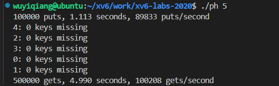
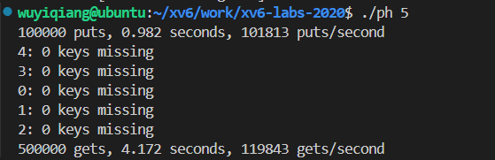
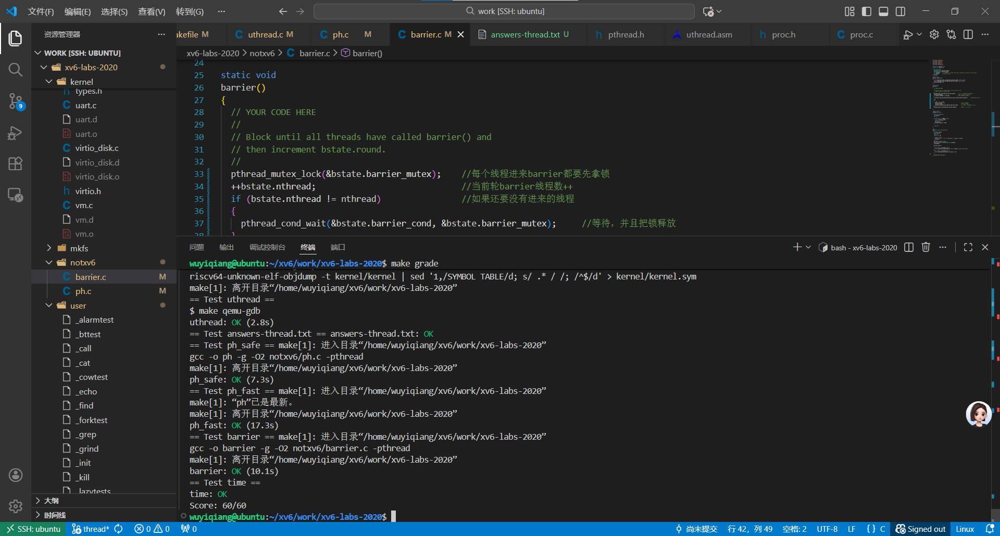

# 1、Multithreading

## Uthread: switching between threads 

### 实验要求

先阅读user/uthread.c和user/uthread_switch.S；完善user/uthread.c中的thread_create()和thread_schduler()使得线程能够被正常调度和创建

### 实验思路

阅读代码可以发现代码规定了某个进程支持的最大线程数量为4个且每一个线程都有一个自己的线程栈；thread_schedule函数完成线程的调度它用t来遍历所有线程数组，用next_thread表示下一个要切换的线程；它每次调度都会遍历一遍线程数组，寻找处于RUNNABLE状态的线程并调度他，如果要调度的线程是当前线程本身（当前线程执行yield时会把自己的state设置成RUNNABLE)那么就说明当前进程只有一个线程就继续执行当前线程，如果不是那么就需要切换线程。**那么如何切换线程？**这是我们需要做的，代码里面提供了`extern void thread_switch(uint64, uint64);`（这个函数只是一个申明，他的函数体在汇编程序uthread_switch.S里）是不是很像进程调度里面的swtch。我们仿造进程调度来实现线程调度。

①、观察进程的`swtch(&c->context, &p->context);`发现它需要保存当前进程的上下文并且切换到下一个进程的上下文。所以我们需要仿造proc.h中为线程结构体添加一个上下文属性`struct context`然后在uthread_switch.S也参考进程的swtch.S来进行上下文的保存与恢复。至此就将thread_schedule()修改好了。

②、修改thread_create()，我们知道进程切换是通过swtch函数的ret指令返回到ra寄存器存储的现场的，那么我们创造完一个线程之后就需要将当前线程的context中的ra修改为当前线程回调函数的地址，使得线程调度会去执行线程回调函数，同时别忘记了线程有自己的栈，所以sp也需要求改。并且我们需要先清理一下线程的context所在的物理内存，防止脏数据影响。

### 实验代码

（1）、在user/uthread.c中定义上下文结构体

```c
struct context {    //lab7
  uint64 ra;
  uint64 sp;
  // callee-saved
  uint64 s0;
  uint64 s1;
  uint64 s2;
  uint64 s3;
    
  uint64 s4;
  uint64 s5;
  uint64 s6;
  uint64 s7;
  uint64 s8;
  uint64 s9;
  uint64 s10;
  uint64 s11;
};
struct thread {
  char       stack[STACK_SIZE]; /* the thread's stack */
  int        state;             /* FREE, RUNNING, RUNNABLE */
  struct context context;       //lab7 模仿进程，我们也定义一个上下文
};
```


（2）、修改user/uthread.c中thread_schedule()函数

```c
void 
thread_schedule(void)
{
   ......
  if (current_thread != next_thread) {        //如果下一个线程不是当前线程（yield会把当前线程的state标记为runable）
    next_thread->state = RUNNING;             //设置下一个线程为running
    t = current_thread;                       //零时存储当前线程
    current_thread = next_thread;             //将当前线程切换为下一个需要运行的线程
    /* YOUR CODE HERE
     * Invoke thread_switch to switch from t to next_thread:
     * thread_switch(??, ??);
     */
    thread_switch((uint64)&t->context, (uint64)&next_thread->context);    //lab7
  } else    //如果下一个线程是当前线程则不需要切换
    next_thread = 0;    
}
```

（3）、修改user/uthread_switch.S

```assembly
	.text
	/*
         * save the old thread's registers,
         * restore the new thread's registers.
         */
	.globl thread_switch
thread_switch:
	/* YOUR CODE HERE */
	sd ra, 0(a0)
    sd sp, 8(a0)
    sd s0, 16(a0)
    sd s1, 24(a0)
    sd s2, 32(a0)
    sd s3, 40(a0)
    sd s4, 48(a0)
    sd s5, 56(a0)
    sd s6, 64(a0)
    sd s7, 72(a0)
    sd s8, 80(a0)
    sd s9, 88(a0)
    sd s10, 96(a0)
    sd s11, 104(a0)

    ld ra, 0(a1)
    ld sp, 8(a1)
    ld s0, 16(a1)
    ld s1, 24(a1)
    ld s2, 32(a1)
    ld s3, 40(a1)
    ld s4, 48(a1)
    ld s5, 56(a1)
    ld s6, 64(a1)
    ld s7, 72(a1)
    ld s8, 80(a1)
    ld s9, 88(a1)
    ld s10, 96(a1)
    ld s11, 104(a1)
	ret    /* return to ra */
```

(4)、修改user/uthread.c中thread_create()函数

```c
void 
thread_create(void (*func)())
{
  struct thread *t;

  for (t = all_thread; t < all_thread + MAX_THREAD; t++) {    //寻找线程坑位
    if (t->state == FREE) break;
  }
  t->state = RUNNABLE;        //设置为可运行
  // YOUR CODE HERE
  //lab7
  memset(&t->context, 0, sizeof(t->context));   //先清理内存防止读取到脏数据
  t->context.ra = (uint64)func;     //设置ra为回调函数的地址
  t->context.sp = (uint64)t->stack + STACK_SIZE;    //栈是自顶向下生长的
}
```


## Using threads

### 实验要求

在自己的电脑的操作系统下运行ph.c程序，并且修复该程序在多线程情况下的数据丢失问题，并且讲明数据丢失原因。

### 实验思路

首先阅读ph.c，这个文件大概做的事情是，定义了键值对（键是随机生成的，值则是插入这个键的线程编号），一共10w个键，然后通过若干个线程将这一些键插入到哈希表中，等待这些线程插入完成后，再创建相同数量的线程来在哈希表里面查找这一些键值，判断键值有没有丢失。

哈希表就是数组+链表，数组的每一个坑位里面存放着一张链表，通过table[key%NBUCKET]来规定那些键要放在那一个散列桶里面。

通过`make ph.c`然后`./ph n`参数n代表需要使用的线程的数量来查看使用不同个数线程来完成这项操作需要多少时间，并且在线程查找的时候打印数据丢失情况。直接运行该程序会发现在多线程的情况下会出现键值的丢失。

问题1：为什么会出现键值的丢失呢？

答：之所以会发生键值丢失是因为如果两个线程要同时往同一个散列桶里面的链表插入数据，在线程T1修改链表头指针的时候，T2同时也要往链表头插入数据，但是此时T1还没有返回更新后的链表的头指针，所以T2其实是在旧链表的表头插入新结点，T2结束后会覆盖T1插入的表头导致T1插入的键值丢失。在《xv6 book》里有提到


问题2：如何解决数据丢失呢？ph_safe

解决办法是加锁，在put函数里面执行加解锁操作，在线程要执行头插时加锁保证其他线程不能修改链表，在结束时释放锁。

问题3：但是这个加锁操作造成了一个问题，在某些情况下，并发put()在哈希表中读取或写入的内存中没有重叠（线程同时插入在不同的散列桶中），但是还需要等待锁这就会减小程序的运行效率，那么应该如何优化呢？ph_fast

答案是：为每一个散列桶分配一个锁，对于要同时插入同一个散列桶的线程需要等待锁，对于如果同时插入不同散列桶则不需要等待锁，提高效率。

对比了两种情况：发现进行ph_fast优化过后的程序比没有优化的程序每秒要多插入差不多1w数量的键值对。

没有优化：



优化了的：



### 实验代码

（1）、修改ph.c申请锁

```c
//pthread_mutex_t lock;   //lab7 ph_safe 申请一个锁
pthread_mutex_t lock[NBUCKET];   // lab7 ph_fast 给每一个散列桶都申请一个锁
```

（2）、在main.c中初始化锁

```c
  int
main(int argc, char *argv[])
{
...
  if (argc < 2) {
    fprintf(stderr, "Usage: %s nthreads\n", argv[0]);
    exit(-1);
  }
  //pthread_mutex_init(&lock, NULL);    //lab7 ph_safe 初始化锁
  //lab7 ph_fast 初始化每个锁
    for (int j = 0; j < NBUCKET; j++)
  {
    pthread_mutex_init(&lock[j], NULL);
  }
...
}

```

（3）、修改put()函数

```c
static 
void put(int key, int value)
{
  int i = key % NBUCKET;  // 计算键对应的哈希桶索引（取模运算

  // is the key already present?
  // 第一步：遍历桶i的链表，检查键是否已存在
  struct entry *e = 0;
  for (e = table[i]; e != 0; e = e->next) {
    if (e->key == key)    //找到键值，跳出循环
      break;
  }
  if(e){
    // update the existing key.
    e->value = value;     //更新键值
  } else {
    // the new is new.
    /*
    //lab7 ph_safe 解决数据丢失
    pthread_mutex_lock(&lock); // 插入前先加锁<解决数据丢失>
    insert(key, value, &table[i], table[i]);      //如果没有找到那么就插入（头插）
    pthread_mutex_unlock(&lock);    //解锁<解决数据丢失>
    */

      //lab7 ph_fast 解决数据丢失
    pthread_mutex_lock(&lock[i]); // 插入前先加锁<解决数据丢失>
    insert(key, value, &table[i], table[i]);      //如果没有找到那么就插入（头插）
    pthread_mutex_unlock(&lock[i]);    //解锁<解决数据丢失>
    
   
  }
}
```

## Barrier

### 实验要求

设计一个屏障函数使得在多线程情况下当线程进入屏障之后就需要阻塞等待其他线程到来，当所有的线程都进来之后，线程才能解除阻塞继续运行。需要统计当所有线程都进入屏障的场景发生的次数。

几个要用到的函数

```c
// 在cond上进入睡眠，释放锁mutex，在醒来时重新获取
• pthread_cond_wait(&cond, &mutex);
• // 唤醒睡在cond的所有线程
• pthread_cond_broadcast(&cond);
```

### 实验思路

每个线程进入屏障之后都要先拿锁才能修改公共数据bstate结构体的属性，所以来一个线程就进行` ++bstate.nthread`，并且判断是不是最后一个线程，如果不是则`pthread_cond_wait(&bstate.barrier_cond, &bstate.barrier_mutex);`当前线程阻塞等待，并且释放锁；如果是则将线程数清零，barrier轮数++，并且唤醒正在阻塞的线程去拿锁。注意只有干完这些之后才能释放最后一个线程的锁。

### 实验代码

修改notxv6/barrier.c中的barrier函数

```c
static void 
barrier()
{
  // YOUR CODE HERE
  pthread_mutex_lock(&bstate.barrier_mutex);    //每个线程进来barrier都要先拿锁
  ++bstate.nthread;                             //当前轮barrier线程数++
  if (bstate.nthread != nthread)                //如果还要没有进来的线程
  {
    pthread_cond_wait(&bstate.barrier_cond, &bstate.barrier_mutex);     //等待，并且把锁释放
  }
  else
  {
    //最后一个线程来了
    bstate.nthread = 0;                               //将线程数清零
    ++bstate.round;                                   //barrier轮数++
    pthread_cond_broadcast(&bstate.barrier_cond);     //广播唤醒所有等待的线程去拿锁
  }
  pthread_mutex_unlock(&bstate.barrier_mutex);        //最后一个线程释放锁

}
```

## 提交测试



