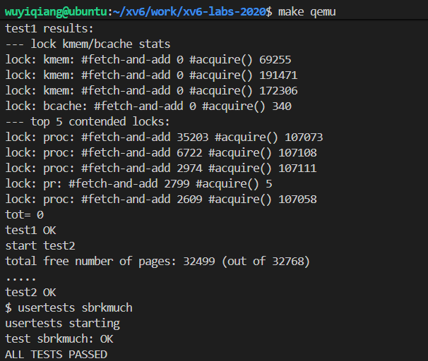
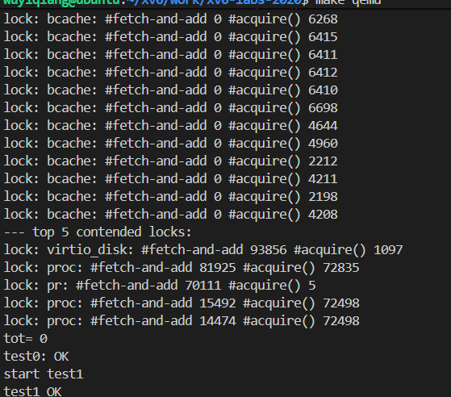

# locks

## Memory allocator

### 实验说明

程序 user/kalloctest 用于对 xv6 的内存分配器进行压力测试：**三个进程会不断增长和缩小它们的地址空间，从而频繁调用 kalloc和 kfree。**这两个函数都会获取`kmem.lock`。`kalloctest `会输出（以 #fetch-and-add 形式）在 `acquire `函数中为了获取已被其他核心占用的锁而进行的循环次数，该数据适用于 `kmem `锁以及其他一些锁。`acquire `中的循环次数可以粗略地反映锁竞争的程度。
`acquire `会记录每个锁被调用的次数（即 `acquire()`）以及尝试获取锁失败而进入自旋的次数（即 #fetch-and-add）。`kalloctest `会调用一个系统调用，让内核打印 `kmem `和 `bcache` 两个锁（本实验重点关注的对象）以及锁竞争最严重的前五个锁的这些统计信息。如果存在锁竞争，那么自旋次数会很大。该系统调用最终返回 `kmem `和 `bcache `锁的自旋总次数。
`kalloctest `中锁竞争的根本原因在于 `kalloc() `仅使用一个空闲链表，并由一个锁保护。为消除锁竞争，你需要重新设计内存分配器，避免单一锁和链表。基本思路是为每个 CPU 维护一个空闲链表，每个链表有自己的锁。这样，不同 CPU 上的分配和释放操作可以并行执行，因为它们各自操作独立的链表。
**主要的挑战在于：当某个 CPU 的空闲链表为空，而另一个 CPU 的链表还有可用内存时，前者必须从后者“偷取”部分内存块。虽然偷取可能会导致锁竞争，但希望这种情况是少数。**
你的任务是实现 每 CPU 一个空闲链表，并在链表为空时执行“偷取”逻辑。你必须为所有的锁命名以 "kmem" 开头。也就是说，在 initlock 中初始化每个锁时，传入的名字必须以 "kmem" 开头。
一些提示：

- NCPU 宏定义为 cpu 数目
- cpuid 函数用于获取当前cpu 的id 
- 让freerange将所有空闲内存分配给正在运行的cpu

### 实验思路

题目意思大概是由于每个cpu会想要去公共的页链表取物理内存，但是这个页链表通过一个锁`kmem`来维护，一次只允许一个cpu访问，其他cpu要访问的时候就会进入自旋，实验记录了所有cpu自旋的次数，由此来反应这个锁的竞争程度。现在我们需要做的就是来减小锁的竞争次数，因为cpu等待锁会严重影响程序运行的效率。给出的思路就是为每一个cpu分配一张页链表，cpu从自己的页链表上读取物理内存，如果自己的页链表没有物理内存，那么就需要从有物理内存的cpu的页链表处偷取内存。

①、根据提示我们先将kmem修改为kmem[NCPU]保证每一个cpu都有一个kmem锁和对应的链表，并且在kvinit中初始化锁。

②、我们需要考虑初始化的时候为每一个cpu分配多少物理页合适，我起初的想法是在kinit初始化的时候用freerange将物理内存均分给所有cpu，freeange通过kfree来为链表分配物理页，但是由于kfree是用来释放进程空间的，在本实验情景里面需要跟cpuid绑定，但是kinit只是在初始化的时候被第一个主核cpu0调度过一次，所以这里初始化的时候均分内存显得有些麻烦。**根据提示“让freerange将所有空闲内存分配给正在运行的cpu”所以我们只需要在主核初始化的时候将所有物理内存都交给cpu0的链表，其他cpu在第一次获取物理内存时因为自己的链表里没有物理内存所以需要从cpu0的链表中获取**，所以在第一次获取物理内存的时候跟往常一样，其他cpu需要等待cpu0的锁才能从cpu0的链表里拿物理页。

③、重点是kfree的时候：当你在用完从cpu0获取来的物理页准备释放的时候不是归还给cpu0而是通过kfree根据cpuid插入自己的链表里面，那么下次你再要申请内存的时候就可以直接用自己链表里面的这块物理内存了，不用获取cpu0的锁，缓解了锁的竞争。

④、所以我们在实现kalloc的时候需要先判断自己cpu的链表里面有无内存，没有的情况再去其他cpu那里偷取。重点是如何偷取，可以设计一个`void* get_free_page()`来遍历cpu获取空闲内存。

注意事项：1、注意避免死锁情况。2、注意关闭中断的时机，在`id = cpuid()`之前关闭中断，一定要等id使用完之后才能开启中断，原因是如果不关中断那么触发定时器中断可能下一次当前进程被其他cpu给调度了，那么在其他cpu上使用旧的cpuid就有可能会出现一系列问题。


### 实验代码

（1）、修啊给kmem结构体和kinit()

```c
struct {
  struct spinlock lock;
  struct run *freelist;
} kmem[NCPU];   //lab8 为每一个cpu都申请一张链表和锁

void kinit()
{
  //lab8 初始化每个cpu的锁
  for (int i = 0; i < NCPU; i++)
  {
    initlock(&kmem[i].lock, "kmem");
  }
 
  freerange(end, (void*)PHYSTOP);
}
```

（2）、修该kfree()

```c
void
kfree(void *pa)
{
  struct run *r;

  if(((uint64)pa % PGSIZE) != 0 || (char*)pa < end || (uint64)pa >= PHYSTOP)
    panic("kfree");

  // Fill with junk to catch dangling refs.
  memset(pa, 1, PGSIZE);

  r = (struct run*)pa;
  //lab8
  push_off();  //关中断
  int id = cpuid();     //获取当前cpuid
  acquire(&kmem[id].lock);
  r->next = kmem[id].freelist;
  kmem[id].freelist = r;
  release(&kmem[id].lock);
  pop_off();    //开中断
}
```

（3）、添加函数用于寻找空闲页

```c
//lab8 寻找空闲页
void* get_free_page(int id)
{
  for (int i = 0; i < NCPU; i++)
  {
    //遍历所有的cpu查看存在空闲页的cpu
    if (i == id)
    {
      continue;   //防止死锁
    }
    acquire(&kmem[i].lock);
    struct run* r = kmem[i].freelist;
    if (r)    //如果有空闲内存
    {
      kmem[i].freelist = r->next;		//将该节点移除
      release(&kmem[i].lock);
      return (void*)r;
    }
    release(&kmem[i].lock);
  }
  //没有空闲内存
  return 0;
}
```

（4）、修改kalloc()

```c
void *
kalloc(void)
{
  struct run *r;
  //lab8
  push_off();   //关中断
  int id = cpuid();
  acquire(&kmem[id].lock);
  r = kmem[id].freelist;
  if (r)    
  {
    //如果cpu自身有内存
    kmem[id].freelist = r->next;
  }
  else
  {
    r = (struct run*)get_free_page(id);	//返回空闲页物理地址
  }
  release(&kmem[id].lock);
  pop_off();    //关中断，只有id使用完之后才能关闭中断
  if(r)
    memset((char*)r, 5, PGSIZE); // fill with junk
  return (void*)r;
}
```

### 测试

```c
kalloctest
usertests sbrkmuch
```





## Buffer cache

### 实验说明

​	这个作业的后半部分与前半部分是相互独立的；无论你是否完成了前半部分，你都可以进行这一部分的工作，并通过相应的测试。
​	如果多个进程密集地使用文件系统，它们可能会争用 bcache.lock，这个锁用于保护 kernel/bio.c 中的磁盘块缓存。bcachetest 会创建多个进程反复读取不同的文件，以制造对 bcache.lock 的竞争。
​	你的任务是修改块缓存的实现，使得在运行 bcachetest 时，所有与块缓存相关的锁的 acquire 循环次数总和接近 0。理想情况下这个总和为 0，但只要总和小于 500 就可以接受。
​	你需要修改 bget 和 brelse，使得对不同块的并发查找和释放 不太可能在锁上产生冲突（比如：不必都等待 bcache.lock）。但你必须保证每个块最多只缓存一份。
​	你必须为所有与块缓存相关的锁命名以 "bcache" 开头。也就是说，你在调用 initlock 初始化锁时，传入的锁名要以 "bcache" 开头。
​	与 kalloc 不同，减少块缓存的锁竞争更具挑战性，因为块缓存是多个进程（从而是多个 CPU）真正共享的。而 kalloc 可以通过为每个 CPU 提供独立的分配器来消除大部分竞争，但这种方法对块缓存并不适用。我们建议你用哈希表来存放缓存块，用每个桶一个锁的方式来查找块号。

- 以下几种情况出现锁冲突是可以接受的：

  ①、两个进程同时访问相同的块号。bcachetest 的 test0 不会发生这种情况。
  ②、两个进程在缓存中都未命中，同时需要找到一个未被使用的块进行替换。bcachetest 的 test0 也不会发生这种情况。
  ③、两个进程访问的块恰好落在相同的哈希桶中（例如，它们的块号哈希到了同一个槽）。bcachetest 的 test0 可能会发生④、这情况，取决于你的设计，但你应尽量调整方案细节来减少这类冲突（比如改变哈希表大小）。
  ⑥、bcachetest 的 test1 使用的块比缓存中的块数量多，会触发文件系统中更多的代码路径。

- 一些提示
  • 可以使用固定数量的桶，不必动态扩容哈希表。建议使用质数个桶（如 13）以减少哈希冲突；
  • 在哈希表中查找缓存块，以及在缓存中未命中时分配新的缓存块，这两个步骤必须是原子的；
  • 删除维护所有块的全局链表（如 bcache.head 等），而是使用最近一次使用的时间戳（可用 kernel/trap.c 中的 ticks）标记每个块的使用时间。这样可以让 brelse 不再需要获取 bcache 锁，而 bget 可以根据时间戳选择最近最少使用的块；
  • 可以在 bget 中串行化替换逻辑（即查找缓存失败时，选择一个块重新使用的部分）；
  • 某些情况下你可能需要同时持有两个锁；例如，在替换缓存块时可能需要同时持有 bcache.lock 和某个桶的锁。一定要避免死锁；
  • 替换块时，可能需要将 struct buf 从一个桶移动到另一个桶中（因为新块号哈希到了不同的桶）。特别注意一种情况：新旧块可能哈希到了同一个桶 —— 此时一定要注意避免死锁；
  • 调试建议：可以在实现桶锁时暂时保留 bcache 全局锁的 acquire/release 操作（比如放在 bget 的开头和结尾），以串行化整个逻辑；确保逻辑无竞态后，再移除全局锁并处理并发问题。

### 实验思路

与内存链表一样，内存里面的缓冲区bcache也是由一块双向链表维护的，但是这个链表只有一个锁，这就会导致并发情况下多个进程争夺锁而造成阻塞，影响程序效率。

①、我们需要将这个bcache表改成一个哈希表，在哈希表里面维护着13个散列桶，每个散列桶里面都有一张链表和一个锁。这样做的好处是，对应特定的缓存块会被哈希到特定的散列桶里面。多个进程同时访问不同的缓存块只需要对应散列桶的锁，大大减小了锁的竞争。

②、初始化的时候我们先将所有的缓存块都给第一个散列桶，等到其他散列桶需要的时候再从这里偷，与实验1的kalloc相似有异曲同工之处。散列桶刚刚开始偷取缓存块的时候也会造成锁的竞争，但是这只是暂时的因为他偷取之后后续要访问就可以通过自己的锁访问自己桶内的缓存块。

③、获取缓存块的原则是先在目标桶里面（block%NBUCKET）查找该缓存块是否被映射，有的话直接返回；没有的话，遍历所有的桶查找时间戳最小的（也就是最不常用的桶）缓存块，如果这个缓存块在目标桶里面就直接分配，如果不在目标桶里面的话需要将缓存块拷贝到目标桶里面。

④、我们先在当前桶内寻找已经映射的缓存块，这个过程只需要获取当前桶的锁，寻找完需要将锁释放，否则如果带着某一个桶的锁去遍历其他的桶可能导致死锁。例如多进程并发的情况下进程A拿着桶1的锁去遍历桶2，进程B拿着桶2的锁去遍历桶1这就是死锁情况。在usertests中的manywrite()可能会出现这种情况。**但是我们又需要保证从其他桶找空闲缓存块的过程是原子的，那么就必须在遍历哈希表之前给他加锁。所以这个时候就需要加全局锁来保证偷取过程的原子性。注意加锁顺序需要先加全局锁再加散列桶锁，先解散列桶的锁再解全局锁。**

⑤、我们在遍历哈希表之前加全局锁，然后采用零时变量来标记找到的最合适的缓存块和它所在的桶，（在遍历桶寻找缓存块的时候需要加对应桶的锁）。再遍历完所有桶之后判断一下是否找到了空闲缓存块，并且判断是否是目标缓存桶里面的，如果是就直接更改缓存块的属性；如果不是需要将缓存块从其他桶链表中断开再移动到目标桶链表。注意在断开其他桶的链表的时候需要加其他桶的锁保证操作原子性，断开之后马上解锁。然后加目标桶的锁在进行缓存块的插入操作。

**重点：1、一个进程不要同时拥有两个散列桶的锁，高并发的情况下容易死锁 2、我们实验全局锁来保证偷取过程的原子性要全局锁和散列桶的加解锁顺序，不然也可能造成死锁**。


### 实验代码

(1)、修改bcache将其设置为哈希表

```c
//lab 8
#define NBUCKET 13    //13个散列桶
struct bucket {
  struct spinlock lock;   //散列桶的锁
  struct buf head;        //散列桶头节点
};
struct {
  struct spinlock lock;     //全局锁
  struct buf buf[NBUF];    //缓冲块总数
  struct bucket buckets[NBUCKET];     //散列桶
} bcache;   //lab8 哈希表

uint global_time = 0;   //lab8 全局时间戳
```

```c
struct buf {
  int valid;   // has data been read from disk?
  int disk;    // does disk "own" buf?
  uint dev;
  uint blockno;
  struct sleeplock lock;
  uint refcnt;
  struct buf *prev; // LRU cache list
  struct buf *next;
  uint timestamp;   //lab8 时间戳
  uchar data[BSIZE];
};
```

（2）、修改binit()

```c
//lab8 初始化
void binit(void)
{
  struct buf* b;
  //char lockname[16];

  for(int i = 0; i < NBUCKET; ++i) 
  {
    // 初始化散列桶的自旋锁
    //snprintf(lockname, sizeof(lockname), "bcache_%d", i);
    initlock(&bcache.buckets[i].lock, "bcache");

    // 初始化散列桶的头节点
    bcache.buckets[i].head.prev = &bcache.buckets[i].head;
    bcache.buckets[i].head.next = &bcache.buckets[i].head;
  }

  //初始化缓存块,并将缓存块全部放到散列桶0上
  for (b = bcache.buf; b < bcache.buf + NBUF; b++)
  {
    b->next = bcache.buckets[0].head.next;
    b->prev = &bcache.buckets[0].head;
    initsleeplock(&b->lock, "buffer");
    b->timestamp = 0;
    bcache.buckets[0].head.next->prev = b;
    bcache.buckets[0].head.next = b;
  }
  
}
```

（3）、修改brelse，bpin，bunpin使他们只使用散列桶的锁，减少锁的竞争

```c
void
brelse(struct buf *b)
{
  if(!holdingsleep(&b->lock))
    panic("brelse");

  releasesleep(&b->lock);
  //lab 8
  uint bucket_id = b->blockno % NBUCKET;
  acquire(&bcache.buckets[bucket_id].lock);     //lab8 获取散列桶的锁
  b->refcnt--;
  release(&bcache.buckets[bucket_id].lock);     //lab8
}
void
bpin(struct buf *b) {
  //lab8
  uint bucket_id = b->blockno % NBUCKET;
  acquire(&bcache.buckets[bucket_id].lock);    
  b->refcnt++;
  release(&bcache.buckets[bucket_id].lock);
}
void
bunpin(struct buf *b) {
  //lab8
  uint bucket_id = b->blockno % NBUCKET;
  acquire(&bcache.buckets[bucket_id].lock);
  b->refcnt--;
  release(&bcache.buckets[bucket_id].lock);
}
```

（5）、修改bget（）

```c
static struct buf*
bget(uint dev, uint blockno)
{
  //lab8
  struct buf *b;
  uint bucket_id = blockno % NBUCKET;   //获取块编号对应的散列桶id
  acquire(&bcache.buckets[bucket_id].lock);     //获取对应散列桶的锁

  //寻找磁盘块是否已经被映射到对应散列桶缓存块上了
  for (b = bcache.buckets[bucket_id].head.next; b != &bcache.buckets[bucket_id].head; b = b->next)
  {
    if (b->dev == dev && b->blockno == blockno)
    {
      ++b->refcnt;
      b->timestamp = __sync_fetch_and_add(&global_time, 1);  //更新时间戳
      release(&bcache.buckets[bucket_id].lock);   //释放散列桶的锁
      acquiresleep(&b->lock);           //加buffer的锁
      return b;
    }
  }
  release(&bcache.buckets[bucket_id].lock);     //没有的话也要解锁

  acquire(&bcache.lock);    //加全局锁，保证分配或者偷取缓存块是原子操作
                            //并且注意需要先加全局锁再加散列桶的锁
  //没有找到就去创建缓存块
  int i, cur_bucket, min_bucket_id = 0;
  struct buf* temp = 0; 
  b = 0;    //注意把b清零
  for (i = 0, cur_bucket = bucket_id; i < NBUCKET; i++, cur_bucket++)   //循环遍历所有散列桶,得到全局最小的lru
  {
    if (cur_bucket == NBUCKET)
    {
      cur_bucket = 0;
    }
    acquire(&bcache.buckets[cur_bucket].lock);  //给每个散列桶加锁

    for (temp = bcache.buckets[cur_bucket].head.next; temp != &bcache.buckets[cur_bucket].head; temp = temp->next)
    {
      if (temp->refcnt == 0 && (b == 0 || temp->timestamp < b->timestamp))
      {
        //这里判断b == 0是为了先不管时间，有空的先拿，然后再去看时间戳是否需要替换
        b = temp;
        min_bucket_id = cur_bucket;     //找到最合适buffer的桶标记
      }
      //找到当前散列桶里面refcnt = 0，且最久没用使用的
    }
    release(&bcache.buckets[cur_bucket].lock);
  }

  acquire(&bcache.buckets[min_bucket_id].lock);   //加桶的锁，保证先全局后桶
  if (b)    //如果全局缓存区还有空闲缓存块
  {
    if (min_bucket_id == bucket_id)     //是从目标散列桶里面拿的
    {
      b->dev = dev;
      b->blockno = blockno;
      b->valid = 0;
      b->refcnt = 1;
      b->timestamp = __sync_fetch_and_add(&global_time, 1);
      release(&bcache.buckets[min_bucket_id].lock);     //释放目标散列桶的锁的
      release(&bcache.lock);    //释放全局锁
      acquiresleep(&b->lock);         //加buffer的锁
      return b;
    }
    else    //从其他散列桶偷来的，将他插入目标桶
    {
      //将结点从其他的散列桶链表中断开
      b->next->prev = b->prev;
      b->prev->next = b->next;
      release(&bcache.buckets[min_bucket_id].lock);    //释放其他散列桶的锁
      //插入目标散列桶
      acquire(&bcache.buckets[bucket_id].lock);     //加目标散列通的锁
      b->next = bcache.buckets[bucket_id].head.next;
      b->prev = &bcache.buckets[bucket_id].head;
      bcache.buckets[bucket_id].head.next->prev = b;
      bcache.buckets[bucket_id].head.next = b; 

      b->dev = dev;
      b->blockno = blockno;
      b->valid = 0;
      b->refcnt = 1;
      b->timestamp = __sync_fetch_and_add(&global_time, 1);
      release(&bcache.buckets[bucket_id].lock);     //释放目标散列桶的锁
      release(&bcache.lock);    //释放全局锁
      acquiresleep(&b->lock);         //加buffer的锁
      return b;
    }
  }
  else
  {
    //没用内存了
    panic("bget: no buffers");
  }
}

```

### 测试




## 提交测试

