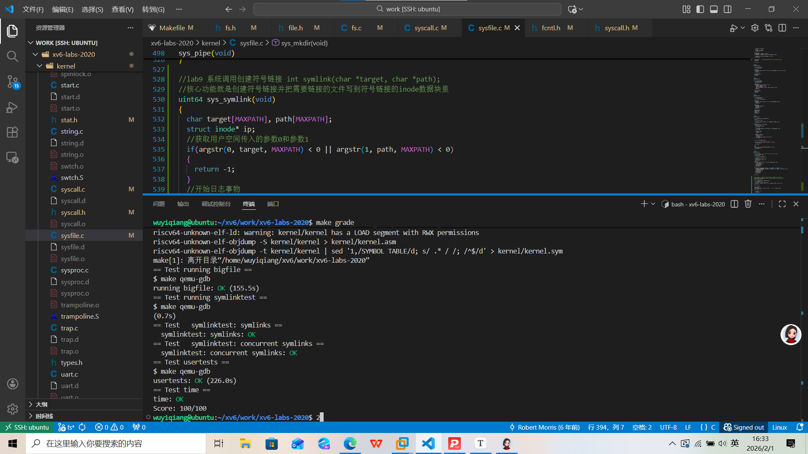

# file system

## Large files

### 实验说明

​	在这个实验中，你将增加 xv6 文件的最大大小。目前，xv6 的文件大小限制为 268 个块，或 268×BSIZE 字节（在 xv6 中 BSIZE 是 1024）。这个限制来自于 xv6 的 inode 结构：它包含 12 个“直接”块编号和 1 个“一级间接”块编号，这个编号指向一个块，该块最多可存储 256 个块号，因此总共是 12+256=268 个块。你将修改 xv6 的文件系统代码，为每个 inode 增加一个“双重间接”块。这个块包含 256 个一级间接块的地址，而每个一级间接块又可以包含最多 256 个数据块地址。最终，一个文件最多可以包含 65803 个块，即：256 × 256 + 256 + 11 块（注意是 11 而不是 12，因为我们要牺牲一个直接块的位置来存放双重间接块的地址）。

​	mkfs 程序用于创建 xv6 文件系统磁盘镜像，并决定文件系统的总块数；这个大小由 kernel/param.h 中的 FSSIZE 控制。你会看到这个实验的代码仓库中，FSSIZE 被设为了 200000 块。在执行 make 命令的输出中，你应该看到如下信息：

```c
nmeta 70 (boot, super, log blocks 30 inode blocks 13, bitmap blocks 25) blocks 199930 total 200000
```

​	这行输出描述了 mkfs 构建的文件系统：它有 70 个元数据块（用于描述文件系统的块），以及 199930 个数据块，总共 200000 个块。在实验过程中如果需要重建文件系统，可以执行 make clean 来强制重新生成 fs.img。

​	磁盘上的 inode 格式由 fs.h 中的 struct dinode 定义。你特别需要关注的包括：NDIRECT、NINDIRECT、MAXFILE，以及 struct dinode 中的 addrs[] 成员。

​	查阅 fs.c 中的 bmap() 函数，这个函数的作用是找到文件对应的磁盘数据块，理解它的具体逻辑。bmap() 函数既用于读文件，也用于写文件。在写操作中，bmap() 会在需要时分配新的块来存放文件内容，并在需要时分配一级间接块用于存储块地址。bmap() 涉及两种块编号：参数 bn 是“逻辑块号”，即相对于文件起始处的块编号；ip->addrs[] 中的值以及 bread() 的参数是磁盘块编号。你可以将 bmap() 理解为将文件的逻辑块号映射为磁盘块号的函数。

- 你的任务：

​	修改 bmap()，在保留直接块和一级间接块的基础上，加入对“双重间接块”的支持。由于不允许改变磁盘上 inode 的大小，你必须将直接块的数量从 12 减少为 11，来腾出一个槽位用于存放双重间接块的地址。因此：ip->addrs[] 的前 11 项为直接块；第 12 项为一级间接块（和现有实现一样）；第 13 项为新的双重间接块。

- 官网提示：

1、一定要理解 bmap() 的实现原理。建议画出 ip->addrs[]、一级间接块、双重间接块和数据块之间的关系图。理解为什么增加一个双重间接块能将最大文件大小增加 256×256 个块（实际上是少 1 个块，因为直接块减少了 1 个）。
2、思考如何用逻辑块号索引双重间接块以及它所指向的所有一级间接块。
3、如果你修改了 NDIRECT 的定义，可能也要修改 file.h 中 struct inode 中的 addrs[] 的声明。确保 struct inode 和 struct dinode 中的 addrs[] 数组元素数量一致。
4、如果更改了 NDIRECT，务必重新生成新的 fs.img，因为 mkfs 使用了 NDIRECT 构建文件系统。
如果文件系统状态异常，例如崩溃了，可以删除 fs.img 文件（在 Unix 环境中删除，而不是在 xv6 中），然后重新执行 make 构建一个干净的文件系统。
5、不要忘记在使用 bread() 读取块之后使用 brelse() 释放块。
6、和原本的 bmap() 一样，只有在确实需要时才分配间接块和双重间接块。
7、确保 itrunc 能够正确释放一个文件的所有块，包括双重间接块。


### 实验思路

xv6提供的文件系统默认只能写268KB的数据：12个直接块 + 一个间接块（12*1024 + 256 *1024）；我们需要做的是给他扩容，将原来的12个直接块里拿出来一个作为双重间接块，这个双重间接块里的块数据存储着间接块的块号，这样一个双重间接块可以存储256 * 256个块，大大提高了文件系统的容量。

①、我们需要修改宏定义NDIRECT，将其修改为11（原本是12），原本inode里面有13个块，我们需要将第12个块作为间接块，最后一个块作为双重间接块。（注意这里间接块和双重间接块的位置不能反过来，bigfile不会出错但是usertests会出错）。注意还要修改一下maxfile。添加symlinktest

修改fs.h

```c
#define NDIRECT 11    //lab9 减少一个直接块用作双重间接块
#define DOUBLE_NINDIRECT (NINDIRECT * NINDIRECT)      //lab9 双重间接块里的块数据数量
#define MAXFILE (NDIRECT + NINDIRECT + DOUBLE_NINDIRECT)    //lab9 修改支持的最大文件大小
struct dinode {
  short type;           // File type
  short major;          // Major device number (T_DEVICE only)
  short minor;          // Minor device number (T_DEVICE only)
  short nlink;          // Number of links to inode in file system
  uint size;            // Size of file (bytes)
  uint addrs[NDIRECT+2];   // lab9 修改为 1间接块 + 1双重间接块 + 11直接块
                          //这里我设置第0~10为直接块，11为间接块，12为双重间接块
};
```

修改file.h里的inode

```c
struct inode {
 ...
  uint addrs[NDIRECT+2];    // lab9 修改为 1间接块 + 1双重间接块 + 11直接块
};
```

②、修改一下fs.c里的bmap函数增加其对双重间接块的处理

```c
static uint
bmap(struct inode *ip, uint bn)
{
  uint addr, *a;
  struct buf *bp;
......
  //lab 9
  bn -= NINDIRECT;
  if (bn < DOUBLE_NINDIRECT)
  {
    if ((addr = ip->addrs[NDIRECT + 1]) == 0)   //如果没有分配双重间接块
    {
      ip->addrs[NDIRECT + 1] = addr = balloc(ip->dev);    //分配一个块用作双重间接块 addr是块编号
    }

     //操作双重间接块
    bp = bread(ip->dev, addr);      //读取双重间接块的映射缓冲块
    a = (uint*)bp->data;
    uint index = bn / NINDIRECT;    //用于索引双重间接块里的条目
    if ((addr = a[index]) == 0)
    {
      a[index] = addr = balloc(ip->dev); //分配一个间接块
      log_write(bp);    //将对双重间接块的修改提交到日志
    }
    brelse(bp);   //释放双重间接块缓冲

    //操作双重间接块里块数组指向的间接块
    bp = bread(ip->dev, addr);    //读取双重间接块指向的间接块的映射缓冲
    a = (uint*)bp->data;
    index = bn % NINDIRECT;
    if((addr = a[index]) == 0){
      a[index] = addr = balloc(ip->dev);
      log_write(bp);
    }
    brelse(bp);
    return addr;
  }
  panic("bmap: out of range");
}
```

③、修改itrunc函数：添加对双重间接块的释放处理

```c
void
itrunc(struct inode *ip)
{
  int i, j;
  struct buf *bp;
  uint *a;
 ......
      bfree(ip->dev, ip->addrs[NDIRECT]);
    ip->addrs[NDIRECT] = 0;
  }
  //lab9 释放双重间接块
  if (ip->addrs[NDIRECT + 1])
  {
    bp = bread(ip->dev, ip->addrs[NDIRECT + 1]);    //读取双重间接块映射缓冲
    a = (uint*)bp->data;
    for (i = 0; i < NINDIRECT; i++)   //遍历双重间接块
    {
      if (a[i])     //如果存在间接块
      {
        struct buf* bp1 = bread(ip->dev, a[i]);   //读取间接块映射缓冲
        uint* a1 = (uint*)bp1->data;
        for (j = 0; j < NINDIRECT; j++)   //释放间接块内数据块
        {
          if(a1[j])
            bfree(ip->dev, a1[j]);
        }
        brelse(bp1);    //释放间接块映射缓冲块
        bfree(ip->dev, a[i]);   //释放间接块本身
      }
    }
    brelse(bp);   //释放算双重间接块映射缓冲块
    bfree(ip->dev, ip->addrs[NDIRECT + 1]);     //释放双重间接块本身
    ip->addrs[NDIRECT + 1] = 0;       //将inode里的双重间接块条目置零
  }
  ip->size = 0;
  iupdate(ip);
}
```

### 结果测试

在makefile里添加`$U/_symlinktest\`

`make qeum`	`bigfile`


`usertests`


## Symbolic links

### 实验说明

​	在本练习中，你将为 xv6 添加**符号链接（symbolic link）**功能。**符号链接（也叫软链接）**通过路径名引用另一个文件；当一个符号链接被打开时，内核会跟随该链接打开所指向的目标文件。符号链接类似于硬链接，但硬链接只能指向同一个磁盘上的文件，而符号链接可以跨磁盘设备。虽然 xv6 不支持多个设备，但实现该系统调用是理解路径名查找机制的一个很好练习。
你需要实现一个新的系统调用：int symlink(char *target, char *path);
提示：

1. 添加系统调用框架：
  首先为 symlink 分配一个新的系统调用号，并将其添加到：
  ◦ user/usys.pl
  ◦ user/user.h
  ◦ 然后在 kernel/sysfile.c 中实现一个空的 sys_symlink 函数。
2. 添加符号链接文件类型：
  在 kernel/stat.h 中添加一个新的文件类型标志 T_SYMLINK，用于表示符号链接。
3. 添加 O_NOFOLLOW 标志：
  在 kernel/fcntl.h 中添加一个新的打开标志 O_NOFOLLOW，可以用于 open 系统调用。
  注意，传递给 open 的标志使用按位或组合，所以你添加的新标志必须和已有标志不冲突。
  添加后你就可以编译 user/symlinktest.c 并在 Makefile 中启用测试。
4. 实现 symlink(target, path) 系统调用：
  实现该系统调用时，它应该在 path 位置创建一个新的符号链接，指向 target。
  注意：target 文件不需要存在，系统调用也能成功。
  你需要选择一个地方来存储符号链接的目标路径，例如可以将目标路径保存在 inode 的数据块中。
  symlink 应该像 link 和 unlink 一样，返回 0 表示成功，返回 -1 表示失败。
5. 修改 open 系统调用以处理符号链接的情况：
  ◦ 如果指定路径所指向的文件不存在，则 open 必须失败。
  ◦ 如果打开时设置了 O_NOFOLLOW，则 open 应打开符号链接本身，而不是跟随它。
  ◦ 如果符号链接的目标也是另一个符号链接，则你必须递归地跟随链接，直到找到非符号链接的文件。
  ◦ 如果符号链接形成了循环引用，你必须返回错误码。你可以用限制链接深度（例如不超过 10）的方法来近似处理这种情况。
6. 其他系统调用（如 link 和 unlink）在处理路径时不应跟随符号链接；它们应仅操作符号链接本身。
7. 无需支持目录的符号链接：本实验不要求你处理符号链接指向目录的情况。


### 实验思路

这个实验是要求是创建一个能为文件添加软链接的系统调用。

- 硬链接：本质就是一个目录项entry（name， inum），为同一个inode新增一个文件名，使得几个文件共用一个inode；对这几个文件读写都是读写同一个inode；不能为目录创建硬链接（避免循环引用）；删除一个硬链接不会影响其他文件对inode数据的读取。只有inode的所有硬链接都被删除之后才有机会释放inode。

- 软连接：本质上是一个文件，里面存储的内容是它要链接到的目标文件的文件路径，软链接可以链接不同磁盘上的文件，因为他只是一个路径的引用。当原始文件被删除软连接不会被一同删除它仍然可以存在，相当于快捷方式。但是如果目标文件位置移动了软连接会失效（因为它里面存储的是目标文件的路径）

①、我们需要创建一个系统调用，这个系统调用能为一个目标文件创建一个软连接。这个系统调用的具体实现是通过create创建一个类型为`T_SYMLINK`的文件（软连接文件），在通过文件系统调（完整的日志事物）用为向他的inode里写入目标文件的文件路径。文件系统调用流程是：begin_op -> create -> writei -> iunlockput-> end_op；这里需要注意的是create会返回一个锁定了的inode，并且这个inode的refcnt会 ++ 所有后续需要使用` iunlockput(ip);`来释放，释放锁的同时使得refcnt--。同时还需要注意用if判断如果create成功但是write出错的时候记得用iunlockput释放refcnt。

这里系统调用的流程不在赘述，直接看关键部分

- 在stat.h中声明符号链接文件

```c
#define T_SYMLINK 4   //lab9 符号链接
```

- 在fcntl.h中添加：

```c
#define O_NOFOLLOW 0x800    //lab9
```

- 在sysfile.c里面实现具体的系统调用sys_symlink：

```c
//lab9 系统调用创建符号链接 int symlink(char *target, char *path);
//核心功能就是创建符号链接并把需要链接的文件写到符号链接的inode数据块里
uint64 sys_symlink(void)
{
  char target[MAXPATH], path[MAXPATH];
  struct inode* ip;
  //获取用户空间传入的参数0和参数1
  if(argstr(0, target, MAXPATH) < 0 || argstr(1, path, MAXPATH) < 0)
  {
    return -1;
  }
  //开始日志事物
  begin_op();
  ip = create(path, T_SYMLINK, 0, 0);	    //创建一个符号链接文件,
  if(ip == 0)
  {
    //inode为0出错
    end_op();
    return -1;
  }
  //将需要连接的目标文件名写入inode数据块
  if (writei(ip, 0, (uint64)target, 0, strlen(target)) != strlen(target))
  {
    //写入不符合预期，失败
    iunlockput(ip);     //释放create里的refcnt++
    end_op();
    return -1;
  }
  iunlockput(ip);
  end_op();
  return 0;
}
```


②、根据提示还需要修改sys_open函数，对于链接文件的打开方式如果是O_NOFOLLOW我们只需要把这个链接文件当成普通文件来操作，打开链接文件本身；反之我们需要找到链接文件链接的目标文件，并打开最终的目标文件。（这里我们链接文件可能链接一个链接文件，这样可能会导致循环引用，我们需要判断保证它的引用层数不超过10，否则认为是循环引用出错）。

- 修改sysfile.c中的sys_open

```c
uint64
sys_open(void)
{
  ....
  if(omode & O_CREATE){
    //lab9 open应该不会创建符号链接文件，符号链接通过系统调用创建
    ip = create(path, T_FILE, 0, 0);
    if(ip == 0){
      end_op();
      return -1;
    }
  } else {
    //不需要创建的情况
    if((ip = namei(path)) == 0){  //获取目标文件所在的inode
      end_op();
      return -1;
    }
    ilock(ip);  //锁定inode
    //lab9
    //需要处理软链接
    if (!(omode & O_NOFOLLOW))    
    {
      int depth = 0;        //记录递归次数
      char name[MAXPATH];   //用于存储链接里的目标文件名
      //处理递归情况
      //需要判断链接的是否是软链接才可竟然循环
      while (ip->type == T_SYMLINK && depth < 10)
      {
        if (readi(ip, 0, (uint64)name, 0, MAXPATH) <= 0)   //这里虽然传入MAXPATH但是readi会返回实际读取到的字节数
        {
          iunlockput(ip); //这里需要应对creat，或者namei里的refcnt++，所以需要释放ref
          end_op();
          return -1;
        }
        iunlockput(ip);
        //判断链接的文件是否存在
        if((ip = namei(name)) == 0)
        {  
          //不存在
          end_op();
          return -1;
        }
        //存在
        ilock(ip);    //给链接文件加锁
        depth++;
      }
      //符号链接循环引用depth=10
      if (depth >= 10)
      {
        iunlockput(ip);
        end_op();
        return -1;
      }
    }
    //如果open的时候没有跟随O_NOFOLLOW，那么就跟普通文件一样

    if(ip->type == T_DIR && omode != O_RDONLY){
      iunlockput(ip);
      end_op();
      return -1;
    }
  }
....
  return fd;
}

```


## 提交评分


