# 1、xv6启动流程

entry.s:

```c
.section .text
_entry:
        la sp, stack0		#：将符号 stack0 的虚拟地址加载到栈指针寄存器 sp。
        li a0, 1024*4		#每个cpu需要4096（一页）内核栈空间
        csrr a1, mhartid	#将cpuid（主核0）赋值给a1，
        addi a1, a1, 1		#a1=a1+1
        mul a0, a0, a1		#a0=a0*a1
        add sp, sp, a0		#sp指向stack0+4096，确定主核的栈顶地址（栈是自上向下生长）：stack0+4096
        call start           #从汇编跳转到c语言
spin:
        j spin
```


RISK-V架构下的xv6启动流程：

- Bootload阶段： 加载内核镜像到物理地址 0x80000

- 000（之所以将内核放在 0x80000000 而不是 0x0，是因为地址范围 0x0-0x80000000 包含 I/O 设备。 ）执行第一段汇编程序entry.s

- Entry 阶段（M 态）：汇编初始化（为cpu分配栈空间以用于运行c程序）→ 程序跳转到 start.c
-  Start 阶段（M 态）：硬件初始化→ 配置 S 态环境 →  执行指令mret 切换到 S 态并执行 main.c
-  Main 阶段（S 态）：初始化内核页表 + 开启 MMU（此时接下来的程序运行在虚拟地址的内核空间）→ 启动从核（从核等待主核初始化完成后，直接进入 `scheduler`）→ 主核执行 `procinit`创建进程表 → 调用userinit创建进程
- userinit 阶段（S 态）：创建第一个用户进程（PID=1）、映射 initcode.S 到用户虚拟地址 0x0，主核 / 从核均进入 scheduler（进程调度循环）→ scheduler 调度第一个用户进程 → 执行 sret 指令→ 从 S 态切换到 U 态，进入用户空间执行 initcode.S （也就是说第一个用户进程执行的是initcode.S这段代码）。
-  initcode.S（U态）： 系统调用exec从用户空间（U态）切换到内核空间（S态）→ 内核处理 exec (init)系统调用（解析 /init 路径，创建新用户页表，加载 /init 到用户内存，执行 sret 指令程序从内核态切换到用户态切换）→  执行 /init 进程。
- /init 阶段（用户态）：创建设备文件 /dev/console  打开并 dup 到 fd0/1/2 →  /init进程fork 子进程 → 子进程 exec ("sh")加载用户态 Shell→ Shell 启动系统进入交互就绪状态；/init 进程循环调用 wait 回收僵尸子进程（退出后的 Shell ）。


# 2、lab2 system call

## syscall trace

### 实验前准备

- 实验前准备：了解系统调用流程，阅读user.h，usy.spl，syscall.h，syscall.c，sysproc.c，trace.c

#### 系统调用流程

xv6系统调用流程：

应用层程序执行一个封装的系统调用函数，该函数将系统调用参数存放在a0-a5寄存器，将系统调用号存放在a7寄存器，执行ecall指令使得cpu陷入内核态，并跳转到内核的陷阱处理入口（trapvec） →  内核的陷阱处理函数trap()把当前所有用户态寄存器完整保存到当前进程的陷阱帧（trapframe）中，读取 CPU 的scause寄存器，判断陷阱类型若为用户态 ecall 触发的系统调用→ 调用 syscall() 函数， syscall() 函数读取 p->trapframe->a7/a0，判断系统调用合法性 ，根据系统调用号进入对应的系统调用函数，将系统调用返回值存放到a0 ，syscall结束返回trap() → trap()执行 sret 指令CPU 切换回用户态，跳转到 ecall 指令的下一条指令→用户态封装系统调用函数执行 ret 指令,返回到应用层程序调用系统调用的位置 → 应用层从函数返回值拿到 a0 中保存的系统调用结果。

#### user.h / user.spl分析

- 用户空间的封装系统调用：

这些封装系统调用没有具体的实现c代码，在user.h里面声明了这一些系统调用，当用户执行封装系统调用的时候，系统会执行usys.pl中的脚本文件生成对应封装系统调用的汇编存根，这些汇编存根：给a7赋值系统调用号，执行ecall陷入内核，返回用户态。

user.s存根文件：

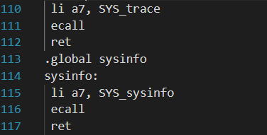

```c
sub entry {
    my $name = shift;
    print ".global $name\n";
    print "${name}:\n";
    print " li a7, SYS_${name}\n";	# 给a7赋值系统调用号
    print " ecall\n";			   # 执行ecall陷入内核
    print " ret\n";				   # 返回用户态
}
entry("fork");...
...
```


#### syscall.c / syscall.h分析

- syscall.c

```c
#include "types.h"
#include "param.h"
#include "memlayout.h"
#include "riscv.h"
#include "spinlock.h"
#include "proc.h"
#include "syscall.h"
#include "defs.h"

// 从当前进程的 addr 处获取 uint64 类型的数据。
int
fetchaddr(uint64 addr, uint64 *ip)
{
  struct proc *p = myproc();
  if(addr >= p->sz || addr+sizeof(uint64) > p->sz)
    return -1;
  if(copyin(p->pagetable, (char *)ip, addr, sizeof(*ip)) != 0)
    return -1;
  return 0;
}

// 从当前进程中获取位于 addr 处的以空字符结尾的字符串。
// 返回字符串的长度（不包括空字符），若出错则返回 - 1
int
fetchstr(uint64 addr, char *buf, int max)
{
  struct proc *p = myproc();
  int err = copyinstr(p->pagetable, buf, addr, max);
  if(err < 0)
    return err;
  return strlen(buf);
}
//获取寄存器值
static uint64
argraw(int n)
{
  struct proc *p = myproc();
  switch (n) {
  case 0:
    return p->trapframe->a0;
  case 1:
    return p->trapframe->a1;
  case 2:
    return p->trapframe->a2;
  case 3:
    return p->trapframe->a3;
  case 4:
    return p->trapframe->a4;
  case 5:
    return p->trapframe->a5;
  }
  panic("argraw");
  return -1;
}

// 获取第 n 个 32 位系统调用参数，用于判断读取寄存器的值是否为空，这里不完善
int
argint(int n, int *ip)
{
  *ip = argraw(n);
  return 0;
}

// Retrieve an argument as a pointer.
// Doesn't check for legality, since
// copyin/copyout will do that.
int
argaddr(int n, uint64 *ip)
{
  *ip = argraw(n);
  return 0;
}

// Fetch the nth word-sized system call argument as a null-terminated string.
// Copies into buf, at most max.
// Returns string length if OK (including nul), -1 if error.
int
argstr(int n, char *buf, int max)
{
  uint64 addr;
  if(argaddr(n, &addr) < 0)
    return -1;
  return fetchstr(addr, buf, max);
}

//定义一个函数指针数组
static uint64 (*syscalls[])(void) = {
[SYS_fork]    sys_fork,			//规定数组每个位置存放哪些内核系统调用函数的入口地址
[SYS_exit]    sys_exit,
[SYS_wait]    sys_wait,
[SYS_pipe]    sys_pipe,
[SYS_read]    sys_read,
[SYS_kill]    sys_kill,
[SYS_exec]    sys_exec,
[SYS_fstat]   sys_fstat,
[SYS_chdir]   sys_chdir,
[SYS_dup]     sys_dup,
[SYS_getpid]  sys_getpid,
[SYS_sbrk]    sys_sbrk,
[SYS_sleep]   sys_sleep,
[SYS_uptime]  sys_uptime,
[SYS_open]    sys_open,
[SYS_write]   sys_write,
[SYS_mknod]   sys_mknod,
[SYS_unlink]  sys_unlink,
[SYS_link]    sys_link,
[SYS_mkdir]   sys_mkdir,
[SYS_close]   sys_close,
};

void
syscall(void)
{
  int num;
  struct proc *p = myproc();		//获取当前进程结构体

  num = p->trapframe->a7;			//从陷阱帧中读取寄存器a7的值
  //合法性校验：1保证系统调用号是合法的，保证系统调用函数入口地址真实存在非空
  if(num > 0 && num < NELEM(syscalls) && syscalls[num]) {
    p->trapframe->a0 = syscalls[num]();			//执行内核系统调用，并将返回值传递给a0寄存器
  } else {
    printf("%d %s: unknown sys call %d\n",
            p->pid, p->name, num);		//失败打印错误信息
    p->trapframe->a0 = -1;				//返回-1给a0
  }
}
```


### 实验代码

- trace实验思路：通过为进程结构体添加一个char mask[23]数组用来表示要追踪进程里的哪一些系统调用，编写内核系统调用sys_trac()函数将proc结构体里的mask数组里面需要追踪的系统调用号写1。更改系统调用函数syscall()，在每次执行完系统调用函数后通过proc结构体里的mask数组结合该系统调用号判断该系统调用是否是需要被追踪的，如果是则进行信息打印。这样就实现了对进程里系统调用的追踪功能。

- 依据启动流程需要在user.h里面声明int trace(int)让系统知道有这么一个封装的系统调用 → 在usy.spl里面添加entry("trace")用于生成trace封装系统调用的汇编存根 → 在syscall.h里添加trace的系统调用号#define SYS_trace  22 → 修改syscall.c文件在里面添加`extern uint64 sys_trace(void);`在函数指针数组里添加sys_trace的入口地址→在sysproc.c中添加内核系统调用的具体实现uint64 sys_trace(void).
- 修改syscall.c文件

```c
static char* syscall_name[]={
  "empyty", "fork", "exit", "wait", "pipe", "read", "kill", "exec", "fstat", 
  "chdir", "dup", "getpid", "sbrk", "sleep", "uptime", "open", "write", 
  "mknod", "unlink", "link", "mkdir", "close", "trace", "sysinfo" 
};
void
syscall(void)
{
  int num;
  struct proc *p = myproc();

  num = p->trapframe->a7;	//去除陷阱帧里的系统调用号
  if(num > 0 && num < NELEM(syscalls) && syscalls[num]) {
    p->trapframe->a0 = syscalls[num]();
    //追钟系统调用的名称，和系统调用的返回值
    if (strlen(p->mask) > 0 && p->mask[num] == '1')   //每个系统调用执行完都来判断一些自己有没有被追钟
    {
      printf("%d: syscall %s -> %d\n", p->pid, syscall_name[num],p->trapframe->a0);
    }
  } else {
    printf("%d %s: unknown sys call %d\n",
            p->pid, p->name, num);
    p->trapframe->a0 = -1;
  }
}

```


- 再sysproc.c中添加sys_trace()

```c
uint64 sys_trace(void)
{
  int n;
  if (argint(0, &n) < 0)  //这里的n（传出参数）存储的是a0也就是trace()的argv[1]，并且已经被转化为int类型
  {
    return -1;
  }
  struct proc *p = myproc();
  char *mask = p->mask;   //修改进程结构体里的mask
  int i = 0;
  while (i < 23 && n > 0) //最多就23个系统调用，要追钟的调用号必须大于0，因为0为无效系统调用
  {
    //32  100000  表示需要追钟第6个系统调用
    if (n % 2)  
    {
      //最低位为1，该位对应的系统调用跟踪mask赋值为1
      mask[i++] = '1';
    }
    else{
      mask[i++] = '0';  
    }
    n >>= 1;	//右移一位 100000 -> 10000
  }

  return 0; 
}
```

- 在proc.h里为proc结构体添加char mask[23]
- 在kernel/proc.c里修该fork():

```c
... 
np->parent = p;
safestrcpy(np->mask, p->mask, sizeof(p->mask)); //将父进程的mask安全拷贝到子进程
// copy saved user registers.
*(np->trapframe) = *(p->trapframe);
...
```

- 测试：` trace 32 grep hello README`	参考trac.c理解这个命令什么意思

- 运行结果：

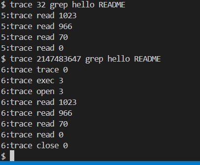

## sysinfo

### 实验前准备

实验前准备：阅读kernel/sysinfo.h，kernel/vm.c里copyout()，kernel/kalloc.c，kernel/proc.c中procinit()，kernel/proc.h ，kernel/param.h，kernel/defs.h ，kernel/sysinfotest.c

#### copyout解析：

操作系统内核空间和用户空间是分离的所有当系统调用进入内核空间，定义的变量等等都会存放在内核栈上，在用户空间是无法访问这些变量的，这时候需要读取内核空间的数据到用户空间就需要实验copyout函数：传入一个用户空间的地址将需要的内核空间的数据拷贝到这个地址上，这样在用户空间就可以访问这个数据了。

- vm.c/copyout()

```c
//将内核空间的数据拷贝到用户空间
int
copyout(pagetable_t pagetable, uint64 dstva, char *src, uint64 len)
{
  uint64 n, va0, pa0;

  while(len > 0){
    va0 = PGROUNDDOWN(dstva);		//虚拟地址va0，取目标地址dstva页边界（向低地址对其页）
    pa0 = walkaddr(pagetable, va0);		//将用户页边界虚拟地址va0转为物理地址pa0
    if(pa0 == 0)
      return -1;
    n = PGSIZE - (dstva - va0);		//计算当前页还可以存放多少数据
    if(n > len)
      n = len;						//若当前页可拷贝的字节数大于剩余未拷贝的len，则只拷贝len字节
    memmove((void *)(pa0 + (dstva - va0)), src, n);	//目标物理地址（页起始物理地址 + 页内偏移）；

    len -= n;
    src += n;				// 内核源地址向后偏移n字节
    dstva = va0 + PGSIZE;	// 目标地址跳到下一页的起始虚拟地址
  }
  return 0;
}
```

这里内核地址为什么要使用char*类型呢：由于char占一个字节，对于char类型的指针p指向p+n会往后偏移n个字节，方便这里内存读取。如果是int类型的话，由于int占4字节那么p+1会由原来的0x1000->0x1004.

#### kernel/kalloc解析

主要作用是管理内核空间内存，规定一页为4096字节，通过一个页链表来标注那些页是未使用的，即内核空间空闲内存。

- kalloc.c

```c
// 物理内存分配器，用于用户进程、
// 内核栈、页表页
// 以及管道缓冲区。分配完整的 4096 字节页
#include "types.h"
#include "param.h"
#include "memlayout.h"
#include "spinlock.h"
#include "riscv.h"
#include "defs.h"

void freerange(void *pa_start, void *pa_end);
//内核的虚拟地址与物理地址之间是一一映射关系
extern char end[]; //内核镜像加载后的最后一个地址，是物理内存分配的起始点（内核占用的内存不可分配）
//struct run对应一个空闲的 4KB 物理页，通过next串联成单向空闲链表。
struct run {
  struct run *next;
};

struct {
  struct spinlock lock;	// 自旋锁：保护freelist的并发访问（多核心/中断安全）
  struct run *freelist;	// 空闲链表头：指向第一个空闲物理页
} kmem;

void
kinit()
{
  initlock(&kmem.lock, "kmem");	// 初始化自旋锁（命名为kmem，方便调试）
  freerange(end, (void*)PHYSTOP);// 释放[end, PHYSTOP)区间的所有物理页到空闲链表,PHYSTOP：物理内存的上限
}
//释放物理内存pa_star到pa_end
void
freerange(void *pa_start, void *pa_end)
{
  char *p;
  p = (char*)PGROUNDUP((uint64)pa_start);	//将起始地址向上取整到页边界（保证页对齐）
  for(; p + PGSIZE <= (char*)pa_end; p += PGSIZE)//遍历区间，每次步进1页（4KB），调用kfree释放
    kfree(p);	
}

//释放单个物理页
void
kfree(void *pa)
{
  struct run *r;
	// 步骤1：合法性校验（非法地址直接panic）
  // 校验1：地址是否页对齐；校验2：是否在内核结束地址之后；校验3：是否在物理内存上限内
  if(((uint64)pa % PGSIZE) != 0 || (char*)pa < end || (uint64)pa >= PHYSTOP)
    panic("kfree");

  // 填充无用信息以捕获悬空引用（后续代码访问地址出错可以更快发现）
  memset(pa, 1, PGSIZE);
	//将物理页地址转为空闲链表节点
  r = (struct run*)pa;

  acquire(&kmem.lock);	//枷锁
  r->next = kmem.freelist;	// 新节点指向原链表头
  kmem.freelist = r;	// 链表头指向新节点（头插法）
  release(&kmem.lock);	//解锁
}

// 分配一个 4096 字节的物理内存页。
// 返回内核可以使用的指针。
// 如果无法分配内存，则返回 0
void *
kalloc(void)
{
  struct run *r;

  acquire(&kmem.lock);	//加锁
  r = kmem.freelist;	//提取空闲页
  if(r)					
    kmem.freelist = r->next;	//头删法
  release(&kmem.lock);

  if(r)
    memset((char*)r, 5, PGSIZE); // 填充5表示该物理页已被分配
  return (void*)r;				//返回已分配过的物理页首地址
}
```

### 实验代码

- sysinfo实验思路：阅读sysinfo.h发现需要获取的是当前内核空间剩余内存信息，和当前系统运行的进程数量。故需要在kalloc.c中添加一个函数用于获取内核内存空间，在proc.c里添加一个函数用于获取进程数量。而此时我们是在系统调用里面，也就是在内核空间操作，获取到sysinfo信息会被存储在内核栈中，那么如果将内核数据放到用户空间呢，使用copyout函数，观察sysinfotest封装的系统调用函数，其传入参数是一个sysinfo结构体，这个结构体的地址是在用户空间，所以我们只需要在内核空间创造一个info结构体并将其数据copy给用户空间就可以了。

- 与上个实验一样，理解系统调用过程，自己添加系统调用sys_sysinfo()，修改哪些文件不在赘述

- 修改kernel/kalloc.c，添加函数get_kernel_freemem获取剩余内核空间

  ```c
  //空闲物理页都被放在freelist链表中，故只需要统计链表大小就可以知道空闲物理内存大小了
  uint64 get_kernel_freemem(void)
  {
    uint64 cnt = 0;
    struct run *r = kmem.freelist;    //获取空闲物理页表头
    acquire(&kmem.lock);   //加锁
    while (r)  //如果不为空
    {
      cnt++;
      r = r->next;    //指向下一个物理页
    }
    release(&kmem.lock);    //解锁
    return cnt * PGSIZE;
  }
  ```

- 修改kernel/proc.c，添加函数get_proc_num获取进程个数

  ```c
  //获取系统中存活进程个数
  uint64 get_proc_num(void)
  {
    struct proc *p;
    uint64 cnt = 0;
    
    for (p = proc; p < &proc[NPROC]; p++)
    {
      acquire(&p->lock);
      if (p->state != UNUSED)
      {
        cnt++;
      }
      release(&p->lock);
    }
    return cnt;
  }
  ```

  - 将两个函数在kernel/defs.h中声明

  - 在sysproc.c中添加系统调用

    ```c
    #include "kernel/sysinfo.h"
    uint64 sys_sysinfo(void)
    {
      struct sysinfo info;  //定义在内核空间的变量
      info.freemem = get_kernel_freemem();  //获取内核空间剩余内存
      info.nproc = get_proc_num();        //获取系统中存活的进程数
      uint64 addr;    //定义一个addr用于接收a0寄存器的值，a0应该保存的是一个用户空间的地址
      if (argaddr(0, &addr) < 0)
      {
        return -1;
      }
      if( copyout(myproc()->pagetable, addr, (char*)&info, sizeof(info)) < 0)  //将内核空间的info拷贝到用户空间的addr
      {
        return -1;
      }
      else{
        return 0;
      }
    }
    ```
    
    - 测试：
    
      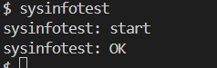

## 提交评分

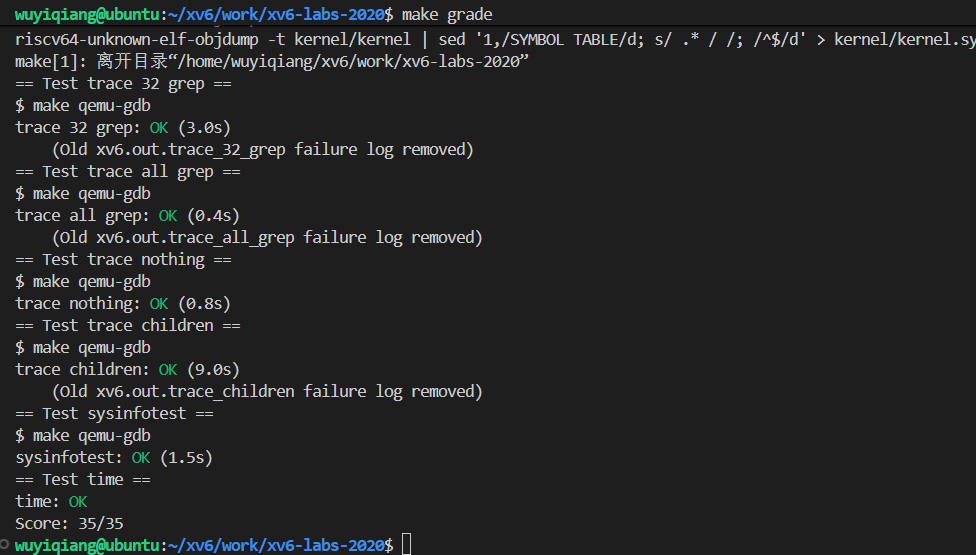

# 3、页表

## 为什么需要页表

- 因为进程间需要强隔离，如果不使用页表（虚拟内存映射）每个进程都运行在物理地址上，恶意程序可以通过直接访问其他进程的物理地址对其他进程进行攻击，如果使用页表，每个进程都有一张自己的页表，进程会运行在各自页表的虚拟地址上，在由页表将虚拟地址转化为物理地址，实现进程间强隔离。


## 分页硬件

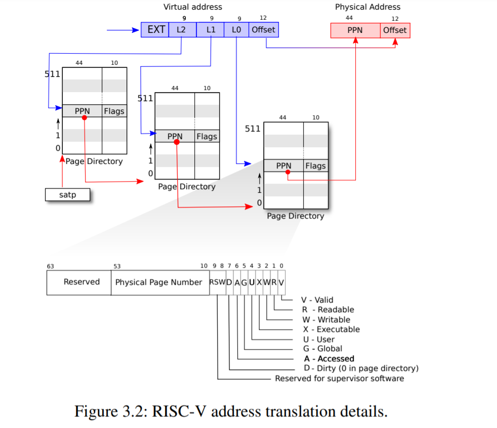

- xv6 运行在 Sv39 RISC-V 上，这意味着只使用 64 位虚拟地址的底部 39 位，顶部 25  位未被使用。使用中间的27位来索引页表，找到页表项（PTE）来转换一个虚拟地址。每个PTE里面都有一个44位的物理页号（PPN）存储下一个页表的首地址，根页表的首地址则是存放在寄存器satp中。最后12位则直接投影到物理地址中，用来索引页内的地址空间（12位正好对应4KB）所以映射的最小粒度是4096字节。
- 每个页是4096字节，每个页里面有512个PTE，所以每个PTE占4096/512 = 8byte，即64位。其中10位用来存放标志位flag，44位用来存放下一页的物理地址，还有10位没用用来日后扩展。
- 页表开销：对于3级页表，第一级只有一张页表占用4KB，第二级页表有512张（一级每个PTE对应一张二级）故占用512 * 4KB = 2MB内存，三级有512x512张，占用512x512x4KB = 1GB。**所以页表的总开销约为1G内存。***
- 虚拟内存：一张二级页表表示的虚拟内存为512 * 2MB也就是1G内存，三级页表则是2MB，也就是一级页表的每一个页表项都代表1G虚拟内存，二级页表每一个页表项都代表2MB虚拟内存，三级页表每一个页表项都对应4KB内存。 所以Sv39虚拟内存一共是512GB。
- 物理内存一共是2^56，也就是72PB

## 内核地址空间

理论上一个进程有512GB的虚拟空间，可以有72PB的物理空间，实际上物理空间RAM只有大概134MB左右，且页表只会将需要使用的虚拟空间映射到物理空间上，并不会将所有的虚拟空间全部映射过去。

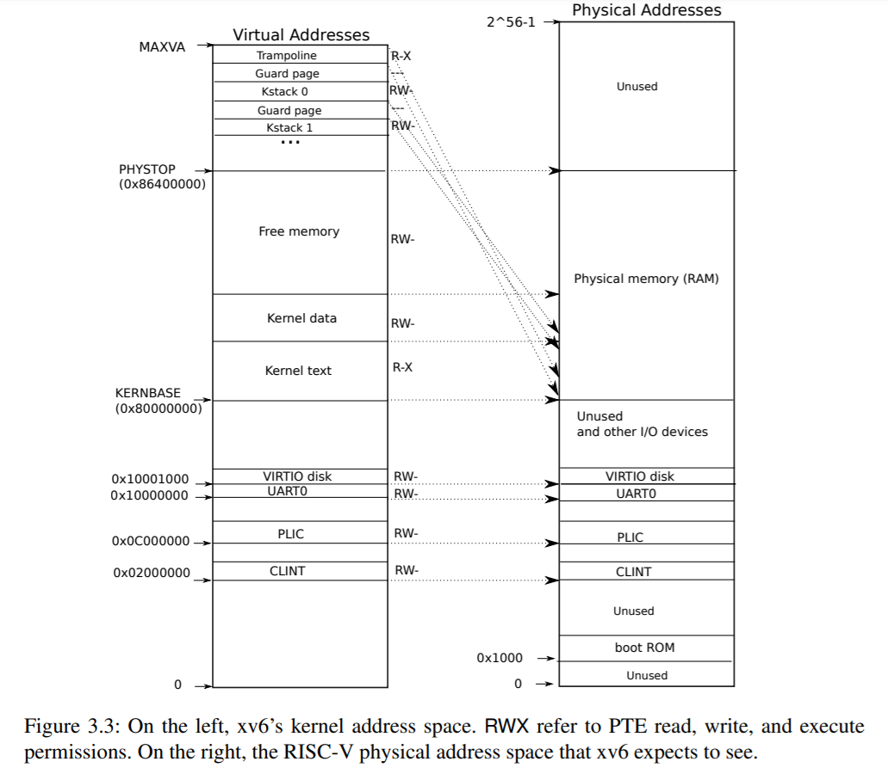

- 映射关系：

由KERNBASE->PHYSTOP对应是物理内存的大小，这一部分一共约128MB（也就是右边的RAM），内核空间的数据段、代码段和freememory是直接映射到（RAM）上的；内核的栈保护区还有trampoline页则采用的是非直接映射也是映射到RAM中。对于后续的进程的用户虚拟空间采用非直接映射映射到RAM中。除去内核本身的数据段和代码段占用了一部分物理内存，其他物理内存（freememory）则是用于存储用户虚拟空间和内核栈、trampoline页的映射；对于设备IO接口，UART...则是采用直接映射，映射到其他物理内存中（不在RAM中）。

这些内核空间和不同进程的用户空间虽然都映射到了RAM中但是彼此之间会采用分页机制进行强隔离不会互相影响。

- 几个问题：

1、为什么内核栈不采用直接映射呢？

①内核栈之间会有一个保护页，这些保护页是不会进行映射的，当栈溢出的时候违规使用这些被保护的虚拟地址，内核会报警。如果采用直接映射，物理地址是连续被映射的，无法在连续的物理地址之间插入无映射的保护页。或者对保护页进行映射，那么被映射的那一段物理内存则无法使用会造成内存泄漏。②内核栈本质上是每一个进程的私有属性，直接映射会把栈地址直接暴露给其他进程，不利于进程之间强隔离。

2、为什么每个进程都需要一个kstack呢？干什么用的？

①内核栈用来存储进程运行的上下文信息，比如一个进程系统调用进入内核，此时时间片到了，cpu要切换去执行其他的进程，内核栈此时要保护当前进程的运行现场方便cpu返回继续执行。②是内核函数调用栈帧③内核函数局部临时数据

## 创造一个地址空间

### 内核页表直接映射部分

- walk函数

  ```c
  #define PXMASK          0x1FF // 9 bits
  #define PXSHIFT(level)  (PGSHIFT+(9*(level)))
  //虚拟地址由低12位offset和27位索引组成，PGSHIFT=12代表一个页大小12位，每层页表有9位索引，9*level代表几层页表需要偏移几位
  
  #define PX(level, va) ((((uint64) (va)) >> PXSHIFT(level)) & PXMASK)
  //将虚拟地址右移& PXMASK，相当于提取索引位，比如根页表提取27位索引里的前7位
  #define PTE_V (1L << 0)	//long形的1，64位里最低位为1
  #define PTE2PA(pte) (((pte) >> 10) << 12)
  //将页表项里的数据右移10位，去除flags在，左移12位拼凑出二级页表的物理地址（页大小位4KB所以要左移12位）
  #define PA2PTE(pa) ((((uint64)pa) >> 12) << 10)
  ```

  

  ```c
  //pagetable是物理地址，传入的是satp，va是虚拟地址，alloc表示是否会创建页表
  //typedef uint64 pte_t;
  //typedef uint64 *pagetable_t; // 512 PTEs
  函数实现类似于mmu功能，会根据虚拟地址帮你找到虚拟地址对应的最后一级页表里的pte，并返回其地址。但是pte里的内容（虚拟地址实际映射的物理地址）不归他管。第三个页表现在还是空的
  pte_t *walk(pagetable_t pagetable, uint64 va, int alloc)
  {
    if(va >= MAXVA)		//传入虚拟地址越界
      panic("walk");
  
    for(int level = 2; level > 0; level--) {		//xv6采用三级页表，从根页表（二级）开始创建
      pte_t *pte = &pagetable[PX(level, va)];		//找到虚拟地址在（根）页表里的pte，并把根页表页表项地址												//赋值给pte
      if(*pte & PTE_V) {	//判断ptefalgs的第十位是否为1，也就是下一级页表是否有效（是否映射了）
        pagetable = (pagetable_t)PTE2PA(*pte);	//已经映射，从pte里面提取出下一级页表的首地址，将下一级												//的页表首地址转化为uint64*类型，并赋值给pagetable
      } else {		//无效重新开辟一张页表
        if(!alloc || (pagetable = (pde_t*)kalloc()) == 0)	//分配一块物理页，返回页的首地址
          return 0;									//现在pagetable为一级页的首地址了
        memset(pagetable, 0, PGSIZE);					//往里写0
        *pte = PA2PTE(pagetable) | PTE_V;		//把一级页的首地址右移12位在左移10位，本质是转化为pte形式，
          								//再给标志位写1，再写道上一级页表对应的pte里面去
      }
    }
    return &pagetable[PX(0, va)];			//找到虚拟地址在0级页表里的pte，并返回pte的地址
  }									//0级页表里的pte存放的真正的物理地址
  ```

- mappages函数：将虚拟地址映射到物理地址，如果pa是RAM中的内存在mappages之前需要kalloc分配够(kalloc一次只能分配一页内存)；这里mappages是用在kvminit中不是映射ram中的内存所以可以直接映射一页以上的空间的内存。

  ```c
  将虚拟地址映射到物理地址
  int mappages(pagetable_t pagetable, uint64 va, uint64 size, uint64 pa, int perm)
  {
    uint64 a, last;
    pte_t *pte;
  
    a = PGROUNDDOWN(va);		//其实虚拟地址向下对其到页边缘(低12位清零)
    last = PGROUNDDOWN(va + size - 1);		//计算映射的最后一个页的起始地址（处理size跨页的情况）
    for(;;){
      if((pte = walk(pagetable, a, 1)) == 0)	//如果最后一级页表未创建成功
        return -1;
      if(*pte & PTE_V)	//判断这个虚拟地址是否已经被映射
        panic("remap");
      *pte = PA2PTE(pa) | perm | PTE_V;	//将物理地址pa转化位pte形式，并且填入权限位perm，设置pte有效
      if(a == last)	//判断是否处理到尾页
        break;
      a += PGSIZE;
      pa += PGSIZE;
    }
    return 0;
  }
  ```

- kvmmap函数

  ```c
  //kernel_pagetable是内核的第一张页表，也就是根页表的首地址
  //将虚拟地址映射为物理地址，这个虚拟地址和物理地址都是传入值
  void kvmmap(uint64 va, uint64 pa, uint64 sz, int perm)
  {
    if(mappages(kernel_pagetable, va, sz, pa, perm) != 0)
      panic("kvmmap");
  }
  ```

- kvminit()为内核页表创建直接映射

  ```c
  //为内核页表创建直接映射
  void kvminit()
  {
    kernel_pagetable = (pagetable_t) kalloc();
    memset(kernel_pagetable, 0, PGSIZE);
  
    // uart registers
    kvmmap(UART0, UART0, PGSIZE, PTE_R | PTE_W);
  
    // virtio mmio disk interface
    kvmmap(VIRTIO0, VIRTIO0, PGSIZE, PTE_R | PTE_W);
  
    // CLINT
    kvmmap(CLINT, CLINT, 0x10000, PTE_R | PTE_W);
  
    // PLIC
    kvmmap(PLIC, PLIC, 0x400000, PTE_R | PTE_W);
  
    // 内核起始地址直接映射，大小为内核的代码段
    kvmmap(KERNBASE, KERNBASE, (uint64)etext-KERNBASE, PTE_R | PTE_X);
  
    // map kernel data and the physical RAM we'll make use of.（freememory+kerneldata段）
    kvmmap((uint64)etext, (uint64)etext, PHYSTOP-(uint64)etext, PTE_R | PTE_W);
  
    //用于映跳板页（用于内核和用户间切换）的地址，这个是非直接映射
    kvmmap(TRAMPOLINE, (uint64)trampoline, PGSIZE, PTE_R | PTE_X);
  }
  ```

- kvminithart()cpu启动新页表

  ```c
  //将kernel_pagetable地址写入satp寄存器
  void kvminithart()
  {
    w_satp(MAKE_SATP(kernel_pagetable));	//将物理地址转化为satp寄存器能识别的模式，并写入寄存器
    sfence_vma();			//刷新TLB
  }
  //TLB的作用：由于mmu每次都要访问页表来进行映射，页表在内存里面直接读取太慢，所以系统会把页表拷贝一份到TLB高速缓存中去，mmu直接从高速缓存中读取页表来加速。
  ```
  

**注意：在还未开启分页的时候，页表创建之后必须要执行w_satp将页表基地址写入寄存器。当开启分页之后你再更新页表，这个时候只需要刷新TLB就行。**

问题：这个kernel_pagetable不是给虚拟地址吗，为什么可以写到satp里面去？

实际上kernel_pagetable是一个物理地址，内核在还没创建页表之前是运行在物理地址上的，所以在此之前创建的kernel_pagetable也是物理地址。

二遍：这个kalloc返回的就是物理地址，这个kernel_pagetable是一个物理地址。


- 小结：

  结合系统启动流程：内核在执行main函数时，是运行在物理地址上的（0x80000000开始）→ kvminit()创建页表，建立直接映射将将物理地址0x80000000绑定到虚拟地址0x80000000上→ kvminithart()将kernel_table写入satp中开启mmu，这个时候程序在0x80上运行由于是一一映射，所以可以认为是在虚拟地址0x80上运行（物理地址和虚拟地址之间的无感切换），接下来程序每次访问虚拟地址mmu都会把他解析为物理地址。

### 内核栈映射的创建

- procinit函数

  ```c
  #define KSTACK(p) (TRAMPOLINE - ((p)+1)* 2*PGSIZE)
  //从跳板空间开始，往下为内核栈开辟空间，每一个栈为4KB还有4KB虚拟地址是保护区不映射
  void procinit(void)
  {
    struct proc *p;
    initlock(&pid_lock, "nextpid");		//初始化锁
    for(p = proc; p < &proc[NPROC]; p++) {	//循环遍历每一个进程槽
        initlock(&p->lock, "proc");
  
        // Allocate a page for the process's kernel stack.
        // Map it high in memory, followed by an invalid guard page.
        char *pa = kalloc();		//为每一个进程槽分配一块物理页
        if(pa == 0)				//物理页耗尽
          panic("kalloc");
        uint64 va = KSTACK((int) (p - proc));	//指针差 = (指针A的数值 - 指针B的数值) / 单个元素的字节大小
        //为什么要转化为int，虽然结果是个整数，但是指针差是ptrdiff_t类型，需要转化为int告诉编译器
        kvmmap(va, (uint64)pa, PGSIZE, PTE_R | PTE_W);	//这里可以看出有4KB的虚拟地址是保护页
        p->kstack = va;		//将进程的内核栈地址写入pcb进程控制块中
    }
    kvminithart();			//重新写satp和刷新TLB
  }
  ```


为当前cpu里的64个进程槽预留出内核栈。


## 进程地址空间

每个进程都有一个单独的页表，当 xv6 在进程间切换时，也会改变页表。大多数进程不使用整个用户地址空间；xv6 使用 PTE_V 来清除不使用的 PTE。 每个进程都认为自己的内存具有从零开始的连续的虚拟地址，而进程的物理内存可以是不连续的。

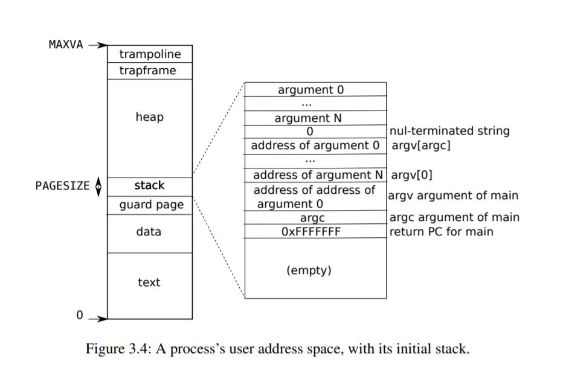

- 第一个进程的页表如何创建的？又是如何映射的，在哪个时候映射？

**userinit()会为临时进程initcode配置进程环境，比如进程页表，分配映射4KB的物理空间（initcode是一段及简的汇编程序主要是执行exec（/init）），exec保持进程 PID 不变（“换核不换壳”），销毁当前进程的所有用户地址空间，创建新的页表重新加载指定程序（`/init`）的二进制代码 / 数据到新的用户地址空间，并设置好执行上下文，初始化用户栈等等...**。

- userinit函数

  ```c
  void uvminit(pagetable_t pagetable, uchar *src, uint sz)
  {
    char *mem;
    if(sz >= PGSIZE)
      panic("inituvm: more than a page");
    mem = kalloc();	//分配一个物理页
    memset(mem, 0, PGSIZE);
    mappages(pagetable, 0, PGSIZE, (uint64)mem, PTE_W|PTE_R|PTE_X|PTE_U);
    memmove(mem, src, sz);
  }
  //将src上的内容拿到物理空间mem上，再将mem映射给进程页表上的虚拟地址0x0
  ```

  

  ```c
  void
  userinit(void)
  {
    struct proc *p;
    p = allocproc();	//分配一个可用的进程槽，并且为这个进程分配了一张根页表p->pagetable
    initproc = p;		// 标记这个进程为「初始用户进程」（全局变量initproc）
    
    uvminit(p->pagetable, initcode, sizeof(initcode));	//重点，现在第一个进程的虚拟地址0x0上存储的就是		//initcode，initcode是一小程序大小不超过一页，作用是执行 exec("/init") 启动真正的 init 进程
    p->sz = PGSIZE;		//设置进程p的用户空间大小仅一页4KB
  
    // 用于进程切换工作空间时存储上下文信息
    p->trapframe->epc = 0;      //设置用户态程序计数器（PC）
    p->trapframe->sp = PGSIZE;  //设置用户态栈指针（SP）
  
    safestrcpy(p->name, "initcode", sizeof(p->name));		//设置进程名
    p->cwd = namei("/");		//设置进程的当前工作目录为根目录
    p->state = RUNNABLE;		//标记进程为就绪态
    release(&p->lock);
  }
  ```

**userinit（）只是为initcode这个进程创建了一个临时的进程地址空间，只有一页大小，main函数最后会执行进程循环调度scheduler();来调度initcode这个进程**

- scheduler()干了什么？

  1、userinit 把 initcode 进程设为 RUNNABLE；
  2、调度器遍历到该进程，acquire(&p->lock) 加锁；
  3、改状态为 RUNNING，调用 swtch(&c->context, &p->context)；
  4、swtch 恢复 initcode 进程的内核上下文，跳转到 trapret 函数；
  5、trapret 执行 sret 指令，切换到用户态，执行 initcode；
  6、initcode 执行 exec("/init") 系统调用，陷入内核；
  7、内核处理完 exec 后，将 /init 进程设为 RUNNABLE；
  8、swtch 切回调度器，调度器释放锁，继续循环 —— 下次会选中 /init 进程执行。

  **注意：在switch之前进程还没调度，在switch结束的时候也就意味着这个进程调度已经结束了，scheduler要开始下一个进程调度了**

- sys_exec()解读：

  

先了解几个必要函数：

```c
//用于查找用户虚拟地址对应映射的物理地址
uint64 walkaddr(pagetable_t pagetable, uint64 va)
{
  pte_t *pte;
  uint64 pa;
  if(va >= MAXVA)	//虚拟地址越界
    return 0;
  pte = walk(pagetable, va, 0);	//返回虚拟地址对应的pte
  if(pte == 0)	//如果这个虚拟地址没被映射过
    return 0;
  if((*pte & PTE_V) == 0)	//pte映射无效
    return 0;
  if((*pte & PTE_U) == 0)	//PTE是否属于用户态（防止访问内核态地址）
    return 0;
  pa = PTE2PA(*pte);	//将pte里的pnn转换为物理地址返回
  return pa;
}
//fetchaddr解析：从进程的用户空间地址addr读取一个uint64类型的数据到内核变量
int fetchaddr(uint64 addr, uint64 *ip)
{
  struct proc *p = myproc();
    //检测地址合法性，进程的用户空间虚拟地址范围为0x0-p->size-1，地址越界返回-1
  if(addr >= p->sz || addr+sizeof(uint64) > p->sz)
    return -1;
    //从用户空间addr处读取内8字节数据到内核空间ip变量中去
  if(copyin(p->pagetable, (char *)ip, addr, sizeof(*ip)) != 0)
    return -1;
  return 0;
}
```

sys_exec()：将exec的参数从用户空间拷贝到内核空间

```c
uint64 sys_exec(void)
{
  char path[MAXPATH], *argv[MAXARG];	//定义一个path用于存放exec传入的程序路径
    						//内核空间定义一个大小为MAXARG的数组，声明数组里存放的是char*类型的数据，比如
    						//"hello"这个字符串他的首地址（用户空间虚拟地址）就是char*类型
  int i;
  uint64 uargv, uarg;	//在内核空间定义两个变量，uargv用于存放exec传入参数argv[]的首地址
    					//uarg用于存放第i个参数，也是参数的首地址
  if(argstr(0, path, MAXPATH) < 0 || argaddr(1, &uargv) < 0){
    return -1;
  //把a0：程序路径拷贝到path里去，把exec参数argv[]数组的首地址放到uargv中去
  }
  memset(argv, 0, sizeof(argv));	//给argv填0也是null，避免野指针，符号exec参数要求，参数以null(0)结尾
  for(i=0;; i++){
    if(i >= NELEM(argv)){	//判断exec带的参数个数是不是越界了
      goto bad;
    }
      //读取用户态argv[i]里的字符串地址（uargv+8*i），存入uarg
    if(fetchaddr(uargv+sizeof(uint64)*i, (uint64*)&uarg) < 0){
      goto bad;
    }
      //用户态argv以NULL结尾（uarg=0
    if(uarg == 0){	//拷贝到停止符了，表示参数拷贝结束
      argv[i] = 0;
      break;
    }
    argv[i] = kalloc();//分配内核内存（存储参数字符串），内核的argv[i]存放物理内存的地址
    if(argv[i] == 0)	//物理内存耗尽
      goto bad;
    if(fetchstr(uarg, argv[i], PGSIZE) < 0)//从用户态uarg地址拷贝参数字符串到内核内存
      goto bad;
  }
 //现在用户空间的argv[]已经被拷贝到了内核空间的argv[]里去了，内核的argv[i]存放的是exec参数的物理地址
//在此之前sys_exec主要是将exec里的argv[]安全拷贝到内核的argv[]
  int ret = exec(path, argv);

  for(i = 0; i < NELEM(argv) && argv[i] != 0; i++)	//释放物理页
    kfree(argv[i]);

  return ret;

 bad:
  for(i = 0; i < NELEM(argv) && argv[i] != 0; i++)	//如果出错释放物理页返回-1
    kfree(argv[i]);
  return -1;
}
```

- kernel/exec解读

  ```c
  int
  exec(char *path, char **argv)
  {
    char *s, *last;
    int i, off;
    uint64 argc, sz = 0, sp, ustack[MAXARG+1], stackbase;
    struct elfhdr elf;
    struct inode *ip;
    struct proghdr ph;
    pagetable_t pagetable = 0, oldpagetable;
    struct proc *p = myproc();
  
    begin_op();
  
    if((ip = namei(path)) == 0){
      end_op();
      return -1;
    }
    ilock(ip);
  
    // Check ELF header 确保要加载的是有效的可执行程序
    if(readi(ip, 0, (uint64)&elf, 0, sizeof(elf)) != sizeof(elf))
      goto bad;
    if(elf.magic != ELF_MAGIC)
      goto bad;
  
    if((pagetable = proc_pagetable(p)) == 0)//①、为进程分配一个全新的根页表，映射了trampoline，trapframe
      goto bad;
  
    // ②下载待执行用户进程的程序到内存，对应进程页表里的text段和data段的映射
    for(i=0, off=elf.phoff; i<elf.phnum; i++, off+=sizeof(ph)){
      if(readi(ip, 0, (uint64)&ph, off, sizeof(ph)) != sizeof(ph))
        goto bad;
      if(ph.type != ELF_PROG_LOAD)
        continue;
      if(ph.memsz < ph.filesz)
        goto bad;
      if(ph.vaddr + ph.memsz < ph.vaddr)
        goto bad;
      uint64 sz1;
      if((sz1 = uvmalloc(pagetable, sz, ph.vaddr + ph.memsz)) == 0)
        goto bad;
      sz = sz1;
      if(ph.vaddr % PGSIZE != 0)
        goto bad;
      if(loadseg(pagetable, ph.vaddr, ip, ph.off, ph.filesz) < 0)
        goto bad;
    }
    iunlockput(ip);
    end_op();
    ip = 0;
  
    p = myproc();
    uint64 oldsz = p->sz;
  
    //③在下一个页边界分配两个页面。
   // 使用第二个作为用户栈。
    sz = PGROUNDUP(sz);
    uint64 sz1;
    if((sz1 = uvmalloc(pagetable, sz, sz + 2*PGSIZE)) == 0)
      goto bad;
    sz = sz1;
    uvmclear(pagetable, sz-2*PGSIZE);  // 栈内存清零
    sp = sz;							// 栈指针指向栈顶
    stackbase = sp - PGSIZE;
  
    // Push argument strings, prepare rest of stack in ustack.
    for(argc = 0; argv[argc]; argc++) {
      if(argc >= MAXARG)
        goto bad;
      sp -= strlen(argv[argc]) + 1;
      sp -= sp % 16; // riscv sp must be 16-byte aligned
      if(sp < stackbase)
        goto bad;
      if(copyout(pagetable, sp, argv[argc], strlen(argv[argc]) + 1) < 0)
        goto bad;
      ustack[argc] = sp;
    }
    ustack[argc] = 0;
  
    // push the array of argv[] pointers.
    sp -= (argc+1) * sizeof(uint64);
    sp -= sp % 16;
    if(sp < stackbase)
      goto bad;
    if(copyout(pagetable, sp, (char *)ustack, (argc+1)*sizeof(uint64)) < 0)
      goto bad;
  
    // arguments to user main(argc, argv)
    // argc is returned via the system call return
    // value, which goes in a0.
    p->trapframe->a1 = sp;
  
    // Save program name for debugging.
    for(last=s=path; *s; s++)
      if(*s == '/')
        last = s+1;
    safestrcpy(p->name, last, sizeof(p->name));
      
    // Commit to the user image.
    oldpagetable = p->pagetable;
    p->pagetable = pagetable;    //使用新页表
    p->sz = sz;
    //重置进程上下文
    p->trapframe->epc = elf.entry;  // initial program counter = main
    p->trapframe->sp = sp; // initial stack pointer
    proc_freepagetable(oldpagetable, oldsz);
   
    return argc; // this ends up in a0, the first argument to main(argc, argv)
  
   bad:
    if(pagetable)
      proc_freepagetable(pagetable, sz);
    if(ip){
      iunlockput(ip);
      end_op();
    }
    return -1;
  }
  
  ```
  
  从这里可以看出，exec函数在初始化进程的时候①、为新进程分配一张新页表，将进程页表的陷阱页进行映射。②、为进程分配数据段（data）和代码段（text）将进程程序写入虚拟内存③、为进程分配两页虚拟内存用于栈和保护页。
  
  现在页表只剩下堆区的内存没有分配了。那么他在哪里分配呢？
  
  - 堆区内存分配：malloc
  
  ```c
  void*
  malloc(uint nbytes)
  {
    Header *p, *prevp;
    uint nunits;
  
    nunits = (nbytes + sizeof(Header) - 1)/sizeof(Header) + 1;
    if((prevp = freep) == 0){
      base.s.ptr = freep = prevp = &base;
      base.s.size = 0;
    }
    for(p = prevp->s.ptr; ; prevp = p, p = p->s.ptr){
      if(p->s.size >= nunits){
        if(p->s.size == nunits)
          prevp->s.ptr = p->s.ptr;
        else {
          p->s.size -= nunits;
          p += p->s.size;
          p->s.size = nunits;
        }
        freep = prevp;
        return (void*)(p + 1);
      }
      if(p == freep)
        if((p = morecore(nunits)) == 0)
          return 0;
    }
  }
  static Header*
  morecore(uint nu)
  {
    char *p;
    Header *hp;
  
    if(nu < 4096)
      nu = 4096;
    p = sbrk(nu * sizeof(Header));
    if(p == (char*)-1)
      return 0;
    hp = (Header*)p;
    hp->s.size = nu;
    free((void*)(hp + 1));
    return freep;
  }
  ```
  
  如果堆区内存不足就会调用sbrk这个系统调用为进程分配堆区内存。

## code:sbrk

- uvmunmap()函数解析：释放第三级页表的物理映射

  ```c
  //从虚拟地址va开始释放n个页的映射，va必须是页对齐的。
  //这个函数只能用来释放第三级页表
  void uvmunmap(pagetable_t pagetable, uint64 va, uint64 npages, int do_free)
  {
    uint64 a;
    pte_t *pte;
  
    if((va % PGSIZE) != 0)	//判断是否页对齐
      panic("uvmunmap: not aligned");
      
    for(a = va; a < va + npages*PGSIZE; a += PGSIZE){
      if((pte = walk(pagetable, a, 0)) == 0)	//判断是否映射了
        panic("uvmunmap: walk");
      if((*pte & PTE_V) == 0)		//判断映射是否有效
        panic("uvmunmap: not mapped");
      if(PTE_FLAGS(*pte) == PTE_V)	//地区pte标志位，如果标志位只有pte_v那么说明这个pte不是最后一级页表
        panic("uvmunmap: not a leaf");
      if(do_free){	//释放pte
        uint64 pa = PTE2PA(*pte);
        kfree((void*)pa);
      }
      *pte = 0;		//取消映射后，页表项写0
    }
  }
  ```


- freewalk()：消除页表本身，不释放物理空间；调用该函数之前需要先调用uvmunmap，否则会panic("freewalk: leaf");

  ```c
  void freewalk(pagetable_t pagetable)
  {
    // there are 2^9 = 512 PTEs in a page table.
    for(int i = 0; i < 512; i++){
      pte_t pte = pagetable[i];
      if((pte & PTE_V) && (pte & (PTE_R|PTE_W|PTE_X)) == 0){
        // 不是最后一级页表
        uint64 child = PTE2PA(pte);
        freewalk((pagetable_t)child);	//递归释放
        pagetable[i] = 0;
      } else if(pte & PTE_V){
        panic("freewalk: leaf");
      }
    }
    //uvmunmap中*pte = 0;所以如果是L0的pte直接不会进if
    kfree((void*)pagetable);		//释放页表
  }


- uvmdealloc():为用户空间缩小虚拟内存

  ```c
  uint64
  uvmdealloc(pagetable_t pagetable, uint64 oldsz, uint64 newsz)
  {
    if(newsz >= oldsz)	//只进行缩小
      return oldsz;
    if(PGROUNDUP(newsz) < PGROUNDUP(oldsz)){	//页对其
      int npages = (PGROUNDUP(oldsz) - PGROUNDUP(newsz)) / PGSIZE;	//计算要缩小多少页
      uvmunmap(pagetable, PGROUNDUP(newsz), npages, 1);	//从新的空间边界开始释放n个页
    }
  
    return newsz;
  }
  ```

  

- uvmalloc()：为用户空间扩展虚拟内存

  ```c
  uint64 uvmalloc(pagetable_t pagetable, uint64 oldsz, uint64 newsz)
  {
    //oldsz进程当前的地址空间大小（虚拟地址范围的上界）
    char *mem;
    uint64 a;
    if(newsz < oldsz)	//新的小于旧的返回旧大小，只做扩展	
      return oldsz;
  
    oldsz = PGROUNDUP(oldsz);	//对旧空间大小进行页对其
    for(a = oldsz; a < newsz; a += PGSIZE){
      mem = kalloc();
      if(mem == 0){	//如果物理内存耗尽
        uvmdealloc(pagetable, a, oldsz);	//回滚以分配的页
        return 0;
      }
      memset(mem, 0, PGSIZE);		//清空物理页：避免残留内核/其他进程的数据，保证进程地址空间干净
      if(mappages(pagetable, a, PGSIZE, (uint64)mem, PTE_W|PTE_X|PTE_R|PTE_U) != 0){
          //将虚拟地址映射到物理地址，映射失败了
        kfree(mem);	//释放物理页
        uvmdealloc(pagetable, a, oldsz);		//回滚已分配的页
        return 0;
      }
    }
    return newsz;		//成功则返回新页的大小
  }
  ```

- sys_sbrk():系统调用传入需要扩展的空间大小，返回扩展后的进程空间大小

  ```c
  int growproc(int n)
  {
    uint sz;
    struct proc *p = myproc();
    sz = p->sz;
    if(n > 0){	//扩展
      if((sz = uvmalloc(p->pagetable, sz, sz + n)) == 0) {
        return -1;
      }
    } else if(n < 0){		//缩小
      sz = uvmdealloc(p->pagetable, sz, sz + n);
    }
    p->sz = sz;	//刷新当前进程pcb
    return 0;
  }
  uint64 sys_sbrk(void)	//返回扩展后的进程空间大小
  {
    int addr;
    int n;
  
    if(argint(0, &n) < 0)
      return -1;
    addr = myproc()->sz;
    if(growproc(n) < 0)
      return -1;
    return addr;
  }
  ```

  

## 关于内核页表和进程页表

对于xv6，它在内核里为自己维护了一个内核页表，这个内核页表存放在内核空间，所有进程在进行系统调用的时候mmu会使用这个页表，这个页表只有内核空间虚拟地址的映射，属于所有进程共享的。对于每个进程而言，他们各自维护着一个自己的页表，当系统运行在用户空间时mmu会使用这张页表，这张页表里只有用户的空间虚拟地址的映射。内核空间映射的是内核页表的高地址部分，用户空间映射的是用户页表的低地址部分，所以我们在内核空间的时候想要读取用户空间的数据，如果我们直接读取页表的低地址部分，系统会显示页表未映射，因为我们使用的是内核页表，这张页表的低地址部分压根没有映射过，所以copyin的操作是在内核空间通过walk函数遍历页表来得到用户空间的虚拟地址所对应的物理地址，再把物理地址上的数据拷贝到内核空间，及其麻烦！！！


# 5、陷入

当系统发生系统调用、设备中断、异常时，cpu会暂停手头正在执行的指令，去执行处理这些事件的特殊代码。我们把这些事件统称为trap。trap可以来自用户空间，也可以来自内核空间，还可以是定时器中断。对于这三种不同的trap，xv6有三种处理方式。

## RISK-V的trap机制

- 几个重要寄存器

1、stvec：这里存放着trpa处理程序的地址

2、sepc：当发生trap时，RISK-V会把程序程序计数器保存在这里（类似于中断的现场保护）。

3、scause：RISK-V在这里存放一个数字，用来描述trap的原因

4、sscratch：内核在这里放置了一个值，这个值会方便 trap 恢复/储存用户上下文

sscratch：存放的是当前进程陷阱帧的虚拟地址TRAPFRAME（用户空间的虚拟地址）

5、sstatus：sstatus 中的 **SIE 位控制设备中断是否被启用**，如果内核清除 SIE，RISCV 将推迟设备中断，直到内核设置 SIE。**SPP 位表示 trap 是来自用户模式还是监督者模式**，并控制 **sret **返回到什么模式。 

- RISK-V的trap机制（定时器中断除外）：

1、如果是设备中断并且SIE是0，则不进行操作

2、通过清除SIE来禁用中断

3、复制pc到sepc（中断现场保护）

4、将当前模式(用户或监督者)保存在 sstatus 的 SPP 位。

5、在 scause 设置该次 trap 的原因。

6、将模式转换为监督者。

7、将stvec复制给pc

8、执行新的pc

注意：这里必须保证pc切换到内核空间。因为内核代码是安全稳定的，如果pc停留在用户程序，这个时候恶意程序取得了监督态的权限（内核态）那么他可以修改satp寄存器的值，可以使它指向一个映射所有物理地址的页表，那样恶意程序可以直接访问所有物理内存了。

注意，CPU 不会切换到内核页表，不会切换到内核中的栈，也不会保存 pc 以外的任何 寄存器。内核软件必须执行这些任务

## 用户空间的陷入

### trampoline和TRAPFRAME的映射分析

- 首先xv6在创建内核页表的时候会为trampoline.S这一段程序分配4KB物理内存，并且将虚拟地址TRAMPOLINE（高地址）映射到这块物理空间上。其次内核在创建进程的时候对于进程的用户页表也会这么映射，在用户页表里面将虚拟地址TRAMPOLINE映射到同一块物理地址。

注意两点：1、保证内核页表和用户页表里面的TRAMPOLINE都是同一个虚拟地址是为了在切换页表的时候能保证trampoline.S持续运行。2、用户页表里面的虚拟地址TPRMPOLINE是高虚拟地址，用户空间寻址不到，只要在调用trap()的时候cpu主动访问。并且这一块区域无论内核还是用户都不可以写，避免破坏程序。


- 用户页表里面还有一个trapframe陷阱帧。

  1、内核在创建进程的时候会为进程开辟一块4KB的物理内存用作陷阱帧，将其**物理地址**返回给p->trapframe(注意这个物理地址也是内核的虚拟地址，因为在创建内核页表的时候内核已经把RAM一一映射了)

  2、内核在创建第一个进程之后第一个进程被调度从forkret开始执行，forkret释放进程锁 → usertrapret填充陷阱帧的前40字节的数据：偏移 0：当前内核页表的地址（kernel_satp）；偏移 8：该进程的内核栈顶地址；偏移 16：内核trap处理函数usertrap()的地址；偏移 32：当前 CPU 核的 ID（hartid）；后续这40个字节的数据在每次完成陷入操作之后返回用户空间时由usertrapret()写入进程陷阱帧，为下一次陷入做准备。

  3、创建用户页表时，映射TRAPFRAME（虚拟高地址），到这块陷阱帧，并设置RWU

注意：区分跳板函数trampoline，和陷阱帧trapframe。


问题：在用户页表里设置了pte为rwu那不是用户也可以读取了吗，这样陷阱帧里面内核的东西不是都给人知道了？

​	首先：为什么要设置U，这个u是为了在用户态执行trampoline.S的时候可以访问到陷阱帧的内容，trampoline.S这个程序是可以信任的，而非是让用户程序来访问。

​	其次：这个映射的TRAPFRAME这个虚拟地址只有内核知道，用户程序是不知道的。并且这个虚拟地址在高地址上，用户程序寻址不到这里。

​	最后：即使给你寻址到了，读取到了内核页表地址等等相关信息，但是此时还在用户态权限不够你执行一些违规操作。

### RISK-V的ecall/sret指令干了什么

- ecall：进内核

1、保存当前状态到 sstatus 寄存器：设置SPP，设置SIE禁用中断。

2、记录陷阱信息：设置scause寄存器为8（系统调用），设置sepc寄存器为ecall指令的地址。

3、切换执行流：程序跳转去执行TRAMPOLINE页面上的uservec函数。

注意这个操作过程是原子性的不会被干扰。

- sret：出内核

1、读取寄存器里的ssp，将cpu特权级恢复为原来的状态

2、恢复程序计数器：将cpu的pc指针指向sepc寄存器的值

3、恢复 SIE: sret 会将 sstatus.SPIE位的值复制到 sstatus.SIE位。

### 陷入内核和返回用户空间

-  整体流程：用户程序触发trap → cpu查看stvec去执行uservec → uservec进行现场保护跳转usertrap → usertrap执行对应的陷阱处理程序 → usertrapret为userret恢复现场做准备 → userret恢复现场并跳转回用户空间 → 用户程序继续运行 

trampoline.S解析：

```c
# 该汇编代码实现用户态与内核态之间的切换逻辑
# 这段代码被同时映射到用户页表和内核页表的同一虚拟地址(TRAMPOLINE)
# 这样在切换页表的过程中，代码仍能持续执行而不中断
# kernel.ld 链接脚本确保这段代码按页边界对齐
.section trampsec   # 定义trampoline专属段
.globl trampoline   # 导出trampoline标签，供其他模块引用
trampoline:         # trampoline入口标签，作为态切换的跳板
.align 4            # 指令按4字节对齐，保证RISC-V指令执行正确性
.globl uservec      # 导出uservec标签，作为trap入口
#----------------------------------------------------------------------------------------------------
uservec:            # uservec：用户态触发trap进入内核态的入口
    # trap.c文件中会将stvec寄存器设置为该地址
    # 因此用户空间触发的所有trap都会从这里开始执行
    # 此时CPU处于监督者模式(内核态)，但仍使用用户页表
    # sscratch寄存器中提前存放了当前进程的trapframe(陷阱帧)在用户空间的映射地址(TRAPFRAME)
    
    # 交换a0寄存器和sscratch寄存器的值
    # 交换后，a0将持有TRAPFRAME(陷阱帧)的地址，sscratch暂存用户态的a0值
    csrrw a0, sscratch, a0

    # 将用户态的通用寄存器依次保存到TRAPFRAME(陷阱帧)中，保存用户上下文
    sd ra, 40(a0)    # 保存返回地址寄存器ra到陷阱帧偏移40处
    sd sp, 48(a0)    # 保存用户态栈指针sp到陷阱帧偏移48处
    sd gp, 56(a0)    # 保存全局指针gp到陷阱帧偏移56处
    sd tp, 64(a0)    # 保存线程指针tp到陷阱帧偏移64处
    sd t0, 72(a0)    # 保存临时寄存器t0到陷阱帧偏移72处
    sd t1, 80(a0)    # 保存临时寄存器t1到陷阱帧偏移80处
    sd t2, 88(a0)    # 保存临时寄存器t2到陷阱帧偏移88处
    sd s0, 96(a0)    # 保存保存寄存器s0到陷阱帧偏移96处
    sd s1, 104(a0)   # 保存保存寄存器s1到陷阱帧偏移104处
    sd a1, 120(a0)   # 保存参数寄存器a1到陷阱帧偏移120处
    sd a2, 128(a0)   # 保存参数寄存器a2到陷阱帧偏移128处
    sd a3, 136(a0)   # 保存参数寄存器a3到陷阱帧偏移136处
    sd a4, 144(a0)   # 保存参数寄存器a4到陷阱帧偏移144处
    sd a5, 152(a0)   # 保存参数寄存器a5到陷阱帧偏移152处
    sd a6, 160(a0)   # 保存参数寄存器a6到陷阱帧偏移160处
    sd a7, 168(a0)   # 保存参数寄存器a7到陷阱帧偏移168处
    sd s2, 176(a0)   # 保存保存寄存器s2到陷阱帧偏移176处
    sd s3, 184(a0)   # 保存保存寄存器s3到陷阱帧偏移184处
    sd s4, 192(a0)   # 保存保存寄存器s4到陷阱帧偏移192处
    sd s5, 200(a0)   # 保存保存寄存器s5到陷阱帧偏移200处
    sd s6, 208(a0)   # 保存保存寄存器s6到陷阱帧偏移208处
    sd s7, 216(a0)   # 保存保存寄存器s7到陷阱帧偏移216处
    sd s8, 224(a0)   # 保存保存寄存器s8到陷阱帧偏移224处
    sd s9, 232(a0)   # 保存保存寄存器s9到陷阱帧偏移232处
    sd s10, 240(a0)  # 保存保存寄存器s10到陷阱帧偏移240处
    sd s11, 248(a0)  # 保存保存寄存器s11到陷阱帧偏移248处
    sd t3, 256(a0)   # 保存临时寄存器t3到陷阱帧偏移256处
    sd t4, 264(a0)   # 保存临时寄存器t4到陷阱帧偏移264处
    sd t5, 272(a0)   # 保存临时寄存器t5到陷阱帧偏移272处
    sd t6, 280(a0)   # 保存临时寄存器t6到陷阱帧偏移280处

    # 从sscratch中取出暂存的用户态a0值，保存到陷阱帧的a0对应偏移(112)处
    csrr t0, sscratch  # 读取sscratch寄存器值到t0(即用户态a0)
    sd t0, 112(a0)     # 将用户态a0保存到陷阱帧偏移112处

    # 从陷阱帧中加载内核栈顶地址，将栈指针sp从用户栈切换到内核栈
    ld sp, 8(a0)

    # 从陷阱帧中加载当前CPU核ID(hartid)，存入tp寄存器供内核识别当前核
    ld tp, 32(a0)

    # 从陷阱帧中加载内核trap处理函数usertrap()的地址，存入t0
    ld t0, 16(a0)

    # 从陷阱帧中加载内核页表地址，切换到内核页表
    ld t1, 0(a0)        # 读取陷阱帧中内核页表地址到t1
    csrw satp, t1       # 将内核页表地址写入satp寄存器，切换页表
    sfence.vma zero, zero  # 刷新TLB(页表缓存)，确保新页表生效

    # 此时a0不再有效，因为内核页表未对进程的trapframe做特殊映射（TRAPFARME和p->trapframe是两个不同的虚拟地址）

    # 跳转到usertrap()函数执行内核态trap处理逻辑，该函数无直接返回
    jr t0
#----------------------------------------------------------------------------------------------------
.globl userret       # 导出userret标签，作为内核返回用户态的入口
userret:             # userret：内核态处理完trap后返回用户态的入口
    # userret(TRAPFRAME, pagetable)
    # 功能：从内核态切换回用户态，由usertrapret()函数调用
    # 参数a0：TRAPFRAME地址(在用户页表中映射)
    # 参数a1：用户页表地址(用于切换回用户页表)

    # 切换回用户页表
    csrw satp, a1        # 将a1中的用户页表地址写入satp寄存器
    sfence.vma zero, zero  # 刷新TLB，确保用户页表生效

    # 从陷阱帧中读取保存的用户态a0值，存入sscratch，为后续交换恢复做准备
    ld t0, 112(a0)       # 读取陷阱帧中保存的用户态a0到t0
    csrw sscratch, t0    # 将用户态a0存入sscratch寄存器

    # 从陷阱帧中恢复除a0外的所有用户态通用寄存器，恢复用户上下文
    ld ra, 40(a0)    # 从陷阱帧偏移40处恢复返回地址寄存器ra
    ld sp, 48(a0)    # 从陷阱帧偏移48处恢复用户态栈指针sp
    ld gp, 56(a0)    # 从陷阱帧偏移56处恢复全局指针gp
    ld tp, 64(a0)    # 从陷阱帧偏移64处恢复线程指针tp
    ld t0, 72(a0)    # 从陷阱帧偏移72处恢复临时寄存器t0
    ld t1, 80(a0)    # 从陷阱帧偏移80处恢复临时寄存器t1
    ld t2, 88(a0)    # 从陷阱帧偏移88处恢复临时寄存器t2
    ld s0, 96(a0)    # 从陷阱帧偏移96处恢复保存寄存器s0
    ld s1, 104(a0)   # 从陷阱帧偏移104处恢复保存寄存器s1
    ld a1, 120(a0)   # 从陷阱帧偏移120处恢复参数寄存器a1
    ld a2, 128(a0)   # 从陷阱帧偏移128处恢复参数寄存器a2
    ld a3, 136(a0)   # 从陷阱帧偏移136处恢复参数寄存器a3
    ld a4, 144(a0)   # 从陷阱帧偏移144处恢复参数寄存器a4
    ld a5, 152(a0)   # 从陷阱帧偏移152处恢复参数寄存器a5
    ld a6, 160(a0)   # 从陷阱帧偏移160处恢复参数寄存器a6
    ld a7, 168(a0)   # 从陷阱帧偏移168处恢复参数寄存器a7
    ld s2, 176(a0)   # 从陷阱帧偏移176处恢复保存寄存器s2
    ld s3, 184(a0)   # 从陷阱帧偏移184处恢复保存寄存器s3
    ld s4, 192(a0)   # 从陷阱帧偏移192处恢复保存寄存器s4
    ld s5, 200(a0)   # 从陷阱帧偏移200处恢复保存寄存器s5
    ld s6, 208(a0)   # 从陷阱帧偏移208处恢复保存寄存器s6
    ld s7, 216(a0)   # 从陷阱帧偏移216处恢复保存寄存器s7
    ld s8, 224(a0)   # 从陷阱帧偏移224处恢复保存寄存器s8
    ld s9, 232(a0)   # 从陷阱帧偏移232处恢复保存寄存器s9
    ld s10, 240(a0)  # 从陷阱帧偏移240处恢复保存寄存器s10
    ld s11, 248(a0)  # 从陷阱帧偏移248处恢复保存寄存器s11
    ld t3, 256(a0)   # 从陷阱帧偏移256处恢复临时寄存器t3
    ld t4, 264(a0)   # 从陷阱帧偏移264处恢复临时寄存器t4
    ld t5, 272(a0)   # 从陷阱帧偏移272处恢复临时寄存器t5
    ld t6, 280(a0)   # 从陷阱帧偏移280处恢复临时寄存器t6

    # 交换a0和sscratch寄存器的值：恢复用户态a0，同时将TRAPFRAME地址存回sscratch
    csrrw a0, sscratch, a0
    
    # 返回到用户态并恢复用户态程序计数器(PC)
    # usertrapret()函数已提前配置好sstatus(特权级别)和sepc(用户态PC)寄存器
    sret
```


usertrap()函数：

```c
void
usertrap(void)
{
  int which_dev = 0;

  if((r_sstatus() & SSTATUS_SPP) != 0)	//读取sstatus寄存器并且检查SSTATUS_SPP标志位，判断是否来自用户模式										//的陷入
    panic("usertrap: not from user mode");

	//原来stvec寄存器里面存放的是uservec的入口地址，用来处理来自用户态的陷阱；现在进入内核态了，如果内核自身发	生了陷入需要一个不同的处理函数来处理所以这里要重新写stvec寄存器为kernelvec，用来处理来自内核的陷入
  w_stvec((uint64)kernelvec);
 
  struct proc *p = myproc();
  // 保存用户程序指针
  p->trapframe->epc = r_sepc();		//读取sepc寄存器到用户帧，因为可能会有一个进程切换
  
  if(r_scause() == 8){		//判断陷入原因
    // system call
    if(p->killed)
      exit(-1);
    // 这个时候sepc指向的是用户封装的系统调用里的ecall指令
    // 我们需要返回下一条程序指令
    p->trapframe->epc += 4;			//将sepc偏移4字节，每条risk—v指令占据4字节大小

    // 中断会改变sstatus寄存器的值
    // 所以在处理完这些寄存器之前不要启动中断；在进入 usertrap() 时，中断是被禁用的（硬件自动操作）
    intr_on();		//启动中断
    syscall();
  } else if((which_dev = devintr()) != 0){		//判断是否是外部设备产生的中断
    // ok
  } else {
    printf("usertrap(): unexpected scause %p pid=%d\n", r_scause(), p->pid);
    printf("            sepc=%p stval=%p\n", r_sepc(), r_stval());
    p->killed = 1;		//其他不明的陷入，杀死进程
  }
  if(p->killed)
    exit(-1);

  // 如果是一个定时器中断那么会让出cpu，（cpu进程调度）
  if(which_dev == 2)
    yield();

  usertrapret();	//返回用户态
}
```

usertrapret()函数：

```c
void
usertrapret(void)
{
  struct proc *p = myproc();
  intr_off();	//关中断，修改SIE
  w_stvec(TRAMPOLINE + (uservec - trampoline));	//计算处uservec的绝对地址，写入stvec寄存器，为下一次用户空											//间的陷入做准备
//从新写陷阱帧的前40字节数据
  p->trapframe->kernel_satp = r_satp();         // kernel page table
  p->trapframe->kernel_sp = p->kstack + PGSIZE; // process's kernel stack
  p->trapframe->kernel_trap = (uint64)usertrap;
  p->trapframe->kernel_hartid = r_tp();         // hartid for cpuid()

  unsigned long x = r_sstatus();
  x &= ~SSTATUS_SPP; // 清除SPP标志位，因为ecall指令设置了ssp
  x |= SSTATUS_SPIE; //SSTATUS_SPIE用于记录在陷入之前的SIE，这里方便后续sret恢复SIE
    //由于这里已经知道是用户态的trap，所以就直接x &= ~SSTATUS_SPP把ssp设置成0，并且知道ecall会清除SIE所以也	//是直接给SPIE位赋值1
  w_sstatus(x);

  // 设置返回地址，即ecall的下一条sret指令的地址
  w_sepc(p->trapframe->epc);

  // 将页表切换回用户页表
  uint64 satp = MAKE_SATP(p->pagetable);

  uint64 fn = TRAMPOLINE + (userret - trampoline);	//得到userret的绝对地址
  ((void (*)(uint64,uint64))fn)(TRAPFRAME, satp);	//执行trapmpoline.S里的userret
  //注意a0寄存器存放第一个参数TRAPFRAME，a1寄存器存放第二个参数satp
}
```

- uservec：它可以使用a0寄存器，他先交换a0和sscratch寄存器（sscratch存放陷阱帧的虚拟地址），通过a0来访问陷阱帧；接着将用户空间下的各个寄存器的值存储到陷阱帧里面去（现场保护因为usertrap()在执行的时候会使用这些寄存器，它们的值会被覆盖）；然后再把栈指针sp切换指向内核栈，并且刷新内核页表到TLB（这个时候程序跳转到内核空间运行），最后跳转到**usertrap()（kernel/trap.c）**函数执行内核态trap处理逻辑。
- usertrap：主要做的就是判断trap是来自用户模式还是内核模式，如果是来自用户模式设置stvec为内“核模式陷入处理函数”入口地址并判断是什么类型的trap，执行相应的措施。（比如系统调用执行对应的调用函数，如果是其他恶意trap则给出预警，并杀死进程。）最后调用usertrapret准备恢复现场返回用户态。
- usertrapret：重新写入陷阱帧的前40字节数据，设置sstatus寄存器的SSP、SIE、SPIE，写sepc寄存器为后续sret返回用户态做准备，并且将用户页表写入satp寄存器；调用trampoline.s中的userret程序
- userret：刷新TLB（程序返回到用户空间运行）将陷阱帧里面保存的寄存器状态重新恢复到寄存器，执行sret指令返回到用户封装的系统调用函数里去

注意：刷新TLB只能trampoline.S来干，如果用户程序或者内核程序干了这个那么会导致虚拟地址解析出错。还有这里并没有对sstatus寄存器进行保存，按理来说每个进程都需要将sstatus寄存器保存到陷阱帧里面，方便下一次陷入。这里不保存是因为硬件以及对status中几个重要的标志位提供了一套完善的保护和恢复机制（比如ecall关闭中断，usertrapret重置sie，spie，sret开中断）无需软件干预。

注意：在usertrap中需要将sepc写入陷阱帧是因为可能在usertrap过程中触发定时器中断cpu循环调度其他进程会导致sepc被覆盖


## 内核空间的陷入

- 流程：

1、用户陷入内核空间的时候usertrap会把stvec寄存器设置为kernelvec。

2、内核程序触发trap：cpu原子性的设置scause，sepc，stval，寄存器。并且设置sstatus寄存器里的ssp=1，SIE=0（禁中断），SPIE=中断禁用前的中断状态，pc指向stvec里的kernelvec程序。

3、kernelvec开辟一个大小为256字节的栈帧用来保护现场，跳转去执行kerneltrap。

4、kerneltrap判断trap类型打印trap原因，进行相应的处理。函数执行完成之后ret会读取ra返回去继续执行kernelvec。

5、kernelvec接下来恢复现场，释放栈空间，调用sret指令读取sepc返回内核陷入之前的现场继续执行内核程序。

- 代码分析：

kernelvec.S

```assembly
# 导出 kernelvec 符号，使得内核的其他部分（如 trapinit()）可以引用这个地址
.globl kernelvec
# 对齐指令地址到 16 字节边界，这是 RISC-V 推荐的做法，可以提高取指效率
.align 4
# kernelvec: 内核陷阱入口
# 当一个陷阱（中断或异常）发生在内核态时，CPU 会根据 stvec 寄存器的值跳转到这里。
kernelvec:
        # 1. 保存现场 (Probe)
        # 为保存所有通用寄存器在栈上分配空间。
        # RISC-V 有 32 个通用寄存器 (x0-x31)，每个 8 字节，共 256 字节。
        # x0 (zero) 总是 0，无需保存。
        # ra, sp, gp, tp, t0-t6, s0-s11, a0-a7 共 31 个寄存器需要保存。
        # 分配 256 字节 (32 * 8) 是为了方便和对齐。
        addi sp, sp, -256

        # 将所有通用寄存器的值依次压入栈中。
        # 这样，当 C 语言函数 kerneltrap() 执行时，它可以自由使用这些寄存器，
        # 而不会破坏陷阱发生前的状态。
        sd ra, 0(sp)   # 保存返回地址
        sd sp, 8(sp)   # 保存压栈前的 sp 值。这很关键，因为如果在 kerneltrap() 中发生了
                       # 进程切换 (yield)，新进程的 sp 会不同。当切换回来时，需要用这个旧的 sp
                       # 来恢复现场。
        sd gp, 16(sp)  # 保存全局指针
        sd tp, 24(sp)  # 保存线程指针 (TLS)
        sd t0, 32(sp)  # 保存临时寄存器 t0-t6
        sd t1, 40(sp)
        sd t2, 48(sp)
        sd s0, 56(sp)  # 保存保存寄存器 s0-s11 (callee-saved)
        sd s1, 64(sp)
        sd a0, 72(sp)  # 保存参数/返回值寄存器 a0-a7
        sd a1, 80(sp)
        sd a2, 88(sp)
        sd a3, 96(sp)
        sd a4, 104(sp)
        sd a5, 112(sp)
        sd a6, 120(sp)
        sd a7, 128(sp)
        sd s2, 136(sp) # 继续保存保存寄存器 s2-s11
        sd s3, 144(sp)
        sd s4, 152(sp)
        sd s5, 160(sp)
        sd s6, 168(sp)
        sd s7, 176(sp)
        sd s8, 184(sp)
        sd s9, 192(sp)
        sd s10, 200(sp)
        sd s11, 208(sp)
        sd t3, 216(sp) # 继续保存临时寄存器 t3-t6
        sd t4, 224(sp)
        sd t5, 232(sp)
        sd t6, 240(sp)
        # 2. 调用 C 语言陷阱处理函数
        # 调用 kerneltrap() 函数。此时，所有寄存器的状态都已安全地保存在栈上。
        # kerneltrap() 会读取 scause, sepc 等 CSR 寄存器来判断陷阱类型并进行处理。
        call kerneltrap

        # ----------------------------------------------------------------------
        # 3. 恢复现场 (Epilogue)
        # 从栈中依次恢复所有通用寄存器的值。
        # 注意恢复的顺序与保存时相反。
        ld ra, 0(sp)
        ld sp, 8(sp)   # 恢复 sp。如果发生了进程切换，这里恢复的 sp 是陷阱发生时的内核栈顶。
        ld gp, 16(sp)
        # not this, in case we moved CPUs: ld tp, 24(sp)
        # 【重要】不恢复 tp 寄存器。原因是：如果在 kerneltrap() 中发生了进程切换，
        # 新进程可能在另一个 CPU 核心上运行。tp 寄存器通常用于存储线程局部存储 (TLS)
        # 的指针或 CPU ID。如果恢复了旧的 tp 值，可能会导致新 CPU 上的代码使用错误的
        # TLS 数据，引发严重错误。因此，tp 寄存器的状态由进程切换机制（swtch）来保证，
        # 而不是在这里恢复。
        ld t0, 32(sp)
        ld t1, 40(sp)
        ld t2, 48(sp)
        ld s0, 56(sp)
        ld s1, 64(sp)
        ld a0, 72(sp)
        ld a1, 80(sp)
        ld a2, 88(sp)
        ld a3, 96(sp)
        ld a4, 104(sp)
        ld a5, 112(sp)
        ld a6, 120(sp)
        ld a7, 128(sp)
        ld s2, 136(sp)
        ld s3, 144(sp)
        ld s4, 152(sp)
        ld s5, 160(sp)
        ld s6, 168(sp)
        ld s7, 176(sp)
        ld s8, 184(sp)
        ld s9, 192(sp)
        ld s10, 200(sp)
        ld s11, 208(sp)
        ld t3, 216(sp)
        ld t4, 224(sp)
        ld t5, 232(sp)
        ld t6, 240(sp)
        # 释放栈上为保存寄存器而分配的空间。
        addi sp, sp, 256
        # 4. 陷阱返回
        # ----------------------------------------------------------------------
        # 执行 sret (Supervisor Return) 指令。
        # 这个指令会：
        # 1. 将 sepc 寄存器的值加载到程序计数器 (PC)，使 CPU 返回到陷阱发生前的指令继续执行。
        # 2. 根据 sstatus 寄存器的 SPP 位，决定返回到 S 模式还是 U 模式。
        #    （在这个流程中，SPP 总是 1，所以返回到 S 模式）。
        # 3. 将 sstatus 寄存器的 SIE 位设置为 SPIE 位的值，从而恢复陷阱发生前的中断使能状态。
        sret
```

kerneltrap():

```c
// interrupts and exceptions from kernel code go here via kernelvec,
// on whatever the current kernel stack is.
void 
kerneltrap()
{
  int which_dev = 0;
  uint64 sepc = r_sepc();		//读取sepc寄存器
  uint64 sstatus = r_sstatus();	//读取sstatus寄存器
  uint64 scause = r_scause();	//读取scause寄存器
  
  if((sstatus & SSTATUS_SPP) == 0)		//判断释放说来自内核模式的trap
    panic("kerneltrap: not from supervisor mode");
  if(intr_get() != 0)				//判断中断释放被关闭（sie=0），在内核trap的时候指令通常会关中断
    panic("kerneltrap: interrupts enabled");

  if((which_dev = devintr()) == 0){		//打印trap原因
    printf("scause %p\n", scause);
    printf("sepc=%p stval=%p\n", r_sepc(), r_stval());	//stval会根据scause来存储错误信息
    panic("kerneltrap");
  }

  // give up the CPU if this is a timer interrupt.
  if(which_dev == 2 && myproc() != 0 && myproc()->state == RUNNING)	//cpu调度其他进程
    yield();
	//由于cpu调度了其他进程，trap可能会改变sepc和sstatus寄存器，所以要重新写入这两个寄存器；scause寄存器虽然	//说也会被改变但是如果发生错误程序会卡死在panic，不会执行到下一步，所以这里不必恢复scause
  w_sepc(sepc);
  w_sstatus(sstatus);
}
```


## 系统调用闭环

### 系统调用流程

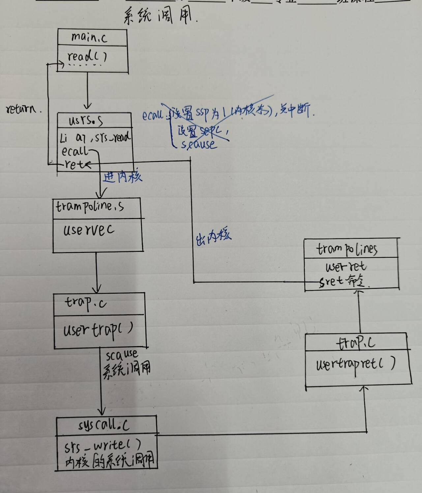

### Code: Calling system calls 

系统调用有时需要将用户空间的数据安全拷贝到内核空间，反之亦然，由于内核页表和用户页表映射不同那么该如何拷贝呢？

（1）、对于某一些用户传入系统调用的参数的拷贝

​	内核 trap 代码将用 户寄存器保存到当前进程的 trapframe 中，内核代码可以在那里找到它们。函数 argint、 argaddr 和 argfd 从 trapframe 中以整数、指针或文件描述符的形式检索第 n 个系统调用参 数。它们都调用 argraw 在 trapframe 中检索相应的数据(kernel/syscall.c:35)。 

（2）、一些系统调用传递指针作为参数，而内核必须使用这些指针来读取或写入用户内存。例 如，exec 系统调用会向内核传递一个指向用户空间中的字符串的指针数组。

​	内核实现了安全地将数据复制到用户提供的地址或从用户提供的地址复制数据的函数。


- 以下三个函数都是在**内核区**执行的，所以copyin和copyinstr的src参数是用户的虚拟地址dst是内核的虚拟地址可以直接传入内核区的一个变量指针，copyout的dstva参数是用户的虚拟地址，需要用walkaddr解析成物理地址，而src是内核的虚拟地址由内核页表直接解析。

copyin():	memmove只能拷贝连续的物理内存上的数据，由于不同页连续的虚拟地址可能被映射到不连续的物理内存（xv6映射粒度为4K）所以一次memmove最多只能拷贝一页大小的数据。

```c
int
copyin(pagetable_t pagetable, char *dst, uint64 srcva, uint64 len)
{
  uint64 n, va0, pa0;
  while(len > 0){
    va0 = PGROUNDDOWN(srcva);		//页对其
    pa0 = walkaddr(pagetable, va0);		//获取页首物理地址
    if(pa0 == 0)
      return -1;
    n = PGSIZE - (srcva - va0);		//计算当前页剩余空间
    if(n > len)
      n = len;
    memmove(dst, (void *)(pa0 + (srcva - va0)), n);		//一次最多拷贝一页

    len -= n;
    dst += n;
    srcva = va0 + PGSIZE;		//准备下一页拷贝
  }
  return 0;
}
```

copyinstr():用walkaddr函数解析虚拟地址到物理地址，再从物理地址上拷贝数据

```c
// Copy a null-terminated string from user to kernel.
// Copy bytes to dst from virtual address srcva in a given page table,
// until a '\0', or max.
//这里的max不是字符串长度，他是允许拷贝的最大长度，所以下文不能用memmove来拷贝，与copyin里面的len不同
// Return 0 on success, -1 on error.
int copyinstr(pagetable_t pagetable, char *dst, uint64 srcva, uint64 max)
{
  uint64 n, va0, pa0;	//n：表示该页还要多少空间，va0：页首的虚拟地址，pa0：页首的物理地址
  int got_null = 0;		//标记是否拷贝完成

  while(got_null == 0 && max > 0){		//如果未拷贝完成
    va0 = PGROUNDDOWN(srcva);		//虚拟地址页对其
    pa0 = walkaddr(pagetable, va0);		//得到虚拟地址对应的物理地址，需要页对其
    if(pa0 == 0)						//物理内存耗尽
      return -1;
    n = PGSIZE - (srcva - va0);			//得道该页空闲空间大小
    if(n > max)							//空闲空间大于剩余数据，只拷贝剩余数据大小
      n = max;

    char *p = (char *) (pa0 + (srcva - va0));	//定义一个字符指针指向数据所在物理空间
    while(n > 0){	//该页还未用完
      if(*p == '\0'){						//拷贝结束
        *dst = '\0';
        got_null = 1;
        break;
      } else {
        *dst = *p;				//dst是内核空间待拷贝处的物理地址
      }
      --n;
      --max;
      p++;
      dst++;
    }

    srcva = va0 + PGSIZE;			//拷贝完一页设置srcva为下一页拷贝做准备
  }
  if(got_null){
    return 0;
  } else {
    return -1;
  }
}
```

copyout():	从内核将数据拷贝到用户区

```c
int
copyout(pagetable_t pagetable, uint64 dstva, char *src, uint64 len)
{
  uint64 n, va0, pa0;

  while(len > 0){
    va0 = PGROUNDDOWN(dstva);
    pa0 = walkaddr(pagetable, va0);
    if(pa0 == 0)
      return -1;
    n = PGSIZE - (dstva - va0);
    if(n > len)
      n = len;
    memmove((void *)(pa0 + (dstva - va0)), src, n);

    len -= n;
    src += n;
    dstva = va0 + PGSIZE;
  }
  return 0;
}
```


# 6、页错误

## 页错误类型


| 异常类型                                      | `scause` 值 | 触发场景                                                     |
| --------------------------------------------- | ----------- | ------------------------------------------------------------ |
| 取指访问错误（Instruction Access Fault）      | 1           | 进程尝试取址的虚拟地址无效（如越界），或权限不允许（如用户态访问内核页） |
| 取指缺页（Instruction Page Fault）            | 12          | **无法转换的虚拟地址位于一条（执行）指令中**（惰性分配场景） |
| 加载访问错误（Load Access Fault）             | 5           | 进程加载（读）内存时，地址无效 / 权限违规（如用户态读内核只读页） |
| 加载缺页（Load Page Fault）                   | 13          | **无法转换的虚拟地址位于一条加载（读）指令中**（惰性分配场景） |
| 存储 / AMO 访问错误（Store/AMO Access Fault） | 7           | 进程存储（写）内存时，地址无效 / 权限违规（如写只读页、用户态写内核页） |
| 存储 / AMO 缺页（Store/AMO Page Fault）       | 15          | **无法转换的虚拟地址位于一条存储（写）指令中**（惰性分配场景） |

page fault中的重要寄存器：

- scause寄存器：缺页错误**类型码**
- stval寄存器：错误的**虚拟地址**
- sepc：引发错误的**指令**所在的地址

## 应用场景

（1）写时复制（COW-fork）
• 来源：父进程fork出子进程后，常常执行exec替换内存，故子进程拷贝的父进程内存绝大部分是多余的，但是直接共享内存会导致父子进程的写干扰，这时就需要利用缺页错误来实现灵活的共享内存。
• 原理：开始时父子进程共享内存页，但是都为只读模式 -> 子进程尝试往某页写入 ，出现page fault -> 内核复制该页并为子进程添加映射 ->对父子进程开放读写权限并更新进程页表 ->返回导致缺页的指令重新运行；
只有当子进程真正需要该页时，才触发page fault进行内存拷贝，否者保持共享。
• 注：父进程往往有多个子进程，每个物理页面会维护一个ref表示共享进程数。每有一个进程需要释放，则--ref，直到ref为0才真正释放

（2）懒惰分配（Lazy Allocation）
• 来源：程序往往申请比所需内存数更大的内存，比如矩阵（int a[N][N]）
• 原理：用户调用sbrk申请内存 -> sz=sz+n，增长虚拟地址，但不实际分配物理内存，而是设置这些页无效-> 访问未分配的无效页，page fault -> 分配物理内存并更新页表。

（3）按需调页（Demand Paging）
• 原理：进程在分配内存时，只完成虚拟地址的分配，只有在触发页面错误后，才进行物理内存的分配，加载并重新映射pte；在页面错误时，把页面从文件读取到内存中，重新映射并运行原始内存；本质是对于内存的节省。
• 页面置换：进程需要装载页进入内存，但是内存不足时，内核逐出evict物理页到磁盘并标记无效 -> 其他进程读取该页时，触发缺页异常，产生缺页错误 -> 再从磁盘读入到内存, 改写PTE为有效后更新页表 -> 重新执行读写指令。
• 页面驱逐策略：LRU（Least Recently Used），优先驱逐非脏页。

（4）按需补零（Zero Fill on Demand）
• 原理：对于全局变量而言，由于初始化全为0，因此只需要在单一页物理地址补0（只读），并将所需要的BSS中全部映射到这一页。在调用这些全局变量时，利用缺页错误进行重新申请分配。其本质是推迟花费；
• 注：按需补零，只是将一些内存分配操作推迟到了处理 page fault 时, 而由于会触发 trap 进入内核, 因此会有额外的存储开销和性能开销

（5）内存映射文件（Mmap）
• 概述：将完整或部分文件加载到内存中, 通过对内存相关地址的读写来操作文件.
• 原理：一般操作系统会提供 mmap 系统调用. 该系统调用会接受虚拟地址(va), 长度(len), protection, 一些标志位(flags), 打开的文件描述符(fd)和偏移量(offset). 从 fd 对应的文件的 offset 位置开始, 映射长度为 len 的内容到虚拟地址 va, 同时加上一些 protection, 如只读或读写.
• 实现：一般文件都是懒加载, 通过 Virtual Memory Area, VMA结构记录相关信息. 通过 page fault 将实际文件内容映射到内存; 通过 unmap 系统调用将文件映射的脏页写回文件.


# 7、中断和设备驱动


## 平台级中断控制器PLIC

用于解决多设备多核心下的中断分发和中断优先级处理和唯一性问题。

RISK-V平台的所有外部设备会向PLIC发送中断请求，再由PLIC转发。PLIC可以设置接收哪些类型中断以及设置不同类型的中断优先级，还可以实现多核心中断分发，设置哪些中断分发给哪些cpu执行，提高多核心利用率。

kernel/plic.c

```c
#include "types.h"
#include "param.h"
#include "memlayout.h"
#include "riscv.h"
#include "defs.h"
// the riscv Platform Level Interrupt Controller (PLIC).
void plicinit(void)
{
  // 为指定设备的中断设置优先级，启用这些设备的中断（PLIC 规则：优先级为 0 的中断会被禁用）
    //将 UART 和 VIRTIO 中断的优先级设为 1（PLIC 优先级范围通常是 0-7，1 是最低有效优先级）
  *(uint32*)(PLIC + UART0_IRQ*4) = 1;
  *(uint32*)(PLIC + VIRTIO0_IRQ*4) = 1;
}

void plicinithart(void)
{
  int hart = cpuid();
  
  // 开启当前核心 S-mode 下 UART 和 VIRTIO 的中断使能，允许该 IRQ 的中断发送到这个核心的 S-mode
  *(uint32*)PLIC_SENABLE(hart)= (1 << UART0_IRQ) | (1 << VIRTIO0_IRQ);

  // 将当前核心 S-mode 的中断优先级阈值设为 0
  //PLIC 规则是：只有优先级高于阈值的中断才会被发送到核心。设为 0 表示 “所有优先级非 0 的中断都能被响应”（因为	//之前设备优先级设为 1，1 > 0）。
  *(uint32*)PLIC_SPRIORITY(hart) = 0;
}

// ask the PLIC what interrupt we should serve.
int plic_claim(void)
{
  int hart = cpuid();
  int irq = *(uint32*)PLIC_SCLAIM(hart);
  return irq;
}

// tell the PLIC we've served this IRQ.
void plic_complete(int irq)
{
  int hart = cpuid();
  *(uint32*)PLIC_SCLAIM(hart) = irq;
}

```

plicinit：用来开启哪些设备的中断，并且设置中断优先级，比如uart，磁盘等等

plicinithart：①、获取当前核心id

​			②、设置当前核心的内核模式允许接收来自PLIC的中断请求

​			③、设置当前核心的中断阈值（只有优先级高于阈值的中断请求才会被处理）


## uart寄存器

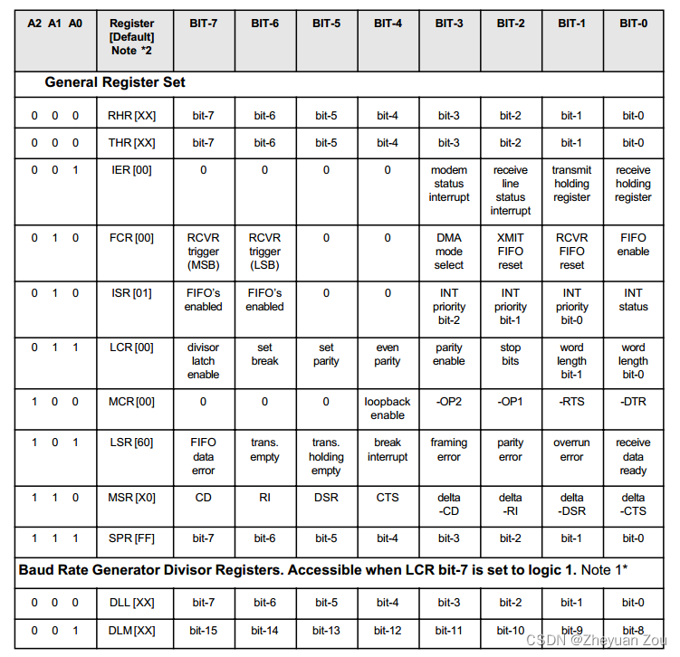


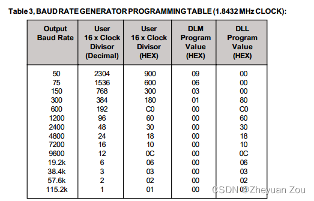

## 控制台输入

流程：

1、shell进程等待读取终端输入：终端初始化consoleinit()，PLIC初始化 → userinit()加载initcode.s → schedule()调度第一个进程initcode.s → initcode执行exec(“init.c”) → init.c fork一个子进程执行 exec(“sh”) → sh.c执行getcmd() → 系统调用read() → 一系列函数调用 →**consoleread（devsw[]）：读取consoleintr写入环形数组缓冲区的终端数据，并将数据传回用户空间（如果数组没数据，则consoleread睡眠等待（即shell进程睡眠）。**→ 通过read系统调用返回用户空间。

2、uart向shell转发用终端数据：用户在终端键入一个字符 →  触发uart中断 → PLIC转发中断 → xv6trap → devintry()判断外部中断类型进行相应处理，如果是uart中断 →  uartintry() 从uart寄存器取出用户输入字符 → **consoleintr()：接收来自uart的字符，对于特殊字符特殊处理，对于普通字符则存放在缓冲区中，待接收到换行字符，或者缓冲区堆满** → wakeup(&cons.r):通过cons.r来索引**唤醒睡眠中的shell进程**


### shell进程等待读取终端输入

（1）、consoleread():

```c
int
consoleread(int user_dst, uint64 dst, int n)
{
  uint target;  // 记录用户请求读取的原始长度（用于最终计算返回值）
  int c;        // 临时存储从缓冲区读取的字符
  char cbuf;    // 单字符缓冲区，用于拷贝到用户态（兼容copyout接口）

  target = n;   // 保存原始读取长度n，后续n会递减，最终用target-n算实际读取数
  acquire(&cons.lock);  // 获取控制台锁，防止和consoleintr（中断）竞态修改缓冲区
  while(n > 0){  // 外层循环：只要还没读满用户请求的n个字符，就继续
    // 内层循环：缓冲区无数据时，睡眠等待（核心等待逻辑）
    while(cons.r == cons.w){
      // 若当前进程被杀死（如收到kill信号），释放锁并返回-1
      if(myproc()->killed){
        release(&cons.lock);
        return -1;
      }
      // 睡眠在&cons.r上，同时释放cons.lock（sleep会自动释放锁）
      // 直到consoleintr调用wakeup(&cons.r)唤醒
      sleep(&cons.r, &cons.lock);
    }

    // 1. 从环形缓冲区读取一个字符
    // cons.r自增后取模：实现环形缓冲区的“读指针前进”
    c = cons.buf[cons.r++ % INPUT_BUF];

    // 2. 处理EOF（Ctrl+D）：特殊逻辑
    if(c == C('D')){  // C('D')等价于Ctrl+D，代表EOF
      if(n < target){
        // 若已经读取了部分字符（n < 原始长度target），把Ctrl+D放回缓冲区
        // 保证下一次读取时能返回0字节（符合EOF语义）
        //下一次读取直接读取到ctr+D，且n == targrt直接break不触发cons.r--;函数返回读取到0个字符
        cons.r--;
      }
      break;  // 终止读取，跳出外层循环
    }

    // 3. 将读取的字符拷贝到用户态缓冲区
    cbuf = c;  // 转存到单字符缓冲区（either_copyout需要指针参数）
    // either_copyout：兼容用户态/内核态地址的拷贝函数
    // user_dst=1表示目标地址是用户态，dst是用户态缓冲区地址，拷贝1个字节
    if(either_copyout(user_dst, dst, &cbuf, 1) == -1)
      break;  // 拷贝失败则终止读取

    // 4. 更新指针和剩余读取长度
    dst++;     // 用户态缓冲区指针后移，准备存下一个字符
    --n;       // 剩余需要读取的字符数减1

    // 5. 处理换行符：读取到换行则终止（一行输入完成）
    if(c == '\n'){
      break;  // 跳出外层循环，返回已读取的字符
    }
  }
  release(&cons.lock);  // 释放控制台锁，完成读取

  // 返回实际读取的字符数：原始长度target - 剩余未读n
  return target - n;
}
```

可以见得当数组未空时进程调用sleep进入睡眠状态，如果有数组那么将一个个字符从数组中拷贝出去，直到拷贝到换行或者特殊字符（ctr+D）停止。

- 这里为什么需要定义一个int类型的c，然后再把c转换为cbuf呢？

①、在变量里面存放的都是补码，对于正数补码是它本身，负数则是符号位不变其他位取反+1。

②、做变量比较等运算的时候，编译器会把补码解析成数值再进行比较计算，解析方式如下：


③、对于char类型的cons.buf如果传入字符的ascll码的值为128，那么它存储的形式为10000000，编译器解析出来的就是-128（-128+0*64+...）用一个char类型的c来接收的话那么它解析出来会是-128，如果是unsigned char那么它解析出来的就是128（128+0*64+...）。

④、所以如果用char c来接收的话那么对于128~255范围的字符永远无法正确解析，因为字符越界了。但是如果用int c接收的话，直接int解析出来还是-128，需要转换为unsigned char才能正确解析。这里用int接收目的就是为了提醒开发者需要进行类型转换如果用char接收开发者很容易执行if（c == 128）造成误判。

补充：整型提升

对于所有运算，计算机要求其只是是4个字节的数据，所有会再运算之前把数值扩展为4字节int类型

对于有符号类型的数据：如果补码最高位为1，则会向前补1直到补足32位；如果补码最高位为0，那么需要向前补0直到补足32位。再进行运算。

```c
unsigned int d = -1;
//打印出来 d = 4294967295
//由于-1的补码是11111111 11111111 11111111 11111111
//解析的时候会按照unsigned int来计算及最高位是+

char a = 128;
char b = 127;
printf("a=%d\n", a);
printf("b=%d\n", b);
// a 补码：10000000 整数扩展：11111111 11111110 11111111 10000000
// b 补码：01111111 整数扩展：00000000 00000000 00000000 01111111
//按照int类型的解析规则解析 a = -128， b = 127
```


（2）、sleep():

```c
void
sleep(void *chan, struct spinlock *lk)
{
  struct proc *p = myproc();  // 1. 获取当前运行的进程结构体（比如shell进程）
  if(lk != &p->lock){ 
    acquire(&p->lock); 
    release(lk);     
  }

  // 2. 标记进程的睡眠状态和等待通道
  p->chan = chan;       // 将进程绑定到等待通道chan（比如&cons.r），wakeup会根据chan找进程
  p->state = SLEEPING;  // 将进程状态改为“睡眠”，调度器不会再选中它执行

  // 3. 触发进程调度：切换到其他可运行的进程
  sched();

  // 4. 进程被唤醒后，从这里继续执行（tidy up）
  p->chan = 0;          // 清空等待通道，标记进程不再等待任何事件

  // 5. 重新获取原来的锁（比如cons.lock），恢复并发安全
  if(lk != &p->lock){
    release(&p->lock);  // 释放进程锁
    acquire(lk);        // 重新获取传入的锁（比如cons.lock），保证后续操作的锁持有
  }
}
```

### uart向shell转发用终端数据

#### 控制台初始化（consoleinit）

（1）、读写uart寄存器：通过基地址+偏移地址实现

```c
#define Reg(reg) ((volatile unsigned char *)(UART0 + reg))
#define ReadReg(reg) (*(Reg(reg)))	//读
#define WriteReg(reg, v) (*(Reg(reg)) = (v))	//写
```


（2）、uartinit()：

```c
void
uartinit(void)
{
  // 关闭中断，关闭所有中断，接收发送等等
  // IER寄存器控制着芯片上所有的中断的使能
  // 这一步相当于关闭了所有UART可能发出的中断
  // IER bit0: 管理receiver ready register中断
  // IER bit1: 管理transmitter empty register中断
  // IER bit2: 管理receiver line status register中断
  // IER bit3: 管理modem status register中断
  // IER bit4-7: 硬连线为0
  WriteReg(IER, 0x00);

  // 进入设置波特率的特殊模式
  // 当向LCR(Line Control Register)最高位(bit7)写入1时
  // 这将会改变地址000和001处两个寄存器的含义
  // 000地址在普通模式下对应RHR和LHR两个寄存器，一个只读、一个只写，因此共用一个地址
  // 001地址在普通模式下对应IER寄存器，就是上面管理中断的寄存器
  // 在设置波特率的模式下，000和001分别对应DLL DLM两个寄存器，用来确定波特率
  WriteReg(LCR, LCR_BAUD_LATCH);
 
  // 根据查表可知要将DLL、DLM两个寄存器分别设置为0和3
  // 之所以设置为38.4K的波特率，与qemu的具体实现代码有关
  // LSB for baud rate of 38.4K.
  WriteReg(0, 0x03);

  // MSB for baud rate of 38.4K.
  WriteReg(1, 0x00);

  // leave set-baud mode,
  // and set word length to 8 bits, no parity.
  // 译：离开波特率设置模式
  // 设置传输字长为8bit，不含奇偶校验位
  // LCR的低两位设置为00、01、10、11时，分别对应5、6、7、8bit的字长
  // 这里设置为8bit字长，即一个字节
  WriteReg(LCR, LCR_EIGHT_BITS);

  // reset and enable FIFOs.
   // 译：重置并使能IO
  // FCR_FIFO_ENABLE标志用于使能输入输出两个FIFO
  // FCR_FIFO_CLEAR标志用于清空两个FIFO并将其计数逻辑设置为0
  WriteReg(FCR, FCR_FIFO_ENABLE | FCR_FIFO_CLEAR);

  // enable transmit and receive interrupts.
  // 译：使能输入输出中断
  // 一旦同时使能了输入(RX)中断和FIFO，UART就会在到达trigger level时向CPU发起一个中断
  // (这个trigger level默认值为1)，同样，在输出THR为空时也会向CPU发起一个中断
  WriteReg(IER, IER_TX_ENABLE | IER_RX_ENABLE);

  initlock(&uart_tx_lock, "uart");
}
```

（3）、consoleinit()：

```c
void consoleinit(void)
{
  initlock(&cons.lock, "cons");		//初始化锁
  uartinit();

  // connect read and write system calls
  // to consoleread and consolewrite.
  devsw[CONSOLE].read = consoleread;
  devsw[CONSOLE].write = consolewrite;
}
```

**devsw数组**：

在consoleinit函数中，在注册读写函数时涉及到了一个特殊的数组devsw，devsw的定义如下，可以看到它就是两个读写函数指针的封装，它封装了可以对一个设备施加的所有的操作，定位非常类似于Linux中的file_operations，但规模大大简化了，所以Xv6内核对驱动程序的支持还是相对简单的。

kernel/file.h

```c
// map major device number to device functions.
struct devsw {
  int (*read)(int, uint64, int);		//定义了读写函数指针
  int (*write)(int, uint64, int);
};
extern struct devsw devsw[];
#define CONSOLE 1
```

**所以在fileread中r = devsw[f->major].read(1, addr, n);其实就是调用consoleread(1, addr, n);**

这里值得补充的一点是，在UNIX系统中，有主设备号(major device number)和从设备号(minor device number)的区分，其中主设备号用来确定设备要使用的驱动程序大类。是的，在操作系统中一个驱动程序可以服务多个设备，这些设备往往拥有类似的特征，因此它们的驱动程序构成非常类似，不需要为每个设备都重写一遍非常相似的驱动程序。

而即便再类似的外部设备，它们的驱动程序也一定会有细微差别，这时候就需要借助从设备号(minor device number)在驱动程序中对特定的设备加以区分和细节处理了。所以所谓主从设备号就是操作系统内核中用于将特定驱动程序和设备关联起来的两个标识符

#### devinty()

devinty():识别当前触发的中断类型，调用对应的处理逻辑，完成中断确认，最终返回中断处理结果（标识处理了哪种中断）。

scause寄存器：是64位，最高位（第63）：1表示中断，0表示异常；低8位：9表示外部中断，1表示软件中断

```c
int devintr()
{
  uint64 scause = r_scause();
  if((scause & 0x8000000000000000L) && (scause & 0xff) == 9){
    // 这是一个内核模式外部的中断，通过PLIC转发
    int irq = plic_claim();		//获取触发中断的设备IRQ编号
    if(irq == UART0_IRQ){	//uart中断
      uartintr();	
    } else if(irq == VIRTIO0_IRQ){	//虚拟磁盘中断（如读写完成）
      virtio_disk_intr();
    } else if(irq){		// 未知设备中断（容错处理）
      printf("unexpected interrupt irq=%d\n", irq);
    }
      
	// 外部中断控制器（PLIC）允许每个设备一次最多产生一个中断；告知外部中断控制器该设备现在可以再次产生中断了。
    if(irq)
      plic_complete(irq);

    return 1;	// 标识：处理了S-Mode外部中断
  } else if(scause == 0x8000000000000001L){
    // 来自机器模式定时器中断的软件中断，
	// 由 kernelvec.S 中的 timervec 转发。

    if(cpuid() == 0){
      clockintr();		// 核心逻辑：更新系统时间、触发进程调度（切换就绪进程）
    }
    
    //清除sip寄存器的SSIP位，确认软件中断已处理
    w_sip(r_sip() & ~2);

    return 2;	//标识：处理了S-Mode软件中断（定时器）
  } else {
    return 0;
  }
}
```

- 定时器中断：触发源来自于RISK-V芯片内置的CLINT硬（具体是 mtime/mtimecmp 定时器寄存器），该中断信号只能在机器模式下(M-mod)被感知，并且由/kernel/kernelvec.s中的timevec进行转发（核心操作是将 M-Mode 定时器中断转为 S-Mode 软件中断，设置 sip 寄存器的 SSIP 位），在 CPU 的 S-Mode（内核态）下，由 `trap.c` 中的 `devintr()` 函数处理。

- 设备外部中断：触发源来自外部设备，该中断信号被PLIC感知并转发，在 CPU 的 S-Mode（内核态）下，由 `trap.c` 中的 `devintr()` 函数处理。

#### uartintr()/consoleintr()

- uartintr：

```c
void uartintr(void)
{
  // read and process incoming characters.（uart从中断读取数据）
  while(1){
    int c = uartgetc();	//读取uart传入的字符
    if(c == -1)
      break;
    consoleintr(c);		//交给console处理
  }
  // send buffered characters.（用于uart向中断发送数据）
  acquire(&uart_tx_lock);
  uartstart();			//上一个字符发送完触发一次中断，再次发送
  release(&uart_tx_lock);
}

```

- consoleintr：将来自uart的字符存入环形缓冲区

1、cons结构体：

```c
struct {
  struct spinlock lock;		//自旋锁
  // input
#define INPUT_BUF 128
  char buf[INPUT_BUF];		//缓冲区
  uint r;  // Read index
  uint w;  // Write index
  uint e;  // Edit index
} cons;
```

①、定义三个指针：读，写，执行。当用户输入字符时执行指针会前进，由于用户可能输入错误，删除字符的时候执行指针回退，只有当用户确定即输入符回车换行时，将执行指针赋值给写指针。

②、内部维护一个环形数组缓冲区:

缓冲区 “空”：cons.r == cons.e；缓冲区 “满”：cons.e - cons.r == INPUT_BUF；写缓冲区：cons.buf[cons.e++ % INPUT_BUF] = c读缓冲区c = cons.buf[cons.r++ % INPUT_BUF]

注意：由于xv6是通过&cons.r来索引要唤醒哪一个终端的，由于只有一个全局变量cons，所以他的地址是唯一且固定的，如果存在多个控制态，每个控制台sleep的时候都持有&cons.r那么wakeup函数会不知道要唤醒哪一个控制态程序（shell），如果要实现多个控制台的话，那么只需要创建一个cons数组就行，终端 i 对应wakeup(&cons[i].r);

2、consoleintr：

```c
void consoleintr(int c)
{
  acquire(&cons.lock);  // 1. 获取控制台锁，防止并发修改（中断/进程竞态）

  switch(c){  // 根据接收到的字符c执行不同操作
  // 分支1：Ctrl+P —— 打印进程列表（调试用）
  case C('P'):  
    procdump();  // 调用procdump()，遍历所有进程并打印PID、状态、优先级等信息
    break;

  // 分支2：Ctrl+U —— 清空当前输入行（Kill line）
  case C('U'):  
    // 循环条件：1. 还有未确认的输入字符；2. 未遍历到行首（换行符）:清空当前行
    while(cons.e != cons.w &&
          cons.buf[(cons.e-1) % INPUT_BUF] != '\n'){
      cons.e--;          // 回退写指针，删除字符
      consputc(BACKSPACE);  // 输出退格符，视觉上删除屏幕上的字符（回显）
    }
    break;

  // 分支3：退格（Ctrl+H 或 Delete键\x7f）
  case C('H'): 
  case '\x7f':
    if(cons.e != cons.w){  // 确保有可删除的字符（输入缓冲区非空）
      cons.e--;            // 回退写指针
      consputc(BACKSPACE); // 回显退格符
    }
    break;

  // 分支4：处理普通字符（字母、数字、换行等）
  default:
    // 条件：1. 字符有效；2. 输入缓冲区未满（写指针-读指针 < 缓冲区大小）
    if(c != 0 && cons.e-cons.r < INPUT_BUF){
      // 统一换行符：将回车\r转换为换行\n（兼容不同终端的换行格式）
      c = (c == '\r') ? '\n' : c;

      consputc(c);  // 回显字符（用户输入什么，屏幕显示什么）

      // 将字符存入环形输入缓冲区：e自增后取模实现环形循环，避免数组越界
      cons.buf[cons.e++ % INPUT_BUF] = c;

      // 触发唤醒条件（满足其一即唤醒consoleread）：
      // 1. 输入换行（整行完成）；2. 输入Ctrl+D（EOF）；3. 缓冲区满
      if(c == '\n' || c == C('D') || cons.e == cons.r+INPUT_BUF){
        cons.w = cons.e;    // 更新唤醒指针，标记当前所有数据可读
        wakeup(&cons.r);    // 唤醒等待读取控制台的进程（如shell）
      }
    }
    break;
  }
  
  release(&cons.lock);  // 释放控制台锁，完成中断处理
}
```

接收来自uart的字符，对于特殊字符特殊处理，对于普通字符则存放在缓冲区中，待换行字符或者缓冲区堆满唤醒进程，并将读指针传给进程。

#### wakeup唤醒进程

```c
void wakeup(void *chan)
{
  struct proc *p;

  for(p = proc; p < &proc[NPROC]; p++) {
    acquire(&p->lock);
    if(p->state == SLEEPING && p->chan == chan) {	//根据chan通道寻找睡眠的进程（比如&cons.r）
      p->state = RUNNABLE;
    }
    release(&p->lock);
  }
}
```

## 控制台输出

（1）、第一种：用户程序向控制台输出信息（异步）：比如使用printf打印 → printf系统调用write → 调用consolewrite：通过either_copyin将内核的数据或者用户的数据拷贝到内核空间调用userputc → userputc：每次往uart的发送缓冲区写一个字符（如果缓冲区满了则停止写先让进程sleep）调用usartstart → usartstart每次拷贝一个字符到usart硬件里让其发送出去，唤醒进程继续往缓冲区写数据。

注意：uartintr 调用 uartstart，uartintr 查看设备是否真的发送完成，并将下一个缓冲输出字 符交给设备，每当 UART 发送完一个字节，就会产生一个中断。因此，如果一个进程向控制台写入多个字节，通常第一个字节将由 uartputc 对 uartstart 的调用发送，其余的缓冲字节 将随着发送完成中断的到来由 uartintr 的 uartstart 调用发送。

此外，由于cpu运行速度大于uart传输速度，如果每次向uart写入一个字符等待uart发送完成之后再次写入那么会造成cpu的浪费，所以xv6通过建立一个uart发送缓冲区来缓存数据，cpu负责向缓冲区里面写数据不会等待uart发送完成（观察uartstart如果uart还在发送那么return），uart发送完一个字符后会触发一次中断trap，中断会调用uartstart 继续发送缓冲区里的字符，直到发完。从而实现**IO并发！**

（2）、第二种用户输入命令在终端回显（同步）：用户调用consoleintr将用户键入的字符写入cons环形缓冲区的同时调用consputc将用户的输入立刻回显到终端上。

注意：这个过程是同步的，不需要经过缓冲区，并且在发送时如果UART串口TX不是空闲的，它会阻塞在此直至发送成功。


### 用户程序向控制台输出信息（异步）

1、consolewrite：

```c
//
// user write()s to the console go here.
// 译：用户态调用的write函数将会进入这里
int consolewrite(int user_src, uint64 src, int n)
{
  int i;
  
  // 开启一个循环，一个接一个地从地址src处复制到字符c中
  // 并通过uartputc函数尝试将字符加入输出缓冲区并输出
  for(i = 0; i < n; i++){
    char c;
    
    // 复制失败则跳出
    if(either_copyin(&c, user_src, src+i, 1) == -1)
      break;
    
    // 成功，则将此字符放入UART输出缓冲区
    // 并尝试使用uartstart函数驱动UART芯片向外发送
    uartputc(c);
  }

  return i;
}

```

2、uartputc：

```c
// 译：将一个字符放入输出缓冲区，如果UART还没有发送就告知它
// 如果输出缓冲区满了就阻塞
// 因为此函数可能被阻塞，所以它不能从中断中被调用，只适合被write使用
void uartputc(int c)
{
  // 获取输出缓冲区(环形队列)的锁
  acquire(&uart_tx_lock);
  
  // 如果内核发生故障，直接陷入死循环
  // 程序失去响应
  if(panicked){
    for(;;)
      ;
  }
  
  // 否则尝试将字符放入发送缓冲区中并开始发送
  while(1){
    if(uart_tx_w == uart_tx_r + UART_TX_BUF_SIZE){
     
      // 缓冲区已满，等候uartstart函数在buffer中开辟出新的空间
      // 让当前线程休眠在uart_tx_r这个channel上，等待被唤醒
      // 关于锁与并发机制的更多细节在后面的博客会一一分析
      sleep(&uart_tx_r, &uart_tx_lock);
    } else {
      
      // 如果缓冲区未满，则将字符放入缓冲区，并调整指针
      // 使用uartstart函数告知UART准备发送
      // 最后释放锁
      uart_tx_buf[uart_tx_w % UART_TX_BUF_SIZE] = c;
      uart_tx_w += 1;
      uartstart();
      release(&uart_tx_lock);
      return;
    }
  }
}
```

3、uartstart

```c
// 如果UART在空闲状态，字符正在发送缓冲区中等待
// 那么直接发送之，调用者必须持有uart_tx_lock锁
// 在驱动的上半、下半部分均会调用
// 驱动的上半部分指用户或内核可以调用的函数接口
// 驱动的下半部分指的是中断处理程序本身
// 事实上，uartstart函数会被两个地方调用
// 一个是我们刚刚看到的uartputc函数，对应驱动的上半部分
// 还会被uartintr函数调用，这部分则是驱动的下半部分
void uartstart()
{
  while(1){
    // 如果发送缓冲区为空，则直接返回
    if(uart_tx_w == uart_tx_r){
      // transmit buffer is empty.
      return;
    }
    
    // 缓冲区中有字符等待发送，但是UART还没有完成上一次发送
    // 这时也不可以发送成功，直接返回
    // ReadReg和上面介绍的WriteReg宏类似，用来读取一个UART寄存器的值
    if((ReadReg(LSR) & LSR_TX_IDLE) == 0){
      // UART THR寄存器仍为满
      // 此时不能给它另外一个字节，所以只能等它准备好时主动发起中断
      return;
    }
    
    // 如果发送缓冲区中有字符并且UART正处于空闲状态
    // 则可以准备发送，读取字符并调整读指针
    int c = uart_tx_buf[uart_tx_r % UART_TX_BUF_SIZE];
    uart_tx_r += 1;
    
    // maybe uartputc() is waiting for space in the buffer.
    // 译：也许uartputc函数正等待缓冲区中有新的空间
    // 这里直接唤醒之前在uart_tx_r地址上进行睡眠等待的锁
    // 其实也就是将进程状态更改为RUNNING，从而进入调度队列
    // 和uartputc中的sleep对应
    wakeup(&uart_tx_r);
    
    // 将数据写入UART的THR寄存器，这个值将会被UART自动移入
    // TSR(transmit shift register)寄存器，一位位地串行发送出去
    WriteReg(THR, c);
  }
}

```

OK，到这里我们大致将consolewrite函数分析得差不多了，它做的事情很简单，首先将数据从源地址拷贝到一个本地临时变量c中，然后将此字符放入输出缓冲区并驱动UART芯片将其发送出去，而这个由qemu模拟出来的UART 16550芯片的输出通道TX默认会连接到我们计算机的显示器上


### 用户输入回显（同步）

1、consputc：

```c
// 译：发送一个字符到UART，被(内核)printf调用，以及回显输入字符
// 但不会被write()调用
void consputc(int c)
{
  // 如果当前字符是退格键
  if(c == BACKSPACE){
    // if the user typed backspace, overwrite with a space.
    // 译：如果用户输入的是一个退格键，那么使用一个空格来覆写前一个字符
    // '\b'转义字符的作用是将光标回退一格，这样下一次写入时会覆盖原本的上一个字符
    // 下面连续调用三个uartputc_sync函数来将上一个字符清除掉
    uartputc_sync('\b'); uartputc_sync(' '); uartputc_sync('\b');
  } else {
    
    // 如果不是退格键，那么按照原样字符输出
    uartputc_sync(c);
  }
}

```

consputc是运行在内核态下的，consolewrite是从用户态读取字符并显示的。
• consputc输出字符是同步的，效率高，consolewrite输出字符是异步的，效率相对低。
• consputc调用uartputc_sync完成同步字符发送，consolewrite则调用uartputc完成异步字符发送。
正是因为consputc的同步发送，使得在consoleintr函数中，我们输入的字符可以第一时间回显给我们。

2、uartputc_sync：

```c
// 不使用中断的uartputc的替换版本
// 用于内核printf和回显字符
// 它会持续等待uart的输出寄存器为空(同步性、阻塞性)
void uartputc_sync(int c)
{
  // 关中断，防止串口中断再次进入造成竞争
  
  push_off();
  
  // 如果内核已经崩溃则陷入死循环
  if(panicked){
    for(;;)
      ;
  }
  // wait for Transmit Holding Empty to be set in LSR.
  // 译：等待LSR中的发送寄存器为空标识被置位
  while((ReadReg(LSR) & LSR_TX_IDLE) == 0)
    ;
  
  // 立即通过UART发送字符
  WriteReg(THR, c);
  
  // 恢复之前的中断状态
  pop_off();
}

```

为什么要关中断：

若不关中断：当前函数在执行while((ReadReg(LSR) & LSR_TX_IDLE) == 0)（循环等待 LSR 空闲）时，UART 突然触发发送完成中断，CPU 暂停当前函数，跳去执行uartintr；uartintr会读取 LSR、甚至写入 THR，导致当前函数再次回到循环时，LSR 寄存器的状态已经被篡改，可能误判 “UART 仍忙”（实际已空闲）或 “UART 已空闲”（实际已被中断占用），最终导致发送逻辑错乱。还有就是与uartputc_sync初衷相违，uartputc_sync需要马上回显，但是中断会浪费时间。


## 控制台输入输出总结

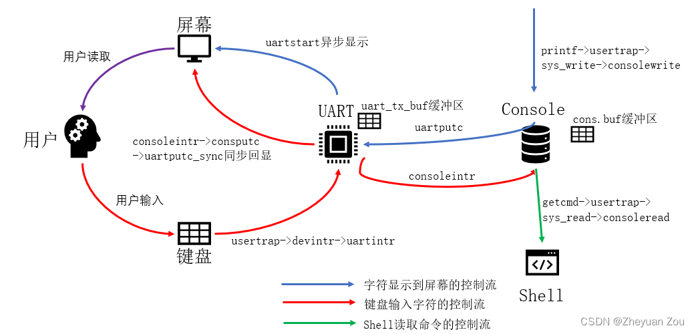

## 设备驱动

​	驱动是操作系统中管理特定设备的代码，他有如下功能：1、配置设备相关的硬件，2、 告诉设备需要怎样执行，3、处理设备产生的中断，4、与等待设备 I/O 的进程进行交互。驱动程序的代码写起来可能很棘手，因为驱动程序与它所管理的设备会同时执行。此外，驱动 程序编写人员必须了解设备的硬件接口，但硬件接口可能是很复杂的，而且文档不够完善

​	许多设备驱动程序在两个 context 中执行代码：上半部分(top half)在进程的内核线程中 运行，下半部分(bottom half)在中断时执行。上半部分是通过系统调用，如希望执行 I/O 的  read 和 write。这段代码可能会要求硬件开始一个操作（比如要求磁盘读取一个块）；然后代 码等待操作完成。最终设备完成操作并引发一个中断。驱动程序的中断处理程序，作为下半部分，推算出什么操作已经完成，如果合适的话，唤醒一个等待该操作的进程，并告诉硬件执行下一个操作。 

例如：控制台驱动程序console，下半部分里的consoleintr是由中断触发时执行的，将字符放入环形缓冲区，待缓冲区满的时候唤醒睡眠的shell进程；上半部分对应的时consoleread。通过系统调用read，读取缓冲区里的数据。

驱动并发安全：

（1）、对于一块公共的缓冲区需要用锁保护，比如一个进程a调用consoleread读取缓冲区中的数据，然后cpu由于触发uart硬件中断要往缓冲区里面写数据，这两个同时进行会导致缓冲区里的数据错乱。所以需要加锁来保证读取的时候缓冲区无法写入。

（2）、一个shell进程可能正在等待来自设备的输入，但是设备输入未完成此时shell进程会睡眠，cpu会去调度其他进程比如A，如果这个时候设备中断，如果中断程序利用当前进程的页表copyout往用户区写数据那么数据会写给A进程而非shell。所以中断程序不允许知道被中断的进程或代码。中断处理程序通常只做相对较少的工作（例如，只是将输入数据复制到缓冲区），并唤醒上半部分代码（shell进程里的consoleread）来做剩下的工作。 


## 现代操作系统

​	由于现在cpu的寄存器越来越多了，每次触发中断进行现场保护和恢复现在所需要操作的寄存器也就越来越多，中断的开销越来越大。如果是高速设备，那么他会频繁的触发中断，然而cpu需要频繁的处理中断，cpu开销巨大且容易跟不上。所以这个时候cpu采用轮询的机制，cpu一直循环读取设备寄存器的字符，不采用中断。但是这又引发了一个问题，如果这个设备是一个低速设备，设备大部分时间空闲，那么cpu大部分时间都在做无意义的轮询工作，大量浪费了cpu的时间；故现在的驱动程序会根据设备的负载情况来选择采用中断还是轮询的方式读取设备数据！


# 8、锁

## 竞争现象（race conditions）

对于为一个链表进行头插的操作

```c
struct element{
    int data;
    struct element* next;
};

struct element* list = NULL;

void
push(int data)
{
    struct element* l;
    
    l = malloc(sizeof *l);
    l->data = data;		
    l->next = list;		//使得l指向全局链表的表头
    list = l;			//将l作为全局链表的新表头
}
```

如 果两个 CPU 同时执行 push，那么两个 CPU 可能都会执行图所示的第 15 行，然后其中 一个才执行第 16 行，这就会产生一个不正确的结果。这样就会出现两个 list 元素，将 next 设为 list 的前值。当对 list 的两次赋值发生在第 16 行时，第二次赋值将覆盖 第一次赋值；第一次赋值中涉及的元素将丢失。 


解决措施是在14、15行前后添加加锁和解锁操作。但是锁会使得并行的程序转换为串行的程序，一个cpu持有锁，另一个cpu只能等待该cpu解锁之后取得锁才能访问公共数据，会减小运行效率。

## code：locks

理论上的加锁机制

```c
void
acquire(struct spinlock *lk)
{
    for (;;)
    {
        if (lk->locked == 0)
        {
            lk->locked = 1;
            break;
		}
	}
}
```

这种情况看似没问题，但是如果两个cpu同时执行到第8行的时候他们都会判断当前锁没用被拿，然后拿锁，这会导致一个锁被多个cpu拿到。

（1）、kernel/spinlock.c中的acquire():加锁

```c
void
acquire(struct spinlock *lk)
{
  push_off(); //关闭中断，防止cpu取得锁之后，在中断中再次等待锁造成死锁
  if(holding(lk))
    panic("acquire");	//用于检测是否造成死锁
	//原子操作将1写入lk->locked，并且将lk->locked上一次存储的值返回
    //如果锁一直被其他cpu持有lk->locked = 1，那么当前cpu会在这里阻塞等待拿锁
  while(__sync_lock_test_and_set(&lk->locked, 1) != 0);
    //禁止编译器和 CPU 对内存读写操作进行重排序，确保临界区的内存操作一定发生在锁获取之后。
  __sync_synchronize();

  //记录当前持有锁的 CPU 核心，用于 holding() 函数判断（检查当前 CPU 是否持有锁），也方便调试时定位锁的持有者。
  lk->cpu = mycpu();
}
```

从这里看出，cpu访问一块公共区域之前需要先加锁，当一个cpu取得锁之后，它就的程序就能继续运行下去，运行后续对公共区的读写操作，而没用取得锁的cpu其程序会阻塞在while循环那里等待拿锁。

注意：这里同一个cpu拿锁之后一定要释放之后才能再拿，如果连续拿两次会导致死锁，触发panic。

（2）、解锁release():

```c
void
release(struct spinlock *lk)
{
  if(!holding(lk))
    panic("release");	//判断当前cpu释放持有锁，有锁才能释放
  lk->cpu = 0;

  __sync_synchronize();		//栅栏函数
  __sync_lock_release(&lk->locked);		//原子操作，对lk->locked写0释放锁

  pop_off();		//开中断
}
```

## 栅栏函数（__sync_synchronize）

​	人们很自然地认为程序是按照源代码语句出现的顺序来执行的。然而，许多编译器和 CPU 为了获得更高的性能，会不按顺序执行代码。如果一条指令需要很多周期才能完成， CPU 可能会提前发出该指令，以便与其他指令重叠，避免 CPU 停顿 	这里我们发现再acquire和release里面都有这个 __sync_synchronize函数，这个函数是一个栅栏函数起到内存屏障的作用。CPU 和编译器为了提升性能，会做一个 “骚操作”：在不影响单线程逻辑的前提下，重排序内存读写指令（比如先执行写操作，再执行读操作，或者反过来）。但在多 CPU 抢自旋锁的场景下，这种 “乱序” 会出大问题：比如将对公共区域读写操作提前到修改lock之前，这就会导致还没加锁成功就修改了公共数据区导致并发问题。加了一个栅栏函数是为了严格保证对公共数据区的读取操作只能在加锁之后。同理在解锁的时候也要保证将lk->cpu置为0之后才能解锁，如果没有内存屏障先解锁在置lk->cpu，那么会可能出现其他cpu拿锁之后写lk->cpu之后你才执行完lk->cpu置0，导致lk->cpu被覆盖。

## EMSI协议+总线嗅探

MESI协议其实是缓存中数据的四种状态的缩写，这四种状态决定着数据更新将如何同步 ：

M : modified —— 修改，数据只存在于本Cache中，但被本核心修改，还没同步到内存

E : exclusive —— 独享，数据只存在于本Cache中，和内存数据一样

S : shared —— 共享，数据存在于很多Cache中，和内存数据一样

I : invalid ——无效，本核心Cache line无效。

这里有四个核心A、B、C、D，有一个数据X在核心A的缓存中，且被该核心改过，但没有传回主内存，而其他缓存则没有这个数据X。 这样的情况下，核心A里的数据X，其状态就是M——修改状态，此时，核心B想修改数据X，那么首先： 核心B通过总线告知自己需要获取数据X，总线向各核心索取X的最新数据 核心A将数据X传回总线，核心B和主内存都从总线读取最新的数据X，然后A、B核心的缓存块状态为S——共享 核心B对自己缓存中的数据X修改，B核心缓存块为M——修改，同时将该消息告知总线，A核心缓存为I——无效
如果你看明白了上面这个例子，其实你已经理解了流程的核心原理，即各核心通过总线嗅探来检测和传播数据，并严格遵守状态转换规则，实时更新本缓存的状态。这里，可以给大家介绍一个MESI过程的可视化网站，方便大家加深理解:[VivioJS MESI help](https://www.scss.tcd.ie/Jeremy.Jones/VivioJS/caches/MESIHelp.htm)

## 死锁和加锁顺序

​	如果一个穿过内核的代码路径必须同时持有多个锁，那么所有的代码路径以相同的顺序获取这些锁是很重要的。如果他们不这样做，就会有死锁的风险。假设线程 T1执行代码 path1 并获取锁 A，线程 T2 执行代码 path2 并获取锁 B，接下来 T1 会尝试获取锁 B，T2 会尝试获 取锁 A，这两次获取都会无限期地阻塞，因为在这两种情况下，另一个线程都持有所需的锁， 并且不会释放它，直到它的获取返回。为了避免这样的死锁，所有的代码路径必须以相同的顺序获取锁。对全局锁获取顺序的需求意味着锁实际上是每个函数规范的一部分：调用者调 用函数的方式必须使锁按照约定的顺序被获取。 

​	死锁的危险往往制约着人们对锁方案的细化程度，因为更多的锁往往意味着更多的死锁机会。避免死锁是内核实现的重要需求。 

## 锁和中断处理

为什么在加锁之前需要先关闭中断，在解锁之后才能开启中断呢？

原因是：如果加锁之后不关闭中断的话会容易造成死锁，当前cpu里进程A拿到了锁，在其未释放锁之前触发了设备中断，如果中断服务程序又进行了拿锁的操作，那么这个时候中断程序会自旋卡死在中断里。或者说触发的是定时器中断，在进程a未释放锁，如果cpu调度了进程b那么进程b在拿锁的时候会panic。

```c
void push_off(void)		//关闭中断
{
  int old = intr_get();	//用old暂存就的中断状态
  intr_off();			//写status寄存器的SIE位关闭中断（连同定时器中断会一起关闭）
  if(mycpu()->noff == 0)	//用noff表示当前cpu关中断的次数
    mycpu()->intena = old;	//将中断状态暂存到cpu的结构体中
  mycpu()->noff += 1;		//标记当前cpu关中断次数++
}

void pop_off(void)		
{
  struct cpu *c = mycpu();
  if(intr_get())			//获取中断状态，如果是关闭的状态，出错
    panic("pop_off - interruptible");
  if(c->noff < 1)			//如果没有关闭过中断，出错
    panic("pop_off");
  c->noff -= 1;				//cpu关中段次数--
  if(c->noff == 0 && c->intena)		//如果当前cpu只关过一次中断，并且旧的中断状态为开
    intr_on();					//开中断
}

```


## code：usinglock

- 粗粒度锁：锁的复杂性较低，但是容易影响程序并行效率。对于xv6中中的页链表锁，在一个cpu分配物理内存时，他会修改链表结构，而再次过程中其他cpu想要访问这个链表需要自旋等待会大大影响并行效率。
- 细粒度锁：锁的复杂性较高，程序并行效率高。xv6 对每个文件都有一个单独的锁，这样操作不同文件的进 程往往可以不等待对方的锁就可以进行。如果想让进程同时写入同一文件的不同区域，文件锁方案可以做得更细。最后，锁粒度的决定需要考虑性能以及复杂性，但是如果锁的粒度低，加锁的方法复杂，容易触发死锁。


## 睡眠锁（sleep lock）

​	有时 xv6 需要长时间保持一个锁。例如，文件系统（第 8 章）在磁盘上读写文件内容 时，会保持一个文件的锁定，这些磁盘操作可能需要几十毫秒。当前进程持有自旋锁（中断被关闭），一直占据cpu，等待磁盘操作完成，这会导致cpu时间被大量浪费。

​	所以有没有一种方案是，让cpu在旧进程等待磁盘操作完成的同时去调度新进程，同时又能够规避死锁的风险。xv6提供了一个睡眠锁来解决，睡眠锁不会关闭中断，允许cpu等待磁盘操作的时候触发定时器中断调度其他进程。

​	采用睡眠锁，在该锁被某一个进程持有的时候，其他进程想要加锁不会阻塞等待而是会睡眠等待（睡眠期间cpu调度其他进程），在持锁进程解锁后会唤醒处于等待中的进程队列来拿锁。

（1）、睡眠锁的定义及初始化

```c
struct sleeplock {
  uint locked;       // Is the lock held?
  struct spinlock lk; // spinlock protecting this sleep lock
  // For debugging:
  char *name;        // Name of lock.
  int pid;           // 睡眠锁跟进程绑定在一起
};
void
initsleeplock(struct sleeplock *lk, char *name)
{
  initlock(&lk->lk, "sleep lock");
  lk->name = name;
  lk->locked = 0;
  lk->pid = 0;
}
```

（2）、加锁

```c
void acquiresleep(struct sleeplock *lk)
{
  acquire(&lk->lk);			//先上自旋锁，防止多个cpu竞争产生同时拿到睡眠锁的异常现象
  while (lk->locked) {		//如果睡眠锁被拿了
    sleep(lk, &lk->lk);		//当前预拿锁进程睡眠去调度其他进程，等待被旧进程唤醒唤醒拿锁
      						//为什么sleep需要传入自旋锁？因为需要在sleep中解锁，不然进程sleep时持有锁会导								//致其他进程拿不到锁造成死锁
    }
  lk->locked = 1;			//如果拿到了，设置锁以被占用
  lk->pid = myproc()->pid;		//记录当前锁被哪个进程拿到
  release(&lk->lk);				//释放自旋锁，允许cpu触发定时器中断调用其他进程（读取磁盘情况）
}
```

sleep：

```c
void
sleep(void *chan, struct spinlock *lk)
{
  struct proc *p = myproc();
  if(lk != &p->lock){  //检测lk是否为进程锁
    acquire(&p->lock);  //不是的话加进程锁
    release(lk);		//释放自旋锁，允许cpu定时器中断;同时避免sleep的进程持锁从而造成死锁
  }
  // Go to sleep.
  p->chan = chan;		//睡眠标记，用于wakeup唤醒进程
  p->state = SLEEPING;
  sched();
  // Tidy up.
  p->chan = 0;
    //恢复之前的锁状态
  if(lk != &p->lock){
    release(&p->lock);
    acquire(lk);
  }
}
```

​	每一个进程都有一个进程锁（自旋锁），进程修改进程属性的时候需要加锁，如果不加锁会出现以下情况：如果cpu0想让进程A睡眠，cpu1目的是唤醒进程A，cpu0执行到p->chan = chan的时候cpu1正好执行完了wakeup，这会导致进程A实际没被唤醒会一直睡下去。加锁保证了进程还没“成功入睡”之前禁止被唤醒。避免出现假唤醒的情况！

​	有一个复杂情况：如果 lk 和 p->lock 是同一个锁，如果 sleep 仍试图获取 p->lock， 就会和自己死锁。但是如果调用 sleep 的进程已经持有 p->lock，那么它就不需要再做任何事情来避免错过一个并发的 wakeup。**这样的情况发生在，wait (kernel/proc.c:582)调用 sleep 并持有 p->lock 时。 **

​	在sleep里面发现当前cpu拿到了进程锁，然后去调度其他进程，那么会不会出现一个问题，当前cpu因为没用释放进程锁导致中断被关闭了，那么它手动执行了sched调度了一次进程，但是由于定时器中断被关闭，所以当前cpu调度完一次之后永远无法调度下一个进程呢？

​	实际上不会，因为顺着代码找下去会发现当cpu返回调度函数scheduler()上下文的时候会执行一个解锁操作（参考下文9.3的跨进程加解锁），并且scheduler在每次执行的时候都会开中断。

（2）、解锁

```c
void
releasesleep(struct sleeplock *lk)
{
  acquire(&lk->lk);		//获取自旋锁，避免锁争夺，其实还设计自旋锁的原子操作
  lk->locked = 0;
  lk->pid = 0;
  wakeup(lk);	
  release(&lk->lk);
}
void
wakeup(void *chan)
{
  struct proc *p;

  for(p = proc; p < &proc[NPROC]; p++) {
    acquire(&p->lock);		//操作进程之前先加锁
    if(p->state == SLEEPING && p->chan == chan) {
      p->state = RUNNABLE;
    }
    release(&p->lock);
  }
}
```

（3）、查看锁是否被当前进程持有

```c
int holdingsleep(struct sleeplock *lk)
{
  int r;
  acquire(&lk->lk);
  r = lk->locked && (lk->pid == myproc()->pid);
  release(&lk->lk);
  return r;
}
```

总结：自旋锁最适合短的临界区，因为等待它们会浪费 CPU 时间；睡眠锁对长时间的操作很有效。 


# 9、进程调度

## 概念


对于xv6操作系统，他是一个8核系统，一个核心严格意义上在一个时间点上只能执行一个进程，一个8核的系统严格意义上可以同时执行8个进程。那么为什么会有一个单核系统同时执行多个进程的说法呢？实际上是cpu的进程调度机制，cpu规定一个进程不能一直执行下去，某个进程执行一段时间之后，会被暂停被迫让出cpu供其他进程运行，等到其他进程也执行相应的时间后该进程才有机会再次被执行。正是这种轮询的进程调度机制，给人一种单核系统能同时运行多个进程的感觉。

## 进程调度分析

- 整体流程：

  ①、每个cpu核心在mian.c完成初始化后都会进入scheduler函数进行进程调度，scheduler()函数是一个死循环会一直寻找处于就绪态的进程来执行。

  ②、当有一个新进程被调度的时候，scheduler中的swtch会先把scheduler的上下文存放到当前cpu的结构体contest中，然后切换上下文去调度新进程。

  ③、进程开始执行一段时间，cpu的时间片到了，触发定时器中断，进程进入trap执行yield，保存当前进程的上下文**并切换上下文去执行mian.c里的scheduler，scheduler再次调度新的进程。**实现进程的循环调度。

  ④、当一个进程到达生命周期后，会执行exit这个系统调用，它最终也会切回scheduler。

注意：1、cpu的时间片到达之后，cpu会默认切换回mian.c里面的scheduler，接下来要调度哪个进程都是由scheduler决定的！

​	    2、并且本质上每个核心只能同时运行一个进程，再没有可以调度的进程的情况下，每个cpu都在运行调度器scheluder，我们把每个cpu的调度器叫做**内核线程**，xv6在启动的时候会给每个cpu分配一个内核栈，供每个cpu的调度器运行。并且保证这些不同cpu的调度器运行在自己的栈空间不互相干扰，如果多个cpu运行在同一个栈空间会出问题。

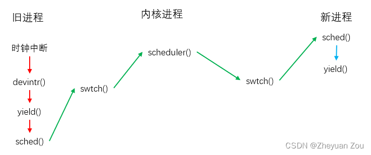

- 实现细节分析：

（1）、每一个cpu都有一个结构体用来存储cpu状态信息

```c
// Per-CPU state.
struct cpu {
  struct proc *proc;          // The process running on this cpu, or null.
  struct context context;     // swtch() here to enter scheduler().
  int noff;                   // 当前cpu持有锁的数量
  int intena;                 // 记录中断被关闭之前，中断的状态
};
```

`struct proc *proc`：表示当前cpu核所运行的进程

**`struct context context`：当前cpu的上下文，这个属性是固定不变的，上下文信息其实就是scheduler()函数的上下文**


（2）、swtch(struct context*, struct context*)分析：

主要是用来保存进程执行上下文的，并用于进程切换。用`scheduler()`里面调用的函数`swtch(&c->context, &p->context);`为例

**它在每次调度之前都会把scheduler的上下文保存到cpu结构体的contest里去**

```assembly
# Context switch
#
#   void swtch(struct context *old, struct context *new);
# 
# Save current registers in old. Load from new.	
#swtch(&c->context, &p->context);
.globl swtch
swtch:
        sd ra, 0(a0)		#将ra寄存器保存到a0，a0存储的是switch的第一个参数c->context
        sd sp, 8(a0)
        sd s0, 16(a0)
        sd s1, 24(a0)
        sd s2, 32(a0)
        sd s3, 40(a0)
        sd s4, 48(a0)
        sd s5, 56(a0)
        sd s6, 64(a0)
        sd s7, 72(a0)
        sd s8, 80(a0)
        sd s9, 88(a0)
        sd s10, 96(a0)
        sd s11, 104(a0)		#到这一步就是将scheduler的现场保存到了c->context !!!
#将要执行的进程的上下文写入寄存器
        ld ra, 0(a1)		#ra里写了新进程p的返回地址
        ld sp, 8(a1)
        ld s0, 16(a1)
        ld s1, 24(a1)
        ld s2, 32(a1)
        ld s3, 40(a1)
        ld s4, 48(a1)
        ld s5, 56(a1)
        ld s6, 64(a1)
        ld s7, 72(a1)
        ld s8, 80(a1)
        ld s9, 88(a1)
        ld s10, 96(a1)
        ld s11, 104(a1)
        
        ret				#读取ra返回去执行新进程p
```

（3）、sched（）函数解析：

```c
void
sched(void)
{
  int intena;
  struct proc *p = myproc();
//切换进程前的安全检测
  if(!holding(&p->lock))
    panic("sched p->lock");
  if(mycpu()->noff != 1)
    panic("sched locks");
  if(p->state == RUNNING)
    panic("sched running");
  if(intr_get())
    panic("sched interruptible");
  intena = mycpu()->intena;	//记录切换前进程的中断状态
    
  swtch(&p->context, &mycpu()->context);	//切换进程，将当前进程的状态保存到进程结构体中，跳转到进程调度											//函数scheduler
  mycpu()->intena = intena;	//切回进程时恢复中断状态
}
```

上文提到了c->contest里面存放的一直都是main.c中scheduler的上下文，&mycpu()->context获取c->contest，**sched函数一定会让cpu切换去执行main进程里面的scheduler()！！**

（4）、scheduler()函数解析：

在kernel/main.c里面指出所以的cpu核在进行一系列的初始化之后都会去执行这个函数，而这个函数是一个死循环，用来寻找处于RUNABLE（就绪态）的进程再进行调度。

```c
void
scheduler(void)
{
  struct proc *p;
  struct cpu *c = mycpu();	//保存当前cpu核的状态
  c->proc = 0;				//设置当前cpu不执行任何进程
  for(;;){				//循环调度进程
    // Avoid deadlock by ensuring that devices can interrupt.
    intr_on();			//开中断
    
    int found = 0;
    for(p = proc; p < &proc[NPROC]; p++) {		//循环遍历每一个进程
      acquire(&p->lock);			//加锁
      if(p->state == RUNNABLE) {		//如果进程处于就绪态，调度
        p->state = RUNNING;				//设置进程在运行中
        c->proc = p;					//设置cpu核执行的进程
        swtch(&c->context, &p->context);	//进程调度
        // Process is done running for now.
		//进程在swtch执行之前被调度，在swtch函数结束之后结束！！
        c->proc = 0;
        found = 1;
      }
     release(&p->lock);
    }
#if !defined (LAB_FS)
    if(found == 0) {
      intr_on();
      asm volatile("wfi");
    }
#else
    ;
#endif
  }
}
```

- 这里注意：进程在swtch执行之前被调度，在swtch函数结束之后结束！！

​	因为：新进程是在当前进程scheduler的switch中进行切换的，switch函数是不会返回的，它切换去执行新的进程，只有在新的进程被执行完之后（或者新进程的时间片到达之后）执行sched才能恢复上下文到swtch的下一条指令也就是c->proc = 0。所以当swtch结束说明新进程已经执行结束了或者说新进程的时间片到了。

这同时也是lab3 pgtb中为什么要在swtch前后切换页表的原因。

（5）、usertrap():cpu时间片到达，触发中断执行下面程序：

```c
void
usertrap(void)
{
  ...
  // give up the CPU if this is a timer interrupt.
  if(which_dev == 2)
    yield();

  usertrapret();
}
void
yield(void)
{
  struct proc *p = myproc();
  acquire(&p->lock);
  p->state = RUNNABLE;
  sched();
  release(&p->lock);
}
```

可以看到yield也是调用sched函数切回scheduler，接下来的进程调度由shceduler决定。


## 跨进程加锁解锁

上文在睡眠锁分析sleep的时候提到了，在修改进程的属性前后要进行加锁和解锁操作。这里涉及到了进程锁，xv6进程调度中有一个特殊的现象：跨进程加锁和解锁


（1）、可以看到旧进程在调度其他进程之前修改了进程的属性，所以在此之前需要加锁。执行sched切换去调度其他进程（在旧进程之中并没有进行解锁）那么他在哪个时候解锁呢？答案是在内核线程调度器scheduler中进行解锁。在进程调度中说过sched会切换回scheduler，要调度哪个进程由scheduler决定；旧进程在执行sched时会执行swtch，swtch会返回上下文到scheduler的c->proc=0这个地方继续执行，而scheduler里面的release释放的就是旧进程的锁。到此旧进程的加锁和解锁操作就已经完成了！

​	那么新进程的加锁和解锁是怎么进行的，scheduler里的for循环在寻找进程之前都会进行加锁，如果不能调度会直接解锁，如果符合调度条件那么会通过swtch返回新进程的上下文也就是右图sched的下一条指令，可以看到之后的release对新进程进行了解锁。

（2）、如果不进行跨进程加锁解锁会发生什么呢？也就是旧进程在sched之前解锁了会发生什么。

​	xv6规定了在执行swtch之前必须持有进程锁，如果打破这项规定当旧进程将进程的状态设置为runnable之后解锁了，那么其他cpu可能刚刚好调度了这个进程，而旧进程还没有完成swtch的操作，此时两个cpu会同时运行在同一个内核栈上面，这样会出问题。如果swtch的时候需要持有锁，那么其他cpu想要调度该进程则会自旋等待该进程swtch完成之后释放锁再进行调度。

（3）、跨进程加解锁是对于一个调度过的进程，也就是说进程存在上下文，那么对于一个全新的进程它又在哪里解锁呢？

​	当一个新的进程第一次被调度时，它开始于 forkret (kernel/proc.c:527)。Forkret 的存在 是为了释放 p->lock，否则，新进程需要从 usertrapret 开始执行。 


## mycpu()/myproc()

​	xv6会为每一个cpu核分配一个hardid，这个属于硬件的描述信息。在xv6启动过程中在机器模式的时候它会通过mstart函数将cpuid写道cpu维护的结构体当中去，并且让tp寄存器指向cpu维护的结构体。在监督模式下xv6无法直接读取cpuid（因为这个属于硬件信息）只能通过tp寄存器来访问cpu的结构体来获取当前cpuid。

​	用户态对tp的干扰：用户程序在运行的时候有可能会修改tp寄存器的值，使得它不再指向cpu结构体，所以在内核返回用户的usertrapret中将tp寄存器暂存到进程的陷阱帧里；用户进入内核空间的时候uservec会恢复保存的tp值。对于内核空间的代码编译器规定其不能使用tp寄存器。

mycpu：

```c
struct cpu* mycpu(void) {
  int id = cpuid();
  struct cpu *c = &cpus[id];
  return c;
}
```

每次调用都是通过访问cpu维护的结构体来获取cpu的信息。

注意：在执新struct cpu* c = mycpu()之前需要关闭中断，用完c之后才能开启中断。这是因为如果在c还在使用的时候触发定时器中断，该进程转移到新的cpu上去执行，而c仍然指向旧的cpu维护的结构体这会出问题。

myproc：

```c
struct proc* myproc(void) {
  push_off();
  struct cpu *c = mycpu();
  struct proc *p = c->proc;
  pop_off();
  return p;
}
```

可以看到myproc在使用mycpu的期间进行了关闭中断的操作，但是myproc在使用期间不需要关闭中断，因为即使进程运行到其他的cpu上进程的结构体指针仍然指向当前进程维护的结构体。

## sleep()/wakeup()

- sleep：

```c
void sleep(void *chan, struct spinlock *lk)
{
  struct proc *p = myproc();
  if(lk != &p->lock){  //检测lk是否为进程锁
    acquire(&p->lock);  //不是的话加进程锁
    release(lk);		//释放自旋锁，允许cpu定时器中断;同时避免sleep的进程持锁从而造成死锁
  }
  // Go to sleep.
  p->chan = chan;		//睡眠标记，用于wakeup唤醒进程
  p->state = SLEEPING;
  sched();
  // Tidy up.
  p->chan = 0;
    //恢复之前的锁状态
  if(lk != &p->lock){
    release(&p->lock);
    acquire(lk);
  }
}
```

（1）、每一个进程都有一个进程锁（自旋锁），进程修改进程属性的时候需要加锁，如果不加锁会出现以下情况：如果cpu0想让进程A睡眠，cpu1目的是唤醒进程A，cpu0执行到p->chan = chan的时候cpu1正好执行完了wakeup，这会导致进程A实际没被唤醒会一直睡下去。加锁保证了进程还没“成功入睡”之前禁止被唤醒。

（2）、有一个复杂情况：如果 lk 和 p->lock 是同一个锁，如果 sleep 仍试图获取 p->lock， 就会和自己死锁。但是如果调用 sleep 的进程已经持有 p->lock，那么它就不需要再做任何 事情来避免错过一个并发的 wakeup。**这样的情况发生在，wait (kernel/proc.c:582)调用 sleep 并持有 p->lock 时。 **

（3）、在sleep里面发现当前cpu拿到了进程锁，然后去调度其他进程，那么会不会出现一个问题，当前cpu因为没用释放进程锁导致中断被关闭了，那么它手动执行了sched调度了一次进程，但是由于定时器中断被关闭，所以当前cpu调度完一次之后永远无法调度下一个进程呢？

​	实际上不会，因为顺着代码找下去会发现当cpu返回调度函数scheduler()上下文的时候会执行一个解锁操作（参考9.3的跨进程加解锁），并且scheduler在每次执行的时候都会开中断。

（4）、为什么sleep的传入参数需要传入当前持有的锁，并且要将其在sleep中释放。`void sleep(void *chan, struct spinlock *lk)`

​	因为如果不释放的话，会导致睡眠中的进程持锁，而其他进程自旋等待拿锁，从而出现死锁现象。

- wakeup():

```c
void wakeup(void *chan)
{
  struct proc *p;

  for(p = proc; p < &proc[NPROC]; p++) {
    acquire(&p->lock);		//操作进程之前先加进程锁
    if(p->state == SLEEPING && p->chan == chan) {
      p->state = RUNNABLE;
    }
    release(&p->lock);
  }
}
```

可以看出wakeup在修改进程属性的时候也要进行加锁解锁操作，如果sleep没有修改好p->state，那么wakeup是绝对不会有机会唤醒它的。

## 管道读写

写管道：

```c
//addr为用户空间要写入管道的数据
int pipewrite(struct pipe *pi, uint64 addr, int n)
{
  int i;
  char ch;
  struct proc *pr = myproc();		//获取当前进程结构体指针

  acquire(&pi->lock);			//加管道锁，保正管道缓冲区不能被同时读写
  for(i = 0; i < n; i++){
    while(pi->nwrite == pi->nread + PIPESIZE){  //管道环形缓冲区满了
      if(pi->readopen == 0 || pr->killed){		//如果管道的读端没有被打开，或者当前进程被杀死
        release(&pi->lock);						//释放管道锁
        return -1;
      }										//用户数据未写完
      wakeup(&pi->nread);					//管道缓冲区被写满唤醒读管道进程来读取管道缓冲区
      sleep(&pi->nwrite, &pi->lock);		//写管道进程进入睡眠
    }
      
    if(copyin(pr->pagetable, &ch, addr + i, 1) == -1)	//将用户空间的数据一个个拷贝到管道缓冲区
      break;
    pi->data[pi->nwrite++ % PIPESIZE] = ch;		//采用环形数组缓冲区来管理管道
  }
    //如果数据写完缓冲区未满则唤醒读取进程
  wakeup(&pi->nread);				
  release(&pi->lock);	//释放锁
  return i;			//返回本次成功写入管道的字节数
}
```

读管道：

```c
//addr表示要将管道缓冲区数据读取到用户空间的位置
int piperead(struct pipe *pi, uint64 addr, int n)
{
  int i;
  struct proc *pr = myproc();	//获取读管道进程的结构体指针
  char ch;

  acquire(&pi->lock);			//加锁
  while(pi->nread == pi->nwrite && pi->writeopen){  //如果管道写端被打开且管道为空
    if(pr->killed){			//如果进程被杀死则释放管道锁
      release(&pi->lock);
      return -1;
    }
    sleep(&pi->nread, &pi->lock); //写端被打开说明写端还要写，所以读端需要睡眠等待
  }
  for(i = 0; i < n; i++){  //循环读取环形缓冲区的数据
    if(pi->nread == pi->nwrite)	//数据提前读取完成（本来需要读取n个但是写管道的时候出问题就写了不到n个）
      break;
    ch = pi->data[pi->nread++ % PIPESIZE];		//将环形缓冲区数据拷贝到用户空间
    if(copyout(pr->pagetable, addr + i, &ch, 1) == -1)
      break;
  }
  wakeup(&pi->nwrite);  //读取完毕唤醒写管道进程继续写
  release(&pi->lock);	//释放管道锁
  return i;				//返回实际读取到的数据
}
```

可以见得：

1、管道需要一个自旋锁来保证公共缓冲区不能同时被多个进程读取和写入

2、对于大数据，管道一次不能全部传输完成，管道先让读管道进程睡眠等待写管道进程写入完成唤醒其读取；由于数据量过大，写管道进程一次写入部分数据之后需要睡眠并且唤醒读管道进程读取管道数据。

3、管道的写端会不写满不罢休，会无限睡眠唤醒来等待用户传输的数据写完；而管道的读取端只会在管道为空且读端开启的时候睡眠等待读取端写入，如果管道里面有数据那么他会直接读取（不管读取多少数据）然后结束本次读取操作，返回读取到的字节数。用户程序需要手动循环调用管道读取函数来保证数据被全部读取完毕。

4、之所以管道读端不设计为不读完不罢休是因为①、管道是流式结构，数据只能被读取一次，可能有多个进程读取一个管道所以每个进程都只能读取到写端数据的一部分，永远无法满足读取到n个数据的情况。②、如果写端出现意外没有写入n个数据，那么读端会因为读取不到n个数据而无限睡眠下去。读进程受写进程干扰，不符合进程之间相互独立的设计理念。


## wait，exit，kill

（1）、wait等待回收子进程

```c
//addr表示用户的传入参数用表获取子进程的退出原因
int wait(uint64 addr)
{
  struct proc *np;		//用来遍历进程组的结构体指针
  int havekids, pid;	//标记是当前进程否持有子进程
  struct proc *p = myproc();

  // hold p->lock for the whole time to avoid lost
  // wakeups from a child's exit().
   //需要持有进程锁，如果父进程刚刚检查完子进程状态还没进入睡眠，而子进程唤醒这会导致父进程永久睡眠
    //检查子进程状态到睡眠这个过程需要全程加锁
  acquire(&p->lock);

  for(;;){
    // Scan through table looking for exited children.
    havekids = 0;
    for(np = proc; np < &proc[NPROC]; np++){
      // this code uses np->parent without holding np->lock.
      // acquiring the lock first would cause a deadlock,
      // since np might be an ancestor, and we already hold p->lock.
      /*这里讲述了为什么不在遍历的时候直接拿锁而是在必须判断该进程是当前进程的子进程之后再拿锁
      	原因是xv6遵循先父后子的拿锁规则，np可能是当前进程的父进程，他可能持有锁然后要等待拿子进程（也就是当前进		程的锁）然后现在子进程p又要拿父进程的锁会导致死锁两个进程都自旋。所以这里遵循先父后子需要先判断np是子进程		才能拿锁。其实可以让xv6全局都遵循先子后父，本质上是所有进程要遵循相同的加锁顺序
      */
      if(np->parent == p){
        // np->parent can't change between the check and the acquire()
        // because only the parent changes it, and we're the parent.
        acquire(&np->lock);		//修改子进程属性前先拿锁，只要父进程能修改子进程属性
        havekids = 1;
        if(np->state == ZOMBIE){	//判断子进程是否处于僵尸态
          // Found one.
          pid = np->pid;			//记录回收子进程的pid
          if(addr != 0 && copyout(p->pagetable, addr, (char *)&np->xstate,sizeof(np->xstate)) < 0) {
           	//将子进程的退出原因拷贝给父进程
            release(&np->lock);
            release(&p->lock);
            return -1;
          }
          freeproc(np);		//释放子进程
          release(&np->lock);
          release(&p->lock);
          return pid;		//返回回收的进程id
        }
          //如果子进程还没执行结束
        release(&np->lock);		//解锁
      }
    }

    // No point waiting if we don't have any children.
    if(!havekids || p->killed){	//没有子进程或者进程被终结
      release(&p->lock);
      return -1;
    }
    
    // 释放进程锁睡眠等待子进程结束唤醒当前进程执行回收操作
    sleep(p, &p->lock);  //DOC: wait-sleep
  }
}
```

（2）、exit

```c
void exit(int status)
{
  struct proc *p = myproc();

  if(p == initproc)		//保证init进程不能被退出
    panic("init exiting");

  // 关闭当前进程所有文件描述符
  for(int fd = 0; fd < NOFILE; fd++){
    if(p->ofile[fd]){
      struct file *f = p->ofile[fd];
      fileclose(f);
      p->ofile[fd] = 0;
    }
  }
    //释放inode等等
  begin_op();
  iput(p->cwd);
  end_op();
  p->cwd = 0;

  // we might re-parent a child to init. we can't be precise about
  // waking up init, since we can't acquire its lock once we've
  // acquired any other proc lock. so wake up init whether that's
  // necessary or not. init may miss this wakeup, but that seems
  // harmless.
  /*当前进程可能会将子进程过继给init，所以我们需要提前唤醒init让他及时检查回收，避免僵尸进程堆积
  	并且唤醒init需要加锁此时进程还没有加锁所以此时加init锁是安全的不会违反加锁顺序原则造成死锁	
  */
  acquire(&initproc->lock);
  wakeup1(initproc);
  release(&initproc->lock);
	/*这里需要保存一下父进程的指针，把它固定下来，根本原因是防止加锁解锁不同的进程对象
		可以看见下面会对父进程进行加锁和解锁，如果不提前固定父进程的指针那么可能加锁的时候获取的是当前进程的父			进程的锁pp->lock，但是解锁之前p->parirnt由于父进程退出将子进程过继给init了那么会导致解锁的是init导			致panic
	*/
  acquire(&p->lock);
  struct proc *original_parent = p->parent;
  release(&p->lock);
  // we need the parent's lock in order to wake it up from wait().
  // the parent-then-child rule says we have to lock it first.
  acquire(&original_parent->lock);	//获取父进程的锁
  acquire(&p->lock);			//获取当前进程的锁

  // Give any children to init.
  reparent(p);	//将当前进程的子进程过继给init
	//唤醒父进程，当前进程必须持有父进程的锁
  wakeup1(original_parent);

  p->xstate = status;	//设置退出原因
  p->state = ZOMBIE;	//设置进程为僵尸态

  release(&original_parent->lock);	//释放父进程的锁

  // Jump into the scheduler, never to return.
  sched();		//调度其他进程，同时释放当前进程的锁
  panic("zombie exit");	//该进程如果被重新调度出错
}

```

可以看出①、exit会释放当前进程的一些文件系统相关的东西。②、如果当前进程没有直接wait，那么进程结束时exit将当前进程的子进程过继给init来回收。③、对于当前进程本身由谁回收，他会唤醒他的父进程来回收，父进程可能是pp也可能是init。

可能会出现一种情况：当前进程唤醒的是pp但是他的父进程正好结束把他过继给了init，那么现在唤醒的是一个结束的僵尸进程，他不会回收当前进程，所以当前进程要被回收只能等到init再次被唤醒的时候。

如果一个父进程一直运行而不进行回收wait操作那么他的子进程也不会过继给init（父进程没有执行exit），这就会导致僵尸进程过多从而占据资源。所以应该避免这种操作。


（3）、kill：杀死一个进程

```c
int kill(int pid)
{
  struct proc *p;
  for(p = proc; p < &proc[NPROC]; p++){		//遍历进程
    acquire(&p->lock);			//加锁
    if(p->pid == pid){
      p->killed = 1;		//设置p->kill等到返回usertrap的时候会执行exit
      if(p->state == SLEEPING){
        // Wake process from sleep().
        p->state = RUNNABLE;	//对于睡眠的进程把他唤醒，他很快也会因为定时器中断在usertrap中被exit
      }
      release(&p->lock);
      return 0;
    }
    release(&p->lock);
  }
  return -1;		//没有找到进程返回错误
}

```

因此，kill 的作用很小：它只是设置进程 的 p->killed，如果它在 sleep，则 wakeup 它。最终，进程会进入或离开内核，这时如果 p->killed 被设置，usertrap 中的代码会调用 exit。如果进程在用户空间运行，它将很快通过进行系统调用或因为定时器（或其他设备）中断而进入内核。 

如果进程处于睡眠状态，kill 调用 wakeup 会使进程从睡眠中返回。这是潜在的危险， 因为正在等待的条件可能不为真。然而，xv6 对 sleep 的调用总是被包裹在一个 while 循环 中，在 sleep 返回后重新检测条件。一些对 sleep 的调用也会在循环中检测p->killed，如果设置了 p->killed，则离开当前活动。只有当这种离开是正确的时候才会这样做。例如， 管道读写代码如果设置了 killed 标志就会返回；最终代码会返回到 trap，trap 会再次检查标志并退出。 


# 10、文件系统

文件系统面临的挑战：

- 文件系统需要磁盘上的数据结构来表示命名目录和文件的树，记录保存每个文件内 容的块的身份，并记录磁盘上哪些区域是空闲的。
- 文件系统必须支持崩溃恢复。也就是说，如果发生崩溃（如电源故障），文件系统 必须在重新启动后仍能正常工作。风险在于，崩溃可能会中断更新序列，并在磁盘 上留下不一致的数据结构（例如，一个块既在文件中使用，又被标记为空闲）。 
- 不同的进程可能并发在文件系统上运行，所以文件系统代码必须协调维护每一个临 界区。
- 访问磁盘的速度比访问内存的速度要慢几个数量级，所以文件系统必须维护缓存， 用于缓存常用块。


## 概述

1、文件系统分层

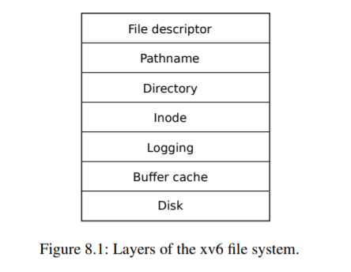

- Disk层：直接与物理磁盘或者块设备交互，负责读写盘块。
- Buffer cache：作为磁盘与上层之间的缓存，将常用的磁盘块缓存在内存中，并同步访问它们，确保一个块只能同时被内核中的一个进程访问
- Logging：在修改文件系统元数据前，先将操作记录到日志中，保证文件系统的一致性，如果系统崩溃，重启时可以通过日志回放来恢复未完成的操作，避免元数据损坏。
- inode：每个文件 / 目录都对应一个唯一的 inode，它存储了文件的元数据（大小、权限、时间戳、数据块指针等），但不存储文件名。
- Directory：目录本身也是一种特殊的文件，它存储的是 “文件名 → inode 编号” 的映射关系。
- Pathname：负责解析文件的路径（如 /home/user/file.txt），将其转化为对应的 inode。
- File descriptor：它为每个打开的文件提供一个整数 “句柄”，用户程序通过这个句柄来进行 read、write、close 等操作，无需关心底层的路径或磁盘细节。


2、xv6磁盘分区：

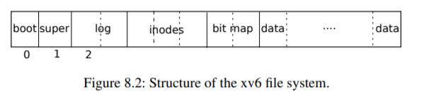

```c
nmeta 70 (boot, super, log blocks 30 inode blocks 13, bitmap blocks 25) blocks 199930 total 200000
```

查看qeum的启动日志：文件系统的磁盘总数为200000块；70块元数据块（不存用户数据，只存文件系统管理信息）；数据块总数199930（200000-70）。

- boot(1块)：用于存放bootload，用于计算机启动时加载xv6内核
- super(1块)：存储整个文件系统的顶层元数据，包括：文件系统总块数、数据块数量、inode 总数、日志块数量等关键参数。由初始化工具 mkfs 写入，是文件系统的 “配置清单”。核心作用：让文件系统启动时能快速获取自身结构信息，是后续所有操作的基础。

```c
struct superblock {
  uint magic;        // 魔数：必须等于FSMAGIC常量
  uint size;         // 文件系统镜像的总大小（以“块”为单位）
  uint nblocks;      // 数据块的总数量
  uint ninodes;      // inode的总数量
  uint nlog;         // 日志块的数量
  uint logstart;     // 第一个日志块的块号（起始位置）
  uint inodestart;   // 第一个inode块的块号（起始位置）
  uint bmapstart;    // 第一个空闲块位图（bmap）的块号（起始位置）
};
```

- log(30块)：对应之前分层中的 Logging 层，用于记录文件系统元数据的修改操作（如 inode、目录的变更）。
- inode(13块)：对应之前分层中的 Inode 层，存储所有文件 / 目录的 inode 结构。一个inode占64byte，一个磁盘块是1024byte。
- bit map(25块)：用二进制位标记每个数据块的状态：1 表示已占用，0 表示空闲。
- data(199930块)：对应之前分层中的 **Disk 层**，是文件 / 目录内容的最终存储位置：普通文件：存储用户实际数据；目录文件：存储 “文件名 → inode 编号” 的映射关系（对应分层中的 Directory 层）。

剩余三个：文件描述符，文件名，缓存，存在于内存中。

- 这里有25个bitmap块那么数据块不应该是25 * 1024 * 8吗？

其实是现有磁盘再有bitmap，磁盘一共就那些数据块，超出的bitmap位会被置1，防止被误使用

## 缓冲层

1、buffer缓冲有两项工作

(1)同步访问磁盘块，以确保磁盘块在内存中只有一个buffer 缓存，并且一次只有一个内核线程能使用该 buffer 缓存例如两个内核线程同时往缓存区里写数据会导致数据覆盖等错误。

(2)缓存使用较多的块，这样它们就不需要从慢速磁盘中重新读取。


2、code

（1）、单个缓存块结构体

```c
struct buf {
  int valid;        // 标记：该缓存块是否已从磁盘加载了有效数据（1=有效，0=无效）
  int disk;         // 标记：磁盘是否“拥有”该块（用于同步：若 disk=1，说明块正在写回磁盘，禁止其他操作）
  uint dev;         // 设备号（标识磁盘设备，比如主磁盘/次磁盘）
  uint blockno;     // 对应的磁盘块号（唯一标识磁盘上的一个物理块）
  struct sleeplock lock; // 单个缓存块的睡眠锁（保护块的读写，长操作适合睡眠锁）
  uint refcnt;      // 引用计数：记录当前有多少线程在使用该缓存块
  struct buf *prev; // LRU 链表前驱指针
  struct buf *next; // LRU 链表后继指针
  uchar data[BSIZE];// 存储磁盘块的实际数据（BSIZE 是磁盘块大小，通常 512 字节）
};
```

（2）、全局缓存池

```c
struct {
  struct spinlock lock;       // 保护整个缓存池的自旋锁
  struct buf buf[NBUF];       // 固定数量（NBUF）的缓存块数组

  // LRU 缓存链表：通过 prev/next 链接所有 buf
  // head.next = 最近使用的缓存块；head.prev = 最久未使用的缓存块
  struct buf head;
} bcache;
```

全局缓存池维护着一张双向循环链表，head是链表头

（3）、初始化缓存池

```c
void binit(void) {
  struct buf *b;

  // 初始化缓存池的全局自旋锁（保护LRU链表操作）
  initlock(&bcache.lock, "bcache");

  // 初始化LRU链表的头节点：形成空的双向循环链表
  bcache.head.prev = &bcache.head;
  bcache.head.next = &bcache.head;
  
  // 遍历所有预分配的buf，插入到LRU链表中
  for(b = bcache.buf; b < bcache.buf+NBUF; b++){
    // 将当前buf插入到head.next位置（链表头部，最近使用位）
    b->next = bcache.head.next;
    b->prev = &bcache.head;
    // 初始化单个buf的睡眠锁（保护该块的读写）
    initsleeplock(&b->lock, "buffer");
    // 更新原头部节点的前驱指针，完成插入
    bcache.head.next->prev = b;
    bcache.head.next = b;
  }
}
```

初始化过程都是往head和head之后的缓冲块之间插入新的缓存块。

（3）、bget()在缓冲区中查找设备dev上的块，如果有返回块地址，没有则创建再返回

```c
static struct buf* bget(uint dev, uint blockno)
{
    //dev设备号，blockno块号
  struct buf *b;
  acquire(&bcache.lock);		//加全局缓存池的自旋锁，避免多线程同时修改链表
  //判断该磁盘块是否已经被缓存了
  for(b = bcache.head.next; b != &bcache.head; b = b->next){
      //从head下一个缓存块开始往后遍历，直至循环一轮停止
    if(b->dev == dev && b->blockno == blockno){		//如果磁盘块已经被缓存
      b->refcnt++;				//标记该块当前被线程使用
      release(&bcache.lock);	//先释放缓存池锁
      acquiresleep(&b->lock);	//再添加缓存块锁
      return b;
    }
  }

  // 如果磁盘块没有被缓存
  // 回收最佳最少使用的缓存块，也就是从链表头开始往前遍历
  for(b = bcache.head.prev; b != &bcache.head; b = b->prev){
    if(b->refcnt == 0) {	//如果没有线程在使用
      b->dev = dev;
      b->blockno = blockno;
      b->valid = 0;
      b->refcnt = 1;		//标记有线程在用
      release(&bcache.lock);
      acquiresleep(&b->lock);
      return b;
    }
  }
  panic("bget: no buffers");//否则警告缓存已满，无法马上对磁盘进行读写
}

```

注意：这里先释放缓存池锁再添加缓存块锁是因为如果磁盘正在读写当前缓存块那么进程无法马上得到缓存块锁从而导致无法马上释放缓存池锁，进而如果其他线程要通过缓存池找缓存块也会因为拿不到缓存池锁而阻塞，影响磁盘读写效率。

（4）、bread()：读取磁盘到缓存（返回一个锁定的buf，包含指定的磁盘块内容）

```c
struct buf* bread(uint dev, uint blockno)
{
  struct buf *b;
  b = bget(dev, blockno);		//从Buffer Cache中获取对应dev+blockno的缓存块（自动加锁）
  if(!b->valid) {				//如果缓存数据无效，从磁盘读取
    virtio_disk_rw(b, 0);		//0表示读取
    b->valid = 1;				//标记缓存块数据有效，后续无需重复读取
  }
  return b;				//返回已锁定的缓存块（调用者用完需调用brelse释放锁）
}
```

（5）、bwrite()：将缓存块数据写入磁盘

```c
void
bwrite(struct buf *b)
{
  if(!holdingsleep(&b->lock))	// 检查当前线程是否持有该缓存块的睡眠锁，未持有则直接panic（崩溃）
    panic("bwrite");
  virtio_disk_rw(b, 1);		//写磁盘
}
```

（6）、brelse()：释放锁定的缓存块，并将其移到head之后表示最近使用

```c
void brelse(struct buf *b)
{
  if(!holdingsleep(&b->lock))		//当前线程必须持有睡眠锁
    panic("brelse");
  releasesleep(&b->lock);			//释放缓存块锁

  acquire(&bcache.lock);		//获取缓存池锁
  b->refcnt--;					//使用此缓冲块的线程数--
  if (b->refcnt == 0) {			//如果没有线程等着使用这个缓存块
    // no one is waiting for it.
    //将这个缓存块插入到head之后表示这个是最近使用过的缓存块
    b->next->prev = b->prev;
    b->prev->next = b->next;
    b->next = bcache.head.next;
    b->prev = &bcache.head;
    bcache.head.next->prev = b;
    bcache.head.next = b;
  }
  
  release(&bcache.lock);		//解锁
}
```

（7）、标记缓存块当前使用的线程数

```c
void bpin(struct buf *b) {
  acquire(&bcache.lock);
  b->refcnt++;
  release(&bcache.lock);
}
void bunpin(struct buf *b) {
  acquire(&bcache.lock);
  b->refcnt--;
  release(&bcache.lock);
}
```

总结：缓存池里面维护着一张双向循环缓存块链表，对应最近使用的缓存块会放在head结点之后，最不常用的缓存块放在head结点之前也就是链表的最后一个结点。线程往磁盘块里读写数据前都需要对对应的缓存块加锁，并且在读写完成之后调用brelse对其解锁，如果“”时机合适”就将这个缓存块插入到head结点之后。

注意：一个磁盘块最多只能映射一个缓冲块，如果每次要使用同一个磁盘块的时候都将其映射到一个缓存块上那么对于频繁使用的磁盘块会映射多个缓存块，但是链表里缓存块就那么多，会很快被使用完导致panic。同时如果映射多个缓存块会导致多线程同时操作同一个磁盘块出现错误，相当于锁没用了。所以xv6使用了refcnt来记录当前有多少个线程在等待使用这个缓存块，保证了磁盘块和缓存块之间相互一一映射的关系。只有当没有线程使用的时候才能将这个缓存块映射给其他磁盘块。

## 日志层

​	Xv6 通过简单的日志系统来解决文件系统操作过程中崩溃带来的问题。什么是崩溃：比如写文件需要写inode块+位图块+磁盘数据块，如果再写完inode块之后还没写位图块的时候断电了，显示inode已经分配了这部分磁盘数据块，但是位图块显示这一部分磁盘数据块还是可用的，那么下一次文件操作可能将这些磁盘数据块分配给其他inode，导致文件系统崩溃。

​	xv6 的系统调用不直接写磁盘上的文件系统数据结构。相反，它将写入的数据记录在磁盘上的日志中。一旦系统调用记录了全部的写入数据，**它就会在磁盘上写一个特殊的提交记录，表明该日志包含 了一个完整的操作**。这时，系统调用就会将日志中的写入数据写到磁盘上相应的位置。**在执行完成后，系统调用将磁盘上的日志清除。 **

​	如果系统崩溃并重启，文件系统会在启动过程中恢复自己。如果日志被标记为包含一个完整的操作，那么恢复代码就会将写入的内容复制到它们在磁盘文件系统中的相应位置。如果日志未被标记为包含完整的操作，则恢复代码将忽略并清除该日志。 

### 日志层设计

- 日志由一个header块和许多日志块组成。logheader里面存放着本次事物要的块数量n，以及待修改的磁盘数据块编号（目标数据区的块号不是日志块的块号）block[LOGSIZE]只有前n个有效。

```c
struct logheader {
  int n;
  int block[LOGSIZE];
};
```

所以崩溃重启的时候这个n要么为0，代表所有数据已经成功写入磁盘了，要么不为零代表还有n个日志块的数据待写入磁盘。系统就会把这n个块的数据从新写入磁盘数据块。

- 为了允许不同进程并发执行文件系统操作，日志系统可以将多个系统调用的写操作累积到一个事务中。因此，一次提交（将日志块写入磁盘数据块）可能涉及多个完整系统调用的写入。为了避免一个系统调用被分裂到不同的事务中，只有在没有文件系统相关的系统调用正在进行时，日志系统才会提交。 

- Xv6 在磁盘上划出固定的空间来存放日志。在一个事务中，系统调用所写的块总数必须 适应这个空间的大小。这将导致两个后果：  

  1、系统调用写入的日志大小必须小于日志空间的大小。这对大多数系统调用来说都不 是问题，但有两个系统调用可能会写很多块，write 和 unlink。大文件的 write 可能会写很多数据块和 bitmap 块，以及一个 inode 块；取消链接一个大文件可能会写很多 bitmap 块和 一个 inode。Xv6 的 write 系统调用将大的写操作分解成多个小的写操作，以适应在日志空间的大小，而 unlink 不会引起问题，因为 xv6 文件系统只使用一个位图块。  

  2、日志空间有限的另一个后果是，日志系统只会在确定了系统调用的写操作可以适应剩余日志空间之后，才会开始执行该系统调用。

**总结：日志层的设计保证了写磁盘块的原子性，要么就是成功将所有内容都写入要么就是全部不写，不会出现写一半的情况导致文件系统崩溃。比如对日志层的写入在写到一半的时候崩溃了，那么他的n是0，开机之后默认不会恢复磁盘数据块。**

数据是从内存到磁盘的日志层，再从磁盘的日志层到磁盘的目标数据块。

### 源码分析

#### 文件系统调用的一般用法

①、一次系统调用流程：

begin_op();		

......

bp = bread();

bp -> data[...] = ...;

log_write ();

......

end_op();

注意：1、一次文件系统调用可以写多个块，要调用多次bread和log_write所以中间的......可能是循环操作。

​	2、可能会出现有多个文件系统调用同时写日志块，那么需要判断当前剩余日志块支持多少个文件系统调用。通过		begin_op判断。

​	3、事件的提交时机是当前活跃的文件系统调用数为0，由end_op完成。

​		

（1）、日志结构体

```c
struct logheader {
  int n;		//待修改的磁盘数据块的数量
  int block[LOGSIZE];		//待修改的磁盘数据块的编号,前n个有效
};		//日志层头结点块

struct log {
  struct spinlock lock;		//自旋锁
  int start;				//日志层初始块的块号，也就是header
  int size;					//日志层的大小块数量
  int outstanding; // 多少个文件系统调用在执行
  int committing;  // 判断事件是否在提交中，等待提交完成
  int dev;			//设备号
  struct logheader lh;	//头节点
};
```

（2）、begin_op函数：会一直等到日志系统没有 commiting，并且有足够的日志空 间 来 容 纳 这 次 调 用 的写。 

```c
void begin_op(void)
{
  acquire(&log.lock);		//获取日志层的自旋锁
  while(1){
    if(log.committing){		//如果有事件正在提交
      sleep(&log, &log.lock);	//睡眠等待
    } else if(log.lh.n + (log.outstanding+1)*MAXOPBLOCKS > LOGSIZE){
        //计算现在已经使用的日志块数量，还未提交的块+系统调用数*每次系统调用最大使用块数 > 日志块
      // 这次系统调用需要写的内容可能会超出日志层的容量
      sleep(&log, &log.lock);		//睡眠等待提交
    } else {
        //有剩余空间
      log.outstanding += 1;		//系统调用数++
      release(&log.lock);		//解锁
      break;
    }
  }
}
```

关于if的第二个分支：在高并发场景多个文件系统调用同时写日志层，outstdanding代表活跃的文件系统调用个数，一个文件系统调用可能写多个块，这里估计最多写MAXOPBLOCKS个。n是之前某个文件系统调用写入的块数（可能这个文件系统调用还在执行还未写完）所以为了保险应当估计应该已经有log.lh.n + log.outstanding*MAXOPBLOCKS个块已经被使用了。**这个时候如果有新的文件系统调用，（我们需要保证一个文件系统调用必须在一个事件之中不能被拆分到多个事件之中）所以这里判断加上这个系统调用之后保险使用的日志块数不会超出日志层的容量才能执行outstanding++否则应该睡眠等待**

（3）、bread：读取目标磁盘的数据到缓冲区块，并且记录设备名和块号

```c
bp->data[...] =...;		//修改缓冲区目标映射块的内容
```

（4）、log_write:将修改过的缓冲块号加入到内存的日志层log里面

```c
void
log_write(struct buf *b)
{
  int i;

  if (log.lh.n >= LOGSIZE || log.lh.n >= log.size - 1)	//size是日志层里总块数包括header
    panic("too big a transaction");
  if (log.outstanding < 1)		//如果系统调用数小于1，没调用begin_op就写日志出错
    panic("log_write outside of trans");

  acquire(&log.lock);
  for (i = 0; i < log.lh.n; i++) {
    if (log.lh.block[i] == b->blockno)   // log 吸收
      break;		//如果日志块里面已经记录了这个磁盘块的块号，break
  }
  log.lh.block[i] = b->blockno;		//如果是第一次，那么会将编号其加到logheader里面
  if (i == log.lh.n) {  // Add new block to log?如果是新加的？
    bpin(b);		//对这个缓冲块进行refcnt++，防止日志在提交过程中缓冲块被占用
    log.lh.n++;		//有用的日志块数量++
  }
  release(&log.lock);
}

```

注意的是这里分了两种情况：当一个块在事物里面如果是第一次被写入那么它把他的块号添加到日志块的新槽口里面；如果一个事物中某一个块被多次修改的话（多次文件系统调用写这个块），那么他在日志层中的槽口位置不会改变，称为**吸收**这样可以节省文件系统空间提高性能。

**这里需要bpin()将磁盘目标数据块映射的缓冲块锁住，因为事件提交是原子的，log_write只是将目标数据块的编号写入内存的log里面（全局变量），此时这个缓冲块的数据还没写到磁盘里面去（commit才会操作磁盘），需要保证这个缓冲块不会被删除（多进程的时候可能其他进程会获取缓冲块，导致覆盖），只有其写入磁盘之后才能被其他块映射。**

（5）、end_op函数：每个文件系统调用结束时进行，如果是最后一个文件系统调用则提交事物。

```c
void end_op(void)
{
  int do_commit = 0;	// 标记是否需要执行日志提交操作

  acquire(&log.lock);
  log.outstanding -= 1;		//一个文件系统调用执行完成，oustanding--
  if(log.committing)		//保证需要在前一个事件执提交成之后才能再次提交
    panic("log.committing");
  if(log.outstanding == 0){		//如果当前的系统调用个数为0，则提交事件
    do_commit = 1;			//标记要进行日志提交操作
    log.committing = 1;		//标记事件正在提交
  } else {
    // 若还有未完成操作：唤醒等待日志空间的begin_op函数
    // 因为outstanding减少意味着预留的日志空间被释放，begin_op可能正等这个资源
    wakeup(&log);
  }
  release(&log.lock);
	//执行实际的提交操作
  if(do_commit){
    // 无锁执行commit：因为锁不允许在睡眠时持有（磁盘I/O会睡眠）
    commit();
    // 提交完成后，重置状态并唤醒等待的操作
    acquire(&log.lock);
    log.committing = 0;		//提交完成
    wakeup(&log);			//唤醒bgein_op中在等待的系统调用
    release(&log.lock);
  }
}
```

​	该函数在每个文件系统调用结束后都会执行一次，如果当前文件系统调用是现存的最后一个文件系统调用，那么会通过commit()来提交事件；如果当前文件系统调用不是最后一个文件系统调用那么就将文件系统调用数--，并且唤醒以下begin_op里面正在睡眠等待的文件系统调用**（这里需要唤醒是因为我们之前是保险操作，都是按照文件系统调用能写的最大块数来计算日志块的，实际上可能文件系统调用写不了那么多，所以需要唤醒一下使得每次事件提交的日志块数尽量多来提高效率）。**

​	同时要注意提交的时候当前文件系统调用不能持有锁，因为提交是写磁盘的日志块，耗时相当长，如果持有锁会阻塞程序运行


#### 事件提交

commit()（操作磁盘）分为四个阶段：

```c
static void commit()
{
  if (log.lh.n > 0) {
    write_log();     // Write modified blocks from cache to log
    write_head();    // Write header to disk -- the real commit
    install_trans(0); // Now install writes to home locations
    log.lh.n = 0;
    write_head();    // Erase the transaction from the log
  }
}
```


①、write_log()(kernel/log.c:178)将事务中修改的每个块（数据块）从 buffer 缓冲中复制到磁盘上的日志槽中。 

```c
// Copy modified blocks from cache to log.
static void write_log(void)
{
  int tail;
    //遍历所有的日志块
  for (tail = 0; tail < log.lh.n; tail++) {	
      //将磁盘上的日志块映射到缓冲块
    struct buf *to = bread(log.dev, log.start+tail+1); // log block
      //将要修改的磁盘数据块映射到缓冲块
    struct buf *from = bread(log.dev, log.lh.block[tail]); // cache block
    memmove(to->data, from->data, BSIZE);	//将要修改的磁盘数据缓冲块的内容复制到磁盘日志缓冲块上
    bwrite(to);  // 将日志缓冲块的数据写入磁盘
    brelse(from);	//释放缓冲块
    brelse(to);
  }
}
```

②、 write_head()(kernel/log.c:102)将 header 块写到磁盘上，就表明已提交，为提交点， 写完日志后的崩溃，会导致在重启后重新执行日志。

```c
static void write_head(void)
{
  struct buf *buf = bread(log.dev, log.start);	//获取日志层头结点的映射块
  struct logheader *hb = (struct logheader *) (buf->data);	//用hb指向缓冲块，bwrite是把data写入磁盘的
  int i;
  hb->n = log.lh.n;		//拷贝有用的日志块数
  for (i = 0; i < log.lh.n; i++) {
    hb->block[i] = log.lh.block[i];		//将待写的数据块编号拷贝到缓冲区块
  }
  bwrite(buf);		//将header缓冲区块写到磁盘上去
  brelse(buf);		//释放缓冲块
}
```

③、install_trans(kernel/log.c:69)从磁盘的日志块中读取每个块，并将其写到文件系统中对应的位置。 

```c
// Copy committed blocks from log to their home location
static void install_trans(int recovering)
{
  int tail;

  for (tail = 0; tail < log.lh.n; tail++) {
      //读取磁盘上日志块映射的缓冲块
    struct buf *lbuf = bread(log.dev, log.start+tail+1); // read log block
      //读取磁盘上目标数据块映射的缓冲块
    struct buf *dbuf = bread(log.dev, log.lh.block[tail]); // read dst
     //日志缓冲块拷贝给目标数据缓冲块
    memmove(dbuf->data, lbuf->data, BSIZE);  // copy block to dst
    bwrite(dbuf);  // 将目标数据缓冲块写入对应的磁盘目标数据块
    if(recovering == 0)		//不需要恢复数据的情况（正常提交）
      bunpin(dbuf);			//解除对目标数据缓冲块的锁定（log_write的时候对其bpin过）
    brelse(lbuf);			//释放缓冲块
    brelse(dbuf);
  }
}
```

注意：这里recovering，对于正常的提交这里的recovering传入0，需要bunpin（log_write的时候对其bpin过）；对于initlog（恢复文件系统）里面调用该函数，recovering应该为1，因为由于崩溃过那么重启的时候buf里的refcnt应该为0，这个时候如果执行bunpin多进行了一次refcnt--反而会出错。


④、后续将log.n置为0，表示磁盘的日志层里面的数据块已经全部写到文件系统里面了。然后再调用write_head()将头部信息写到磁盘日志层里去。后续开机的时候会自动检测磁盘日志层里面的n判断文件系统是否成功写入。

#### 开机检测恢复文件系统

1、initlog：

```c
void initlog(int dev, struct superblock *sb)
{
    // 日志头（logheader）的大小不能超过单个磁盘块的大小
  // 原因：日志头必须存在于一个独立的磁盘块中，若超过BSIZE，无法完整存储
  if (sizeof(struct logheader) >= BSIZE)
    panic("initlog: too big logheader");

  initlock(&log.lock, "log");	//初始化日志锁
  log.start = sb->logstart;		//初始化日志层起始块地址
  log.size = sb->nlog;			//日志层大小（块）
  log.dev = dev;				//设备号
  recover_from_log();			//恢复文件系统
}

```

initlog 是在第一个用户进程运行 (kernel/proc.c:539) 之前, 由 fsinit(kernel/fs.c:42) 调用 的。它读取日志头，如果日志头显示日志中包含一个已提交的事务，则会像 end_op 那样执行日志。 

2、recover_from_log()：恢复文件系统

```c
static void read_head(void)
{
  struct buf *buf = bread(log.dev, log.start);	//获取磁盘上日志层的headler块
  struct logheader *lh = (struct logheader *) (buf->data);	//用lh指向这个缓冲块
  int i;
  log.lh.n = lh->n;		//重点:查看磁盘上日志层中的n（还未写入磁盘数据区的日志块）
  for (i = 0; i < log.lh.n; i++) {
    log.lh.block[i] = lh->block[i];		//获取目标数据块的块号
  }
  brelse(buf);
}
static void recover_from_log(void)
{
  read_head();		//读取磁盘上headler的信息
  install_trans(1); // 如果n大于0，将磁盘日志层的数据拷贝到磁盘目标数据块，恢复文件系统
  log.lh.n = 0;		
  write_head(); // clear the log 将n写入磁盘
}
```

开机恢复文件系统，开机后会去读取磁盘上日志层的head块，判断n是否为0.如果不为0则将日志层里的所有数据拷贝到磁盘目标块上。也就是说n不为0只有一种情况就是数据从磁盘的日志层迁移到磁盘的目标数据块上出错了，这种情况可以恢复。如果是在写日志层的时候出错那么开机之后无法恢复文件系统因为最后一步才写n，没写完n=0

## 磁盘块分配（bitmap）

1、balloc()：从磁盘上分配一个空闲块，更新bitmap，并返回其块编号。

```c
static uint balloc(uint dev)
{
  int b, bi, m;		//b+bi：磁盘块号（从0开始），m:用于位运算
  struct buf *bp;	//缓冲块

  bp = 0;		//置null
    //遍历每一个位图块，BPB是一个位图块管理的磁盘块个数1024*8（1字节8位）
  for(b = 0; b < sb.size; b += BPB){
    bp = bread(dev, BBLOCK(b, sb));		//获取位图块映射的缓冲块bp，BBLOCK(b, sb)获取位图块块编号
      //一个位图块对于一个for循环
    for(bi = 0; bi < BPB && b + bi < sb.size; bi++){
     //bi < BPB：本次循环遍历的磁盘块的个数小于一个位图块最大管理的磁盘块数
     //b + bi < sb.size：当前遍历的磁盘块号要小于文件系统大小（块）
      m = 1 << (bi % 8);	//用于位运算：取一个字节里的第几位
        
        //位图块里面一个位代为一块，所以bi/8(bi:0~8)代表位图块里的第一个字节
        //将其与m位运算就是为了提出这个字节里的每一位
      if((bp->data[bi/8] & m) == 0){  // 如果为0：是空闲块
        bp->data[bi/8] |= m;  // 把这个字节里对对应位置1，标记对应磁盘块被使用
        log_write(bp);	//将这个修改过的位图块标记到log的header块里
        brelse(bp);		//释放位图块缓冲区
        bzero(dev, b + bi);		//将对应磁盘块上的内容清0
        return b + bi;
      }
    }
    brelse(bp);		//释放位图块缓冲区
  }
  panic("balloc: out of blocks");		//磁盘被用完了
}

static void bzero(int dev, int bno)
{
  struct buf *bp;
  bp = bread(dev, bno);		//获取对应缓冲块
  memset(bp->data, 0, BSIZE);	//清空
  log_write(bp);		//写日志headler
  brelse(bp);			//释放缓冲块
}
```

2、bfree：释放磁盘块

```c
// Free a disk block.
static void bfree(int dev, uint b)
{
  struct buf *bp;
  int bi, m;

  bp = bread(dev, BBLOCK(b, sb));	//获取编号为b的块，其所在位图块对应的缓冲块bp
  bi = b % BPB;						//获取该块在位图块中对应标志位的位置
  m = 1 << (bi % 8);
  if((bp->data[bi/8] & m) == 0)		//如果是一个空闲块，panic
    panic("freeing free block");
  bp->data[bi/8] &= ~m;				//将其标志位至0
  log_write(bp);					//将这个修改过的位图块标记到log的header块里
  brelse(bp);						//释放缓冲区
}
```


## inode层

术语 inode 有两种相关的含义。1、它可能指的是磁盘上的数据结构，其中包含了文件的大小和数据块号的列表；2、inode 可能指的是内存中的 inode，它包含了磁盘上 inode 的副本以及内核中需要的其他信息。 

### 磁盘上的dinode

磁盘上一个inode结构体占64个字节，**每一个磁盘上的dinode都有一个编号**可以准确计算出第n个dinode的位置为32 + n * 64/1024

其结构体包含以下部分：


- type：用于记录该inode对应磁盘上存储的文件类型，普通文件，目录或者设备文件。0表示空闲。
- nlink：用于统计inode的目录项数目，链接数，只有当链接数为0时才会释放磁盘上的inode及数据块
- size：记录文件的字节数
- major，minor：记录磁盘主次设备号
- address：块号数组，有12块直接块和一个间接块

直接块address1~12：存放磁盘数据块的块编号，每一个都是4字节（32位）意味着磁盘大小是2^32个块，文件的前12KB（12*1024）数据可以通过直接块来直接获取，磁盘的块大小是1024字节

间接块：里面存放着256个磁盘块的块编号（1024/4），所有可以寻找到256KB的文件数据。


### 内存里的inode

（1）、结构体inode是对磁盘上dinode的拷贝

```c
// in-memory copy of an inode
struct inode {
  uint dev;           // 设备号：该inode所属的磁盘设备
  uint inum;          // inode的编号，磁盘上每一个dinode都有唯一编号
  int ref;            // 引用计数，记录当前内核中都多少地方引用了这个内存inode（也就是多少指针指向这个地址）
  struct sleeplock lock; // 锁：保户下面所有数据（多进程并发场景）
  int valid;          // inode 已经从磁盘中读取了吗？

  short type;         // 下面是磁盘上dinode的内容
  short major;
  short minor;
  short nlink;
  uint size;
  uint addrs[NDIRECT+1];
};
```

ref引用计数为指向该inode的指针数量（指针可以是某个进程的文件描述符等等），如果为0，那么内核就会把这个inode从内存中丢弃。iget 和 iput 函数引用和释放 inode， 并修改引用计数。

（2）、减小inode的引用计数，且在合适时释放inode资源

```c
void
iput(struct inode *ip)
{
  acquire(&icache.lock);		//获取inode缓存池的锁

  // 只有满足这3个条件，才会真正删除文件/inode
  if(ip->ref == 1 && ip->valid && ip->nlink == 0){
    // 1. ip->ref == 1：当前是最后一个引用该inode的地方（释放后无任何引用）
    // 2. ip->valid == 1：该inode是从磁盘加载的有效inode（不是空的）
    // 3. ip->nlink == 0：无硬链接指向该inode（文件已被“真正删除”）

    // ref=1意味着没有其他进程持有该inode的锁，因此下面的sleep锁不会阻塞/死锁
    // 获取当前inode的睡眠锁（保护单个inode的修改）
    acquiresleep(&ip->lock);

    // 释放全局缓存锁（因为后续是耗时的磁盘操作，避免阻塞其他进程）
    release(&icache.lock);

    // 截断文件，释放所有数据块（直接块、间接块）
    // 把文件占用的磁盘空间全部回收
    itrunc(ip);
    // 将inode类型置0（标记为“空闲inode”）
    ip->type = 0;
    // 将内存inode的修改同步到磁盘dinode（确保修改持久化）
    iupdate(ip);
    // 标记内存inode为无效（后续不会再用它访问磁盘）
    ip->valid = 0;

    //释放当前inode的睡眠锁
    releasesleep(&ip->lock);

    //重新获取全局缓存锁（准备修改引用计数）
    acquire(&icache.lock);
  }

  // 无论是否删除inode，都要减少引用计数
  ip->ref--;
  //释放全局缓存锁，完成流程
  release(&icache.lock);
}
```

1、这里为什么需要使用自旋锁和睡眠锁配合呢？我不能直接使用每一个inode的睡眠锁吗？

这里分情况：如果ref=1且满足删除inode的条件，需要释放磁盘空间，该过程非常耗时，所以选择使用inode专属的睡眠锁。而如果ref不为1，则只需要进行ref--耗时极短，如果使用睡眠锁的话需要进行上下文切换，反而加加剧了开销，用自旋锁更加高效。所以设置两种锁是为了应对不同的情况来提高程序的运行效率。

2、可以看出只有在引用计数为1时（比如保证所有进程关于该文件的文件描述符都释放了）和当前inode的硬链接个数为0时才会释放inode资源。

3、iput()会写磁盘（iupdate）。这意味着任何使用文件系统的系统调用都会写磁盘，**因为系统调用可能是最后一个对文件有引用的调用（需要将磁盘当的dinode->type置零）**。甚至像 read()这样看似只读的调用，最终也可能会调用 iput()。这又意味着，即使是只读的系统调用，如果使用了文件系统，也必须用事务来包装（只要涉及到写磁盘就必须先写日志所以要用事物形式包装）。

（3）、iget： 在设备 dev 上查找编号为 inum 的索引节点，并返回内存中的副本。如果是新的内存inode，则里面存储有设备号和磁盘上dinode的编号。

```c
static struct inode* iget(uint dev, uint inum)
{
  struct inode *ip, *empty;
  acquire(&icache.lock);		//加inode缓存池的锁

  empty = 0;		//用于寻找空的inode槽位
  for(ip = &icache.inode[0]; ip < &icache.inode[NINODE]; ip++){	//遍历缓存池寻找对应的inode结点
    if(ip->ref > 0 && ip->dev == dev && ip->inum == inum){
      ip->ref++;			//调用一次iget，那么ref++
      release(&icache.lock);
      return ip;		//找到了返回对应的inode结点
    }
    if(empty == 0 && ip->ref == 0)    //从前往后，记住空槽
      empty = ip;
  }

  // 回收一个索引结点缓存项
  if(empty == 0)
    panic("iget: no inodes");	//inode缓存池满了

  ip = empty;
  ip->dev = dev;
  ip->inum = inum;
  ip->ref = 1;
  ip->valid = 0;		//还未将磁盘上的dinode拷贝过来
  release(&icache.lock);

  return ip;	//返回初始化后的空inode缓存项（需后续加载磁盘数据）
}

```

- 可以看出iget是用于寻找特定磁盘设备上的inode的，如果该inode已经在缓存里面了，返回inode，如果没有则返回初始化后的空inode缓存项（需后续加载磁盘数据）。
- ①、iget()返回的 inode 指针在调用 iput()之前都是有效的；inode 不会被删除，指针所引用的内存也不会被另一个 inode 重新使用。②、iget()提供了对 inode 的非独占性访问，因此可以有许多指针指向同一个 inode。③、文件系统代码中的许多部分都依赖于 iget()的这种行为，既 是为了保持对 inode 的长期引用(如打开的文件和当前目录)，**也是为了防止竞争，同时避免在操作多个 inode 的代码中出现死锁(如路径名查找)。 **

①、因为只要调用iput的时候ref不是1那么就不会删除inode，且iget里面也只会寻找ref=0的inode来重新加载。

②、iget只是在遍历的时候只加了缓存池的锁，并没有需要获取inode的睡眠锁，指针指向inode不需要一直持有睡眠锁，所以允许有多个指针指向这个inode，只有在读取和修改inode的数据的时候才需要短暂的持有inode的睡眠锁。

③、长期引用：只要ref不为0就不会删除inode；。。。待填坑


（3）、inode缓存

```c
struct {
  struct spinlock lock;
  struct inode inode[NINODE];
} icache;
```

- inode 缓存只缓存被指针指向的 inode（ref!=0）。它的主要工作其实是同步多个进程的访问，缓存是次要的（比如进程a读取了某个inode到缓存池，进程b要访问这个inode的时候直接从缓存池访问不用去磁盘，减少io，但这不是主要目的）

- 如果一个 inode 被频繁使用，如果不被 inode 缓存保存，buffer 缓存可能会把它保存在内存中。（比如经常对一个磁盘的inode块读写那么这个inode不仅仅会在inode缓存池里也会在buffer缓存块里）。
- inode 缓存是 write-through 的，这意味着缓存的 inode 被修改，就必须立即用 iupdate 把它写入磁盘。 （如果不立即写入系统崩溃了会导致inode丢失可能会导致整个文件系统崩溃）。


（4）、inode的四种锁

1、icache.lock：这个是inode缓存池的锁，如果要修改内存中inode的专属属性只需要加这个锁就可以。

2、sleep.lock：每一个inode缓存都有自己的一个睡眠锁，当要修改inode里的dinode属性时（把他写入磁盘或从磁盘中读取出来）需要加这个锁。

3、ilock：在读写 inode 的元数据或内容之前，代码必须使用 ilock 锁定它。

- ilock函数：加inode的睡眠锁，必要时从磁盘里将数据读取给inode

```c
void ilock(struct inode *ip)
{
  struct buf *bp;		//缓冲区
  struct dinode *dip;		//磁盘上的inode

  if(ip == 0 || ip->ref < 1)		//如果传入inode缓冲为空，引用计数小于1，panic
    panic("ilock");

  acquiresleep(&ip->lock);		//加inode的专属睡眠锁

  if(ip->valid == 0){			//如果还未将磁盘上的dinode数据拷贝到缓存上的inode
      //从缓冲区里将dinode数据拷贝到内存的inode
    bp = bread(ip->dev, IBLOCK(ip->inum, sb));
    dip = (struct dinode*)bp->data + ip->inum%IPB;
    ip->type = dip->type;
    ip->major = dip->major;
    ip->minor = dip->minor;
    ip->nlink = dip->nlink;
    ip->size = dip->size;
    memmove(ip->addrs, dip->addrs, sizeof(ip->addrs));		//拷贝块号数组
    brelse(bp);											//释放缓冲块
    ip->valid = 1;						//标记已经获取到了dinode
    if(ip->type == 0)				//如果dinode为空panic
      panic("ilock: no type");
  }
}
```

- iunlock：释放睡眠锁

```c
void iunlock(struct inode *ip)
{
  if(ip == 0 || !holdingsleep(&ip->lock) || ip->ref < 1)	//判断释放持有锁，释放为有效的inode
    panic("iunlock");

  releasesleep(&ip->lock);
}

```


### 源码分析

1、ialloc函数：

创建文件时为其分配一个磁盘上的dinode，并返回对应的内存inode。内存的inode只包含这个dinode所在的设备号和其在磁盘上的编号，其他属性还需后续添加。

- 先了解超级块sb：

```c
struct superblock {
  uint magic;        // Must be FSMAGIC
  uint size;         // Size of file system image (blocks)
  uint nblocks;      // Number of data blocks
  uint ninodes;      // 磁盘上inode的数量
  uint nlog;         // Number of log blocks
  uint logstart;     // Block number of first log block
  uint inodestart;   // Block number of first inode block
  uint bmapstart;    // Block number of first free map block
};
```

- IBLOCK宏函数：

```c
// Inodes per block.
#define IPB           (BSIZE / sizeof(struct dinode))	//计算每一个块里面有多少个dinode，16个

// Block containing inode i
#define IBLOCK(i, sb)     ((i) / IPB + sb.inodestart)	//计算第i个dinode在所属磁盘设备的第几块
```

- ialloc：分配一个空闲的磁盘块作为inode块，返回其inode编号

```c
struct inode* ialloc(uint dev, short type)
{
  int inum;			//遍历用的inode编号
  struct buf *bp;		//缓冲块
  struct dinode *dip;		//磁盘上的inode结构体
    
	//遍历磁盘上所以都inode号,从1开始0通常保留
  for(inum = 1; inum < sb.ninodes; inum++){
    bp = bread(dev, IBLOCK(inum, sb));	//查找inum所在磁盘块所映射的缓冲块，并返回给bp
    dip = (struct dinode*)bp->data + inum%IPB;	//找到缓冲块上dinode存放的位置，dip指向缓冲块bp上dinode的																				//地址
    if(dip->type == 0){  // a free inode
      memset(dip, 0, sizeof(*dip));				//初始化dinode
      dip->type = type;							//标记dinode所要存储的文件类型
      log_write(bp);   // 将修改过的inode块标记到日志的header待一起提交修改
      brelse(bp);		//释放缓冲块
      return iget(dev, inum);//iget分配了一个内存里的空inode，并把对应的设备号和dinode编号写入内存inode中
    }
    brelse(bp);			//释放缓冲块bp
  }
  panic("ialloc: no inodes");
}
```

可以看出ialloc主要做了以下内容：遍历磁盘上的空闲dinode号，将其所在块映射到缓冲区bp。再通过缓冲区来修改磁盘上的dinode的type属性标记为已用。通过iget来获取内存中对应inode。**但是ialloc得到的inode只有dev和inum，type信息。**


2、iupdate函数：将修改过后的inode写到磁盘上（inode是直写的）

```c
// 将修改后的内存索引节点复制到磁盘。
// 每次修改 ip->xxx 字段（该字段存在于磁盘上）后都必须调用此函数，因为索引节点缓存是直写式的。
// 调用者必须持有 ip->lock。
void
iupdate(struct inode *ip)
{
  struct buf *bp;		//缓冲区
  struct dinode *dip;		//磁盘上的inode

  bp = bread(ip->dev, IBLOCK(ip->inum, sb));		//获取ip所在磁盘的块号
  dip = (struct dinode*)bp->data + ip->inum%IPB;		//获取IP在该磁盘块对应缓冲区里的偏移位置
  dip->type = ip->type;			//修改缓冲区ip内容
  dip->major = ip->major;
  dip->minor = ip->minor;
  dip->nlink = ip->nlink;
  dip->size = ip->size;
  memmove(dip->addrs, ip->addrs, sizeof(ip->addrs));
  log_write(bp);		//将修改的inode块标记到log的header里去
  brelse(bp);			//释放缓冲区
}
```

3、bmap：将文件的逻辑块bn（文件的第几块）映射到磁盘的物理块上，并返回对应的物理块号。

​	如果文件的逻辑块没有映射（如第一次操作文件），balloc会分配一个空闲的物理块；如果文件的逻辑块映射了（比如修改文件）那么会返回对应已经映射了的物理块号。

```c
static uint bmap(struct inode *ip, uint bn)
{
  uint addr, *a;
  struct buf *bp;
	//出力直接块
  if(bn < NDIRECT){		
      //判断是否有对应的物理块号
    if((addr = ip->addrs[bn]) == 0)		//没有	
      ip->addrs[bn] = addr = balloc(ip->dev);	//分配新的空闲块，写入块号数组
    return addr;			//返回物理块号
  }
    // 逻辑块号超出直接块范围，计算间接块内的偏移
  bn -= NDIRECT;

  if(bn < NINDIRECT){
    // Load indirect block, allocating if necessary.
      //判断间接块是否已经分配物理块号
    if((addr = ip->addrs[NDIRECT]) == 0)	//没有
      ip->addrs[NDIRECT] = addr = balloc(ip->dev);		//分配一个物理块作为间接块
    bp = bread(ip->dev, addr);			//将间接块映射到缓冲块
    a = (uint*)bp->data;		//将间接块的缓冲区数据转为uint数组（每个元素是物理块号）
      //检查间接块内该偏移是否有对应的物理块号
    if((addr = a[bn]) == 0){	//没有
      a[bn] = addr = balloc(ip->dev);	//分配一共物理块给他
      log_write(bp);	//将间接块的修改写入日志
    }
    brelse(bp);		//释放简介快缓冲区
    return addr;	//返回物理块号
  }
	//文件过大超出了NDIRECT+NINDIRECT
  panic("bmap: out of range");
}

```

注意：bmap只是修改了内存里inode的数组块，没有进行inode提交到日志；只对于如果修改了间接块（独立于inode块）这种情况需要将对间接块的修改提交到日志。间接块修改后必须马上提交，否则brelese之后就找不到了。而对于inode里块数组的修改并没有马上提交日志原因是：bamp一般都是在系统调用写文件的时候才会调用（writei），writei可能会循环调用多次bmap，如果每次都在bmap里面将inode写入磁盘日志那么会影响效率（磁盘io耗时），并且在writei的最后也会对inode进行一次提交日志操作，（也就是说bmap调用的上下文一般会对inode进行一次提交）所以这里bmap并没有直接把inode的修改提交到磁盘。

4、itrunc函数：释放磁盘上的dinode

```c
//在此操作前必须拥有inode的睡眠锁
void itrunc(struct inode *ip)
{
  int i, j;
  struct buf *bp;		//缓冲块
  uint *a;				//用于指向bp的data
	//释放直接块
  for(i = 0; i < NDIRECT; i++){		//遍历直接块
    if(ip->addrs[i]){			//如果存在直接块
      bfree(ip->dev, ip->addrs[i]);		//释放
      ip->addrs[i] = 0;				//将块数组置零
    }
  }
	//释放间接块
  if(ip->addrs[NDIRECT]){		//如果间接块存在
    bp = bread(ip->dev, ip->addrs[NDIRECT]);		//获取间接块的缓冲映射
    a = (uint*)bp->data;				//a指向数据区
    for(j = 0; j < NINDIRECT; j++){		//遍历间接块的每一个条目
      if(a[j])			//如果存在
        bfree(ip->dev, a[j]);	//释放间接块中指向的块
    }
    brelse(bp);		//释放缓冲区
    bfree(ip->dev, ip->addrs[NDIRECT]);		//释放间接块本身
    ip->addrs[NDIRECT] = 0;			//将块数组置零
  }

  ip->size = 0;			//inode大小置零
  iupdate(ip);			//将对dinode的修改更新到日志
}
```


5、readi函数：从inode中读取文件数据

```c
// 调用前必须持有inode的睡眠锁
// If user_dst==1, then dst is a user virtual address;
// otherwise, dst is a kernel address.
//dst：需要将文件信息读取到的地址，off文件偏移（字节），n：希望读取到的字节数
int readi(struct inode *ip, int user_dst, uint64 dst, uint off, uint n)
{
  uint tot, m;		 // tot：累计成功读取的字节数；m：单次循环读取的字节数
  struct buf *bp;		//缓冲块指针

  if(off > ip->size || off + n < off)	//偏移超出文件大小，或 off+n 溢出（uint 无符号溢出），返回0
    return 0;
  if(off + n > ip->size)	// 读取范围超出文件大小，调整n为文件剩余可读取的字节数
    n = ip->size - off;

    //循环分块读取：按磁盘块（BSIZE）为单位读取，处理跨块场景
  for(tot=0; tot<n; tot+=m, off+=m, dst+=m){
    bp = bread(ip->dev, bmap(ip, off/BSIZE));	//读取off所在的磁盘块到缓冲区
      
      //计算本次读取的字节数m：取「剩余未读字节」和「块内剩余字节」的较小值
    m = min(n - tot, BSIZE - off%BSIZE);
      //根据user_dst将数据以m为单位拷贝到目标地址；user_dst=1用户区，user_dst=0内核区
    if(either_copyout(user_dst, dst, bp->data + (off % BSIZE), m) == -1) {
        //如果拷贝失败了
      brelse(bp);
      tot = -1;		//返回-1
      break;
    }
    brelse(bp);
  }
  return tot;	//成功返回成功读取到的文件字节数
}
```


6、writei函数：向inode中写文件数据

```c
// 调用前必须持有inode的睡眠锁
// If user_dst==1, then dst is a user virtual address;
// otherwise, dst is a kernel address.
//src:将该地址的数据写入inode，off文件偏移（字节），n：希望写入的字节数
int writei(struct inode *ip, int user_src, uint64 src, uint off, uint n)
{
  uint tot, m;	// tot：累计写入的字节数；m：单次循环写入的字节数
  struct buf *bp;

  if(off > ip->size || off + n < off)//偏移超出文件大小，或 off+n 溢出（uint 无符号溢出），返回-1
    return -1;
  if(off + n > MAXFILE*BSIZE)	// 写入后文件大小超过系统限制（MAXFILE个磁盘块）→ 失败
    return -1;

    //循环分块写入：按磁盘块（BSIZE）为单位处理，兼容跨块写入场景
  for(tot=0; tot<n; tot+=m, off+=m, src+=m){
      //读取当前文件偏移所在块的缓冲区（每次写off都会更新）
    bp = bread(ip->dev, bmap(ip, off/BSIZE));
      // 计算本次写入的字节数m：取「剩余未写字节」和「块内剩余空间」的较小值
    m = min(n - tot, BSIZE - off%BSIZE);	
      //将src的数据以m为单位拷贝到缓冲区
    if(either_copyin(bp->data + (off % BSIZE), user_src, src, m) == -1) {
        //拷贝失败
      brelse(bp);	// 拷贝失败，先释放缓冲区避免内存泄漏
      n = -1;		//标记n=-1
      break;
    }
    log_write(bp);	//每次写完都将修改过的块提交到日志
    brelse(bp);		//释放缓冲块
  }

  if(n > 0){		//如果写入成功
    if(off > ip->size)	// off 是写入后的偏移量，若超过原文件大小则更新
      ip->size = off;	//更新inode的大小
    // write the i-node back to disk even if the size didn't change
    // because the loop above might have called bmap() and added a new
    // block to ip->addrs[].
      // 即使大小没有改变，也要将 i 节点写回磁盘
	// 因为上面的循环可能调用了 bmap () 并向 ip->addrs [] 中添加了一个新块。
    iupdate(ip);	//将对inode的修改更新到日志
  }

  return n;		//返回成功写入的字节数
}
```

注意：

- 这里每次循环都把缓冲块提交到日志了，因为一次系统调用可能使用很多缓冲块，所有这里用完一块需要马上释放来保证其他进程有缓冲块可用。由于需要马上释放就需要马上把对缓冲块的修改写到日志里去避免数据丢失。

- 这里用n=-1不用tot是因为writei返回要么全部成功写入要么不成功-1，不会出现返回写入一半的情况。所以需要返回n，不返回tot，故用n=-1来标记错误。而readi里我们在读文件的时候不知道文件还要多少数据，所以可能读取到的字节数不是希望的字节数n而是文件实际剩余的字节数tot，所以返回tot。


7、stati函数： 将 inode 元数据复制到 stat 结构体中，通过 stat 系统调 用暴露给用户程序。 

```c
// Copy stat information from inode.
// Caller must hold ip->lock.
//st是传入参数
void stati(struct inode *ip, struct stat *st)
{
  st->dev = ip->dev;
  st->ino = ip->inum;
  st->type = ip->type;
  st->nlink = ip->nlink;
  st->size = ip->size;
}

```


### inode崩溃

​	崩溃发生在 iput()中是相当棘手的。当文件的链接数降到零时，iput()不会立即截断一个文件，因为一些进程可能仍然在内存中持有对 inode 的引用：一个进程可能仍然在对文件进行读写，因为它成功地打开了 inode。但是，如果崩溃发生在该文件的最后一个文件描述符释放时，那么该文件将被标记为已在磁盘上分配，但没有目录项指向它。 

​	文件系统处理这种情况的方法有两种。简单的解决方法是，是在重启后的恢复时，文件 系统会扫描整个文件系统，寻找那些被标记为已分配的文件，但没有指向它们的目录项。如果有这样的文件存在，那么就可以释放这些文件。  第二种解决方案不需要扫描文件系统。在这个解决方案中，文件系统在磁盘上（例如， 在 superblock 中）记录链接数为 0 但引用数不为 0 的文件的 inode 的 inumber。如果文件系统在其引用计数达到 0 时删除该文件 。当文件的引用数为 0 时，文件系统会删除该文件，同时它更新磁盘上的列表，从列表中删除该 inode。恢复时，文件系统会释放列表中的任何文件。

​	Xv6 没有实现这两种解决方案，这意味着 inode 可能会在磁盘上被标记分配，即使它们不再使用。这意味着随着时间的推移，xv6 可能会面临磁盘空间耗尽的风险。


### inode的引用计数和锁定

- 那些函数会使得inode的引用计数++呢？

对于返回类型是inode指针的函数都会使得inode的引用计数++。

核心函数分类：
路径解析：namei、nameiparent；
创建 / 分配：create、ialloc；
引用复制：idup；
目录查找：dirlookup、dirent2ip；

- 只有create函数解锁后返回的inode会持有锁。


## 目录层

​	目录文件和普通文件类似，只不过其对应的inode.type是T_DIR。目录文件里面存放的是一条条目录项（entry）。每一个条目是一个 dirent 结构体它包含一个名称和一个inode号（其中inode编号占据2字节，inode对应的文件名占14字节）。inode 号为 0 的目录项是空闲的。对应文件名较短的文件会以null结尾（0）


（1）、dirlookup函数：在目录文件中搜索给定文件名的条目，找到了返回待查找文件对应的inode指针，并将该文件目录项在目录文件中的偏移传递给poff；没找到返回0（null）。

```c
// Look for a directory entry in a directory.
// If found, set *poff to byte offset of entry.
struct inode* dirlookup(struct inode *dp, char *name, uint *poff)
{
  uint off, inum;	//off：文件所在条目在目录文件中的偏移，inum：待查找文件对应的inode编号
  struct dirent de;		//目录项结构体

  if(dp->type != T_DIR)		//如果不是目录文件panic
    panic("dirlookup not DIR");
	//遍历目录文件里的每一条目录项
  for(off = 0; off < dp->size; off += sizeof(de)){
      //每次读取一条目录项到内核遍历de
    if(readi(dp, 0, (uint64)&de, off, sizeof(de)) != sizeof(de))
      panic("dirlookup read");		//读取出错
    if(de.inum == 0)	//如果是空闲目录项，跳过
      continue;
    if(namecmp(name, de.name) == 0){	//对比文件名
      // entry matches path element
      if(poff)		//指针非空（poff是传入参数）
        *poff = off;	//将目录项所在偏移位置传递给poff
      inum = de.inum;	
      return iget(dp->dev, inum);		//返回带查找文件对应的inode指针
    }
  }

  return 0;		//没找到返回0
}
```

注意：dirlookup返回的inode是没有锁定的，这样可用避免死锁，如果需要对其读写需要加锁。


（2）、dirlink：在目录文件中添加一个新的目录项

```c
// Write a new directory entry (name, inum) into the directory dp.
int dirlink(struct inode *dp, char *name, uint inum)
{
  int off;
  struct dirent de;
  struct inode *ip;

  // 检查这个文件名是否存在
  if((ip = dirlookup(dp, name, 0)) != 0){	//存在
    iput(ip);		//dirlookup里面的iget会给他增加引用计数，所以这里要释放
    return -1;		
  }

  // 寻找一个空的目录项
  for(off = 0; off < dp->size; off += sizeof(de)){		//遍历目录文件
    if(readi(dp, 0, (uint64)&de, off, sizeof(de)) != sizeof(de))
      panic("dirlink read");	//读取出错
    if(de.inum == 0)		//找到空的目录项break
      break;
  }
    //如果没有空的条目off也会设置为dp->size，新的目录项会添加到文件尾
	//更新目录项
  strncpy(de.name, name, DIRSIZ);	
  de.inum = inum;
    //将修改过目录项写入命令文件
  if(writei(dp, 0, (uint64)&de, off, sizeof(de)) != sizeof(de))
    panic("dirlink");

  return 0;	//成功返回0
}

```

注意：函数中没有`lock/unlock`操作，说明**调用者必须在调用`dirlink`前锁定`dp`**

​	strncpy会截断超过DIRSIZ的文件名，且不会自动加\0（内核中目录项的name是固定长度，无需字符串结束符）。

## 路径层

1、skipelem函数：从路径字符串中提取单个路径元素，清理多余的 '/'，返回剩余路径指针

```c
// 参数：
//   path: 输入的路径字符串（如 "//a/b//c"），函数会逐步推进指针
//   name: 输出参数，存储提取出的单个路径元素（如 "a"、"b"）
// 返回值：
//   剩余路径的起始指针（无剩余则返回0）
// Examples:
//   skipelem("a/bb/c", name) = "bb/c", setting name = "a"
//   skipelem("///a//bb", name) = "bb", setting name = "a"
//   skipelem("a", name) = "", setting name = "a"
//   skipelem("", name) = skipelem("////", name) = 0
static char* skipelem(char *path, char *name)
{
  char *s;          // 保存当前路径元素的起始地址
  int len;          // 当前路径元素的长度

  // 跳过路径开头的所有连续 '/'（处理 "///a/b" 这类冗余斜杠）
  while(*path == '/')
    path++;
  // 若跳过 '/' 后路径为空（如路径是 "/" 或空字符串），无元素可提取，返回0
  if(*path == 0)
    return 0;

  // 记录当前路径元素的起始位置（有效字符的起点）
  s = path;
  // 推进指针直到遇到 '/' 或字符串结束，定位路径元素的结束位置
  while(*path != '/' && *path != 0)
    path++;
  // 计算当前路径元素的长度（结束位置 - 起始位置）
  len = path - s;

  // 将路径元素存入name，适配目录项的固定长度规则
  if(len >= DIRSIZ) {
    // 元素超长：截断为DIRSIZ字节（目录项name字段的最大长度）
    memmove(name, s, DIRSIZ);
  } else {
    // 元素长度正常：复制全部字符，补'\0'保证字符串结束（避免越界读取）
    memmove(name, s, len);
    name[len] = 0;
  }

  // 跳过当前元素后的所有连续 '/'（处理 "a//b" 这类冗余斜杠）
  while(*path == '/')
    path++;
  // 返回剩余路径的指针，供下一次解析使用
  return path;
}
```

需要注意的是skipelem("a", name) = " ", setting name = "a"，他找到最后一个文件名之后会返回路径结束符‘\0’也就是空格字符串" "，//   skipelem("", name) = skipelem("////", name) = 0只要传入空格路径的时候才会返回0（null）

2、namex：根据路径名查找inode，或文件父目录的inode

```c
// namex - 内核核心路径解析函数：逐段解析路径，返回目标inode或其父目录inode
// 参数：
//   path:        待解析的路径字符串（支持绝对路径/相对路径，如 "/a/b/c" 或 "./test"）
//   nameiparent: 布尔标志（0/1），0=返回路径最终目标的inode；1=返回最后一级的父目录inode
//   name:        输出参数，存储路径最后一级的文件名（仅nameiparent=1时有效）
// 返回值：
//   成功：返回对应的inode指针（未锁定）；失败：返回0（路径不存在/中间节点非目录）
// 注意：返回的inode引用计数已+1，调用者用完后需调用iput释放
static struct inode* namex(char *path, int nameiparent, char *name)
{
  struct inode *ip, *next;  // ip=当前解析到的inode；next=下一级路径元素对应的inode

  // 第一步：确定路径解析的起始inode（根目录/当前工作目录）
  if(*path == '/')
    // 绝对路径：从根目录inode开始（ROOTDEV=根设备号，ROOTINO=根目录inode编号）
    ip = iget(ROOTDEV, ROOTINO);
  else
    // 相对路径：复制当前进程的工作目录（cwd）inode（idup会让引用计数+1）
    ip = idup(myproc()->cwd);

  // 第二步：循环解析路径的每一个元素（核心逻辑）
  // skipelem提取单个路径元素存入name，返回剩余路径指针；返回0则路径解析完毕
  while((path = skipelem(path, name)) != 0){
    ilock(ip);  // 锁定当前inode，防止多进程并发修改目录（避免竞态问题）

    // 检查：路径中间节点必须是目录（如 "/a.txt/b" 中a.txt是文件则解析失败）
    if(ip->type != T_DIR){
      // 解锁并释放当前inode（iunlockput=解锁+iput，引用计数-1），返回失败
      iunlockput(ip);
      return 0;
    }

    // 关键逻辑：若需要返回父目录，且当前是最后一级路径
    // 例：解析 "/a/b/c" 且nameiparent=1，此时提取到c，剩余path为空，返回b的inode
    if(nameiparent && *path == '\0'){
      // Stop one level early. —— 原注释保留，说明“提前一级返回”的设计意图
      iunlock(ip);  // 仅解锁（不释放，因为要返回该inode给调用者）
      return ip;
    }

    // 在当前目录(ip)中查找下一级路径元素(name)对应的inode
    if((next = dirlookup(ip, name, 0)) == 0){
      // 路径元素不存在：解锁并释放当前inode，返回失败
      iunlockput(ip);
      return 0;
    }

    // 用完当前inode：解锁+释放（引用计数-1），切换到下一级inode继续解析
    iunlockput(ip);		
    ip = next;		//这里释放的是父目录的inode
  }

  // 第三步：循环结束后的收尾逻辑（路径已解析完毕）
  if(nameiparent){
    // 若要求返回父目录，但路径无最后一级（如解析 "/" 且nameiparent=1），释放inode返回0
    iput(ip);		//ip = iget(ROOTDEV, ROOTINO);增加了引用计数
    return 0;
  }
  // nameiparent=0：返回路径最终目标的inode（如 "/a/b/c" 返回c的inode）
  return ip;
}
```

- 每次执行到`  while((path = skipelem(path, name)) != 0)`的时候，当前ip指向的inode为name的父目录，而返回值path为name之后的路径。比如/a/b/c，如果当前ip指向a的inode，那么name就是b ，path是c，在进入while循环之后才会把ip更新为b的inode。
- namex 可能需要很长的时间来完成：它可能会涉及几个磁盘操作，通过遍历路径名得 到的目录的 inode 和目录块（如果它们不在 buffer 缓存中）。Xv6 经过精心设计，如果一个内核线程对 namex 的调用在阻塞在磁盘 I/O 上，另一个内核线程查找不同的路径名可以同时进行。**Namex 分别锁定路径中的每个目录，这样不同目录的查找就可以并行进行。并且在获取下一级目录的锁的时候会提前释放上一级目录的锁，保证每次只持有一个目录的锁防止死锁 **


3、nameiparent函数：获取路径最后一个文件的父目录文件inode，并获取最后一个文件名

```c
struct inode* nameiparent(char *path, char *name)
{
  return namex(path, 1, name);
}
```

4、namei函数：获取最终路径文件对应的inode

```c
struct inode*
namei(char *path)
{
  char name[DIRSIZ];
  return namex(path, 0, name);
}
```


## 文件描述符层

1、文件结构体file：f

```c
struct file {
#ifdef LAB_NET
  enum { FD_NONE, FD_PIPE, FD_INODE, FD_DEVICE, FD_SOCK } type;	 // 文件类型枚举
#else
  enum { FD_NONE, FD_PIPE, FD_INODE, FD_DEVICE } type;	 // 文件类型枚举
#endif
  int ref; //引用计数用于管理file结构体的生命周期，引用计数为0时，内核释放该file结构体
  char readable;	//标记文件以什么方式打开
  char writable;
    //关闭最后一个文件描述符的时候有可能需要释放inode和清理管道
  struct pipe *pipe; // 管道指针：仅当type=FD_PIPE时有效，指向对应的管道结构体
  struct inode *ip;  // inode指针：仅type=FD_INODE/FD_DEVICE时有效
#ifdef LAB_NET
  struct sock *sock; // FD_SOCK
#endif
  uint off;          //文件偏移量：仅type=FD_INODE时有效，记录下一次读写的位置
  short major;      // 主设备号：仅type=FD_DEVICE时有效，标识设备驱动类型（如硬盘/键盘）
};
```

（1）、每次调用open都会创建一个新的打开文件（一个新的fd）

（2）、如果多个进程独立打开同一个文件，那么不同的 file 实例会有不同的 I/O 偏移量

（3）、一个打开的文件（同一个结构文件）可以在一个进程的文件表中出现多次，也可以在多个进程的文件表中出现（fork的时候会复制文件描述符）

（4）、fd是进程里面文件描述符指针数组的下标

2、全局文件表ftable：这里面存储着系统所有的文件描述符

```c
struct {
  struct spinlock lock;
  struct file file[NFILE];		// 系统级文件对象数组：存储所有打开的file结构体实例
} ftable;
```

（1）、filealloc函数：分配文件描述符

```c
struct file* filealloc(void)
{
  struct file *f;	//fd指针
  acquire(&ftable.lock);	//操作公共数组数据需要加锁
    //遍历文件对象数组
  for(f = ftable.file; f < ftable.file + NFILE; f++){
    if(f->ref == 0){	//找到空的fd槽
      f->ref = 1;		//标记被引用
      release(&ftable.lock);		//解锁
      return f;			//返回文件描述符指针
    }
  }
  release(&ftable.lock);	//如果没有空位返回0
  return 0;
}
```

（2）、filedup函数：增加文件描述符引用计数

```c
struct file* filedup(struct file *f)
{
  acquire(&ftable.lock);	//加锁
  if(f->ref < 1)		//必须保证操作的是已经分配了的fd
    panic("filedup");
  f->ref++;				//引用计数++
  release(&ftable.lock);	//解锁
  return f;
}
```

（3）、fileclose函数：释放对文件描述符的引用

```c
// Close file f.  (Decrement ref count, close when reaches 0.)
void fileclose(struct file *f)
{
  struct file ff;	// 临时变量：拷贝f的状态，用于后续释放底层资源（原f会被重置）

  acquire(&ftable.lock);
  if(f->ref < 1)	//保证ref>=1
    panic("fileclose");
  if(--f->ref > 0){		//如果释放之后引用计数不为0，直接返回（无需释放资源）
    release(&ftable.lock);
    return;
  }
   //如果ref==0需要释放对应的inode等等
  ff = *f;
  f->ref = 0;	// 引用计数置0
  f->type = FD_NONE;	// 类型置为无效，标记file对象空闲
  release(&ftable.lock);
	//根据文件类型，释放关联的底层资源（无需锁，因为file对象已标记为空闲）
  if(ff.type == FD_PIPE){
    pipeclose(ff.pipe, ff.writable);
      // 管道类型：调用pipeclose关闭管道，ff.writable标识关闭读端/写端
  } else if(ff.type == FD_INODE || ff.type == FD_DEVICE){
      // 普通文件/设备文件：先标记磁盘操作开始，再释放inode（iput递减inode引用计数）
    begin_op();
    iput(ff.ip);
    end_op();
  }
}
```

这里用临时变量ff来拷贝文件描述符的原因应该是：释放inode等这些操作需要操作磁盘比较耗时，又由于释放fd的时候需要持有自旋锁，这样会导致程序阻塞。所以拷贝一份fd，使得在不用持有自旋锁的时候可用释放inode等资源提高效率。

（4）、filestat函数：获取文件信息

```c
// Get metadata about file f.
// addr is a user virtual address, pointing to a struct stat.
int filestat(struct file *f, uint64 addr)	//这里的addr是用户空间的虚拟地址
{
  struct proc *p = myproc();	//主要是为了获取进程页表
  struct stat st;		//内核临时变量st
  //如果是普通文件和设备文件
  if(f->type == FD_INODE || f->type == FD_DEVICE){
    ilock(f->ip);		//加锁
    stati(f->ip, &st);		//获取文件信息到内核变量st
    iunlock(f->ip);		//解锁
      //将内核临时变量的数据拷贝到用户空间
    if(copyout(p->pagetable, addr, (char *)&st, sizeof(st)) < 0)
      return -1;
    return 0;		//成功返回0
  }
  return -1;		//失败返回-1
}
```


（5）、fileread函数：通过fd来读取文件数据

```c
// Read from file f.
// addr是用户的虚拟地址，n是希望读取到的字节数
int fileread(struct file *f, uint64 addr, int n)
{
  int r = 0;		//标记实际读取到的字节数

  if(f->readable == 0)		//先判断fd指向的文件是否可读
    return -1;

  if(f->type == FD_PIPE){		//如果是管道文件
    r = piperead(f->pipe, addr, n);		//读取管道数据到addr
  } else if(f->type == FD_DEVICE){
      //设备文件
    if(f->major < 0 || f->major >= NDEV || !devsw[f->major].read)
      return -1;
    r = devsw[f->major].read(1, addr, n);
  } else if(f->type == FD_INODE){
      //如果是普通文件（文件数据保存在磁盘上）
    ilock(f->ip);		//加锁
    if((r = readi(f->ip, 1, addr, f->off, n)) > 0)		//读取数据到addr
      f->off += r;			//更新文件偏移
    iunlock(f->ip);		//解锁inode
  } else {
      //如果是其他类型的文件panic
    panic("fileread");
  }

  return r;		//返回实际读取到的数据
}
```


（6）、filewrite函数：通过文件描述符向文件里写数据

```c
//addr 用户空间的虚拟地址
//n 希望写入的字节数
int filewrite(struct file *f, uint64 addr, int n)
{
  int r, ret = 0;	//r 单次写入的字节数， ret 是否写入成功 n：成功，-1失败

  if(f->writable == 0)		//判断fd是否可写
    return -1;

  if(f->type == FD_PIPE){
      //管道文件
    ret = pipewrite(f->pipe, addr, n);
  } else if(f->type == FD_DEVICE){
      //设备文件
    if(f->major < 0 || f->major >= NDEV || !devsw[f->major].write)
      return -1;
    ret = devsw[f->major].write(1, addr, n);
  } else if(f->type == FD_INODE){
      //普通文件
   	// 普通文件类型（磁盘文件）：核心逻辑——拆分大写入请求，适配日志事务大小限制
    // 【关键】MAXOPBLOCKS：日志事务支持的最大磁盘块数（xv6中默认30）
    // 计算单次最大写入字节数：
    // - 减1（inode块）-1（间接块）-2（非对齐写入的冗余块）→ 剩余可用于数据的块数
    // - 除以2：预留一半空间避免事务超限；乘以BSIZE（块大小，如512字节）→ 转成字节数
    int max = ((MAXOPBLOCKS-1-1-2) / 2) * BSIZE;
    int i = 0;		 // 已写入的字节偏移（累计写入量）
    while(i < n){
      int n1 = n - i;	// 本次要写入的字节数：剩余未写入的字节数（n-i），不超过max
      if(n1 > max)
        n1 = max;
	// 开始磁盘操作事务：保证本次写入的原子性（崩溃后日志可恢复）
      begin_op();
      ilock(f->ip);		 // 加锁inode：保护inode元数据（如文件大小、块指针）不被并发修改
       // 参数：f->ip=目标inode；1=用户空间标识；addr+i=本次写入的用户数据起始地址；f->off=文件写入起始偏移；		//n1=本次写入字节数
      if ((r = writei(f->ip, 1, addr + i, f->off, n1)) > 0)
        f->off += r;	// 写入成功，更新文件偏移（下次从新位置写）
      iunlock(f->ip);
      end_op();		// 结束磁盘事务：将本次写入刷入日志/磁盘

        // 异常处理：单次写入失败（r<0），终止循环
      if(r < 0)
        break;
        // 校验：writei应写入全部n1字节（短写入属于内核逻辑错误，触发panic）
      if(r != n1)
        panic("short filewrite");
         // 累计已写入字节数
      i += r;
    }
    ret = (i == n ? n : -1);// 最终结果判断：全部写入（i==n）返回n，否则返回-1（部分写入也视为失败）
  } else {
    panic("filewrite");
  }

  return ret;	// 返回最终结果：管道/设备返回实际写入数；普通文件返回n/-1
}


```

可用看到filewrite会对要写入的数据拆分，保证一次文件系统调用写入的数据大小符合日志要求规范。


## system call

1、sys_link函数：编辑目录创建对inode的引用，成功return 0，失败-1

用户空间函数原型int link(const char*, const char*);	参数0：旧文件路径，参数1：新文件路径

```c
uint64 sys_link(void)
{
  char name[DIRSIZ], new[MAXPATH], old[MAXPATH];//存储文件名/路径：name=目标文件名，new=新路径，old=原路径
  struct inode *dp, *ip;	// dp=目标目录的inode；ip=原文件的inode
	//从用户态获取原路径(old)和新路径(new)，失败则返回-1
  if(argstr(0, old, MAXPATH) < 0 || argstr(1, new, MAXPATH) < 0)
    return -1;
	//开始磁盘事务
  begin_op();
  if((ip = namei(old)) == 0){	//获取原文件的inode
    end_op();		//原文件不存在。返回-1
    return -1;
  }
	//源文件存在
  ilock(ip);		//加原文件对应的inode锁	
    //硬链接不能指向目录防止文件系统循环引用
  if(ip->type == T_DIR){	//如果原文件是一个目录文件出错
    iunlockput(ip);	//解锁
    end_op();
    return -1;	//出错返回-1
  }

  ip->nlink++;	//原inode的硬链接个数++
  iupdate(ip);	//更新inode的修改到日志
  iunlock(ip);	//释放锁ip
    
	//获取目标文件父目录，new是目标文件路径，name传入参数：获取目标文件名
  if((dp = nameiparent(new, name)) == 0)	//这里有iget使得ip->ref++
    goto bad;	//出错回滚
  ilock(dp);	//加目标文件所在目录的inode锁 dp
    
    //硬连接需要保证同一个磁盘
    //dirlink在目标文件父目录（dp）里添加硬连接条目（entry）
  if(dp->dev != ip->dev || dirlink(dp, name, ip->inum) < 0){
    iunlockput(dp);		//解锁
    goto bad;
  }
    //成功创建硬链接，释放锁资源
  iunlockput(dp);	//解锁dp
  iput(ip);			//释放nameiparent里的ref

  end_op();		//结束磁盘事物

  return 0;		//成功返回0
// 异常分支：回滚操作，恢复文件系统一致性
bad:
  ilock(ip);	// 重新加锁原文件inode
  ip->nlink--;	//回滚：释放nameiparent里的ref
  iupdate(ip);		//写到磁盘日志
  iunlockput(ip);	// 解锁并释放原文件inode
  end_op();			// 结束磁盘事务
  return -1;		//出错返回-1
}
```

sys_link是文件创建硬连接，硬连接相当于为同一个inode又创建了一个文件，对新文件的读写（硬链接）也就是对原文件的读写。需要注意的是硬连接不能是目录，否则会造成循环引用。硬链接只能链接同一个磁盘里的文件，不能跨盘使用。

2、sys_unlink函数：删除硬链接（目录项）

用户空间函数原型 int unlink(const char*);

```c
uint64 sys_unlink(void)
{
  struct inode *ip, *dp;	//dp路径的父目录inode，ip要删除文件的inode
  struct dirent de;
  char name[DIRSIZ], path[MAXPATH];	// name=要删除的文件名；path=完整路径
  uint off;		 // 目标目录项在父目录中的偏移量

  if(argstr(0, path, MAXPATH) < 0)	//从用户态获取要删除的路径，失败则返回-1
    return -1;
	//开始磁盘事物
  begin_op();	
    //找到路径的父目录inode，并提取要删除的文件名name
  if((dp = nameiparent(path, name)) == 0){
    end_op();
    return -1;
  }
	//加待删除文件父目录的锁
  ilock(dp);

  // Cannot unlink "." or "..".
  if(namecmp(name, ".") == 0 || namecmp(name, "..") == 0)
    goto bad;

    //寻找待删除文件的inode，和通过off获取其entry在父目录内的偏移
  if((ip = dirlookup(dp, name, &off)) == 0)
    goto bad;
  ilock(ip);		//加待删除文件的inode锁

  if(ip->nlink < 1)		//如果目标文件硬链接数少于1，panic
    panic("unlink: nlink < 1");
    
    //若目标是目录，必须为空才能删除（防止丢失目录内的文件）*********
  if(ip->type == T_DIR && !isdirempty(ip)){
      //目录非空直接return掉
    iunlockput(ip);
    goto bad;
  }
	//删除父目录中的目标目录项
  memset(&de, 0, sizeof(de));	//将dirent结构体置0（表示该目录项为空）
    //向父目录的off偏移处写入空的dirent，覆盖原有目录项
  if(writei(dp, 0, (uint64)&de, off, sizeof(de)) != sizeof(de))	
    panic("unlink: writei");
    //********
    //如果要删除的是目录，那么他的父目录的硬链接数要--
    //为什么，因为子目录里的..链接着父目录，因为他的存在父目录的nlink会++
  if(ip->type == T_DIR){	//如果是目录
    dp->nlink--;		//父目录的硬链接数减一
    iupdate(dp);		//刷新到日志
  }
  iunlockput(dp);		//释放dp的锁，且ref--

  ip->nlink--;			//释放nameiparent里的ref++
  iupdate(ip);			
  iunlockput(ip);		//释放ip锁

  end_op();			//结束磁盘事物

  return 0;			//成功返回0

bad:
  iunlockput(dp);
  end_op();
  return -1;
}
```

- 这里之前不是说硬链接不能是目录吗？为什么unlink可以释放目录？

​	因为规定是用户不能创建硬链接，在mkdir的时候每个目录文件都会有一个 . 和 .. 的目录项分别指向当前目录的inode和父目录的inode，所以一个目录文件被创建出来之后nlink就为2，且unlink可以释放目录但是需要保证目录里面为空，否则影响其他文件。

- unlink：是删除硬链接也就算删除目录项，它的目的是将目标文件的父目录的目录项置零。


3、create函数：根据指定的路径创建文件，目录或者设备文件并返回对应的inode。对于已经存在的普通文件返回inode。

```c
//path 文件路径，type 需要创建的文件类型，major 主设备号，minor 次设备号
static struct inode* create(char *path, short type, short major, short minor)
{
  struct inode *ip, *dp;		//ip指向目标待创建文件inode，dp指向目标文件的父目录inode
  char name[DIRSIZ];			//目标文件名
	//获取目标文件的父目录的inode，并且将目标文件名保存在name里
  if((dp = nameiparent(path, name)) == 0)		//这里dp->refcnt++
    return 0;		//失败返回null

  ilock(dp);		//加dp的锁
    
	//在父目录里寻找目标文件的inode
  if((ip = dirlookup(dp, name, 0)) != 0){		//ip->refcnt++
      //如果目标文件是已经存在的文件，则create直接返回目标文件的inode
    iunlockput(dp);		//释放父目录的锁并且refcnt--
    ilock(ip);			//加目标文件的inode锁
      //如果要创建的是文件，并且已经存在的也是文件
    if(type == T_FILE && (ip->type == T_FILE || ip->type == T_DEVICE))
      return ip;		//返回文件inode
      //失败
    iunlockput(ip);			//解锁，ip->refcnt--
    return 0;
  }

    //如果待创建的文件不存在，需要分配给它一个新的inode
  if((ip = ialloc(dp->dev, type)) == 0)		
    panic("create: ialloc");
  ilock(ip);		//加目标文件的锁
  ip->major = major;
  ip->minor = minor;
  ip->nlink = 1;
  iupdate(ip);		//更新inode到磁盘日志
    
	//如果需要创建的是目录文件
  if(type == T_DIR){  // Create . and .. entries.
    dp->nlink++;  // for ".."
    iupdate(dp);
    // No ip->nlink++ for ".": avoid cyclic ref count.
      //将这两个entry插入目录里面
    if(dirlink(ip, ".", ip->inum) < 0 || dirlink(ip, "..", dp->inum) < 0)
      panic("create dots");
  }
    
	//将其插入父目录的目录项里面
  if(dirlink(dp, name, ip->inum) < 0)
    panic("create: dirlink");

  iunlockput(dp);	//解锁父目录

  return ip;	//返回目标文件的inode
}

```

注意：create函数会返回一个锁定了的inode。如果是新的文件默认refcnt=1，如果是创建已经存在的出错返回null


4、sys_open函数：打开文件

**在返回之前会对inode解锁，但是inode的refcnt会++**

```c
uint64 sys_open(void)
{
  char path[MAXPATH];	//待打开的文件路径
  int fd, omode;	//fd 最终返回的文件描述符，omode 打开文件的方式（按位或）
  struct file *f;	//内核里的fd
  struct inode *ip;		//待打开的文件的inode
  int n;
	//获取用户空间函数的第一个参数和第二个参数
  if((n = argstr(0, path, MAXPATH)) < 0 || argint(1, &omode) < 0)
    return -1;

  begin_op();		//开始日志事物

  if(omode & O_CREATE){		//如果需要创建文件
    ip = create(path, T_FILE, 0, 0);	//返回目标文件的inode
      //create会锁定inode，所以不用ilock(ip)
    if(ip == 0){
       //inode为0出错
      end_op();
      return -1;
    }
  } else {
      //如果不需要创建直接打开已经存在的文件
    if((ip = namei(path)) == 0){	//获取目标文件的inode，ip->ref++
        //失败
      end_op();
      return -1;
    }
      
    ilock(ip);		//加目标文件的inode锁，namei不会锁定inode所以这里需要加锁
    if(ip->type == T_DIR && omode != O_RDONLY){
        //如果目标文件是目录，只能以只读的方式打开
      iunlockput(ip);
      end_op();
      return -1;
    }
  }
	//如果打开的是设备文件
  if(ip->type == T_DEVICE && (ip->major < 0 || ip->major >= NDEV)){
    iunlockput(ip);
    end_op();
    return -1;
  }
	//为目标文件分配fd
    //filealloc分配内核里的fd，fdalloc：将内核里的fd添加到进程的fd数组里
  if((f = filealloc()) == 0 || (fd = fdalloc(f)) < 0){
      //fd分配失败回滚
    if(f)
      fileclose(f);
    iunlockput(ip);
    end_op();
    return -1;
  }
	//到此fd成功分配，接下来配置fd
  if(ip->type == T_DEVICE){
    f->type = FD_DEVICE;
    f->major = ip->major;
  } else {
      //如果不是设备文件
    f->type = FD_INODE;		//设置fd类型为普通文件
    f->off = 0;				//文件偏移为0
  }
  f->ip = ip;			//设置fd指向的inode
  f->readable = !(omode & O_WRONLY);		//设置打开文件的读写权限
  f->writable = (omode & O_WRONLY) || (omode & O_RDWR);
	//如果需要新打开的文件进行截断
  if((omode & O_TRUNC) && ip->type == T_FILE){
    itrunc(ip);		//释放文件数据，不删除inode
  }

  iunlock(ip);		//解锁ip
  end_op();

  return fd;
}
```
